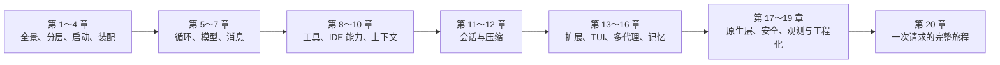
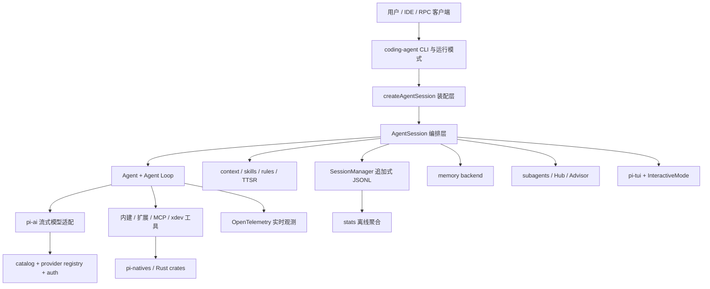

# Oh My Pi 17.1.3 源码深度拆解

**在线文档：<https://hanqing.github.io/oh-my-pi-notes/>**

> 以 `refs/dg-ai-notes` 拆解 Pi Agent 的方法为参照，沿真实源码路径系统讲清 `oh-my-pi-17.1.3`：它如何启动、组装会话、驱动模型、调度工具、维护上下文、持久化历史、扩展能力、协作并自我观测。

## 这套文档解决什么问题

只看项目根目录的 README，很容易把 Oh My Pi 理解成“工具很多的 Pi 分支”。源码给出的答案更准确：它已经是一套完整的 coding-agent 运行时，Agent Loop 只是内核，外围还包括模型目录与鉴权、能力发现、插件与 MCP、多代理生命周期、长期记忆、原生执行层、追加式终端渲染、会话树、压缩恢复和观测系统。

这套教程不按文件逐个翻译，而是反复回答三个问题：

1. **是什么**：这个子系统在整台机器里承担什么责任？
2. **怎么做**：一次真实请求经过了哪些对象、事件和状态？
3. **为什么**：为什么不用更直接的实现？它在防什么错误？

教程基于本地源码快照：

- 目标源码：[`can1357/oh-my-pi@v17.1.3`](https://github.com/can1357/oh-my-pi/tree/v17.1.3)
- 对照源码：[`badlogic/pi-mono@v0.82.0`](https://github.com/badlogic/pi-mono/tree/v0.82.0)
- 写法参考：[`buchidonggua/dg-ai-notes/pi-agent`](https://github.com/buchidonggua/dg-ai-notes/tree/main/pi-agent)
- 目标版本：`17.1.3`
- 运行时基线：Bun `>= 1.3.14`

本文档里的数量是这个快照的静态统计，不应当被理解为未来版本承诺。比如当前模型目录包含 61 个 provider 分组、3,839 个模型条目，而统一鉴权注册表有 70 个 provider 定义；两者职责不同，所以数字本来就不必相等。

## 阅读地图

推荐第一次按顺序阅读。若只想解决一个问题，可以从下面的主题表直接跳入。

## 章节目录

| 章 | 主题 | 你会得到什么 |
| --- | --- | --- |
| 01 | [开篇：从 Pi 分支到 Agent 操作系统](./docs/第01章-开篇-从Pi分支到Agent操作系统.md) | 项目定位、全景图、核心设计原则 |
| 02 | [Monorepo 骨架与包依赖](./docs/第02章-Monorepo骨架与包依赖.md) | 16 个 TS 包、8 个 Rust crate 的责任边界 |
| 03 | [CLI 启动与运行模式](./docs/第03章-CLI启动与运行模式.md) | 从 `omp` 到 interactive/print/RPC/ACP 的分流 |
| 04 | [会话装配工厂](./docs/第04章-会话装配工厂-createAgentSession.md) | `createAgentSession()` 如何并行拼出一套运行时 |
| 05 | [Agent Loop](./docs/第05章-AgentLoop-真正转动的内核.md) | turn、stream、tool、steering、follow-up 的状态机 |
| 06 | [模型目录、鉴权与流式调用](./docs/第06章-模型目录鉴权与流式调用.md) | catalog、registry、resolver、provider dispatch 与安全重放 |
| 07 | [消息、方言与跨 Provider 回放](./docs/第07章-消息方言与跨Provider回放.md) | 统一消息模型如何穿过不同供应商协议 |
| 08 | [工具注册、调度与审批](./docs/第08章-工具注册调度与审批.md) | 工具从 schema 到并发执行、拦截与结果配对 |
| 09 | [编码工具纵深](./docs/第09章-编码工具纵深-文件HashlineLSPDAP与Eval.md) | `read/edit/bash/eval/lsp/debug` 的关键机制 |
| 10 | [上下文工程与能力发现](./docs/第10章-上下文工程与能力发现.md) | AGENTS、skills、rules、TTSR、系统提示词如何合并 |
| 11 | [会话日志与树形历史](./docs/第11章-会话日志与树形历史.md) | JSONL、parentId、branch/tree/resume 的持久化模型 |
| 12 | [压缩、恢复与 Snapcompact](./docs/第12章-压缩恢复与Snapcompact.md) | 六种触发器、剪枝、摘要、位图归档与重试 |
| 13 | [扩展、插件与 MCP](./docs/第13章-扩展插件与MCP.md) | 三种能力入口如何汇入同一工具与事件运行时 |
| 14 | [TUI 与追加式渲染](./docs/第14章-TUI与追加式终端渲染.md) | 为什么终端 UI 要维护提交边界和字节稳定性 |
| 15 | [多代理、Hub、Advisor 与协作](./docs/第15章-多代理HubAdvisor与协作.md) | 子代理停放/恢复、IRC、只读审阅与加密共享 |
| 16 | [长期记忆与自动学习](./docs/第16章-长期记忆与自动学习.md) | local、Hindsight、Mnemopi 四后端统一抽象 |
| 17 | [Rust 原生层](./docs/第17章-Rust原生层与跨平台执行.md) | N-API loader、原生搜索/PTY/AST/隔离的分工 |
| 18 | [配置、安全与信任边界](./docs/第18章-配置安全与信任边界.md) | 配置优先级、审批、密钥混淆、权限边界 |
| 19 | [观测、统计、测试与发布](./docs/第19章-观测统计测试与发布.md) | OTLP、离线 stats、工程约束与发布链 |
| 20 | [一次请求的完整旅程](./docs/第20章-一次请求的完整旅程.md) | 把前 19 章连接成一条可调试的调用链 |
| 附录 A | [源码导航与阅读路线](./docs/附录A-源码导航与阅读路线.md) | 按问题定位入口文件、类和文档 |
| 附录 B | [术语、状态机与不变量速查](./docs/附录B-术语状态机与不变量速查.md) | 高频概念和不可破坏的系统约束 |

## 先记住这张总图

最容易混淆的是三层状态：

- `Agent` 管的是**当前模型运行状态**：messages、streaming、tool calls、steering/follow-up 队列。
- `AgentSession` 管的是**产品级会话行为**：持久化、重试、压缩、模式、扩展、记忆、TTSR、子代理、UI 事件。
- `SessionManager` 管的是**可恢复历史**：追加日志、树结构、当前叶子、分支摘要和重建上下文。

如果把三者混成一个“Agent 类”，后面几乎每个机制都会看不懂。

## 与参考教程的对应关系

参考教程的十章仍然构成主干，但 Oh My Pi 的外围系统更大，因此本教程做了展开：

| Pi 教程主题 | 本教程对应章节 | Oh My Pi 新增的观察维度 |
| --- | --- | --- |
| 三层架构 | 02、03、04 | CLI 模式、SDK 装配、Rust 原生层 |
| Agent Loop | 05 | steering、follow-up、aside、工具并发、telemetry |
| 模型调用 | 06、07 | catalog/registry 拆分、鉴权轮换、方言、自定义 API |
| 工具系统 | 08、09 | xdev、审批、MCP、Hashline、LSP、DAP、eval re-entry |
| 消息与事件 | 05、07、14 | provider payload、TUI ledger、协作 wire 协议 |
| 上下文工程 | 10 | 多生态发现、skills、rules、TTSR、项目树 |
| 上下文压缩 | 12 | 六类触发、远端压缩、snapcompact 位图帧 |
| 会话管理 | 11、15、16 | 树历史、子代理会话、长期记忆 |

## 本地快照的几个尺度

| 维度 | 本地快照 |
| --- | ---: |
| TypeScript workspace 包 | 16 |
| 顶层 Rust crates | 8 |
| `models.json` provider 分组 | 61 |
| `models.json` 模型条目 | 3,839 |
| `pi-ai` provider 注册定义 | 70 |
| 规范化可见内建工具名 | 28 |
| 隐藏内建工具名 | 2（`yield`、`goal`） |

这里特意不用“总行数”描述复杂度：仓库包含生成模型表、嵌入的前端产物、协议定义和大量测试，粗暴 `wc -l` 会严重夸大可维护逻辑。更有意义的是责任边界、状态机数量和跨层不变量。

## 如何对照源码

文档遵循四条证据规则：

1. 关键结论都尽量给出相对源码路径和符号名。
2. 不依赖易漂移的行号；优先链接文件并写明函数/类。
3. README 中的市场化数字只作为产品表述；源码中的注册表才作为静态事实。
4. 对推断明确写“可以推断”或“设计上意味着”，不把推断伪装成注释原文。

建议把源码和教程并排打开。从第 3 章起，每章末尾都有“下一步该读什么”和“调试落点”。

## 一条最短阅读路线

如果只有一小时：

1. 第 1 章看全景。
2. 第 4 章理解运行时怎样被装配。
3. 第 5 章理解循环。
4. 第 8 章理解工具边界。
5. 第 11、12 章理解它为何能长期运行和恢复。
6. 第 20 章把链路重新走一遍。

如果要二次开发插件：读 02 → 04 → 08 → 10 → 13 → 18。

如果要排查模型兼容：读 05 → 06 → 07 → 12 → 19。

如果要改 TUI：读 05 → 11 → 14，并先记住“已提交行不可被普通更新重写”这一不变量。

---

从这里开始：[第 1 章：从 Pi 分支到 Agent 操作系统](./docs/第01章-开篇-从Pi分支到Agent操作系统.md)。
