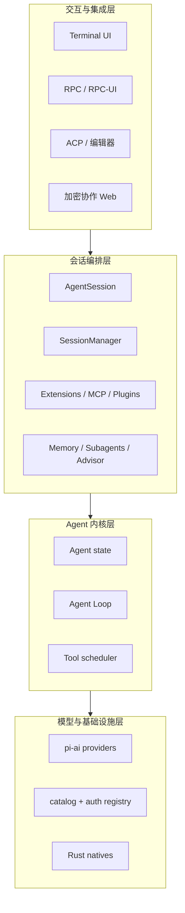

# 第 1 章　开篇：从 Pi 分支到 Agent 操作系统

> 本章先不钻函数。我们要建立一张不会在后续章节里失效的地图：Oh My Pi 到底是什么，它比 Pi 多了什么，以及为什么这些“外围能力”并不外围。

## 1.1 一个容易低估的项目

`oh-my-pi-17.1.3` 的根 README 用一句话定位自己：**A coding agent with the IDE wired in**。这句话比“CLI 编程助手”准确，因为它描述的不是界面，而是运行时边界：

- 模型不只生成文本，还能读取和改变工作区；
- 改变不是盲写，能借助 Hashline、AST、LSP 和 DAP 获取结构化反馈；
- 一次会话不是内存数组，而是可恢复、可分叉、可压缩的追加日志；
- 一个 Agent 不是唯一工作者，还能生成、停放、恢复、寻址其他 Agent；
- 扩展不只加命令，还能拦截模型请求、工具调用和会话生命周期；
- 性能敏感或平台相关的操作落到 Rust/N-API，而不是假设系统装好了 `rg`、GNU 工具或 bash。

所以，更合适的心智模型是：

> **Oh My Pi 是一个以 Agent Loop 为内核、以会话为进程、以工具为系统调用、以终端/ACP/RPC 为前端的 coding-agent 操作系统。**

这不是源码里的正式术语，而是从责任划分得出的架构类比。后续每章都会验证它。

## 1.2 从 Pi 0.82.0 到 Oh My Pi 17.1.3

本地的 Pi 0.82.0 快照有五个主要 workspace 包：

```text
@earendil-works/pi-ai
@earendil-works/pi-agent-core
@earendil-works/pi-coding-agent
@earendil-works/pi-tui
@earendil-works/pi-server
```

它已经具备参考教程讲解的完整主干：模型适配、Agent Loop、工具、TUI、上下文与会话。

Oh My Pi 保留了这条主干，并扩展为 16 个 TypeScript workspace 包和 8 个顶层 Rust crate。新增包不是简单拆文件，而是在建立独立的演化边界：

- `catalog` 独立维护模型事实与发现策略；
- `wire` 给浏览器协作端提供无运行时依赖的 JSON 协议；
- `natives` 把原生绑定作为正式包；
- `hashline` 把编辑协议从 coding-agent 中抽离；
- `snapcompact` 把视觉压缩策略抽离；
- `mnemopi` 把长期记忆做成独立引擎；
- `stats` 从追加会话日志离线构建分析库；
- `collab-web` 成为会话共享的独立前端。

项目还保留 [`docs/porting-from-pi-mono.md`](https://github.com/can1357/oh-my-pi/blob/v17.1.3/docs/porting-from-pi-mono.md)，说明它并未切断上游，而是用明确的“有意分歧”清单持续吸收变更。这里有一个重要结论：

> Oh My Pi 不是某个时间点的 Pi 复制品，而是一条仍与上游交换代码、但已建立自己架构约束的分支。

## 1.3 四个同心圆

把整套系统按离模型调用的距离分成四层，会比按目录记忆更稳。



### 第一层：模型与基础设施

这一层回答“怎么把统一请求变成 Anthropic、OpenAI、Gemini、Bedrock、Ollama 或其他协议”。

核心入口：

- [`packages/ai/src/stream.ts`](https://github.com/can1357/oh-my-pi/blob/v17.1.3/packages/ai/src/stream.ts)：统一流式入口与 provider dispatch。
- [`packages/ai/src/types.ts`](https://github.com/can1357/oh-my-pi/blob/v17.1.3/packages/ai/src/types.ts)：消息、工具、流事件和请求选项。
- [`packages/ai/src/registry/registry.ts`](https://github.com/can1357/oh-my-pi/blob/v17.1.3/packages/ai/src/registry/registry.ts)：鉴权、登录和 provider 元数据注册表。
- [`packages/catalog/src/models.json`](https://github.com/can1357/oh-my-pi/blob/v17.1.3/packages/catalog/src/models.json)：生成的模型事实表。
- [`packages/natives/native/index.js`](https://github.com/can1357/oh-my-pi/blob/v17.1.3/packages/natives/native/index.js)：平台原生 addon 的 ESM 入口。

### 第二层：Agent 内核

这一层回答“模型如何重复调用工具直到可以停下”。

- [`packages/agent/src/agent.ts`](https://github.com/can1357/oh-my-pi/blob/v17.1.3/packages/agent/src/agent.ts) 是有状态外壳。
- [`packages/agent/src/agent-loop.ts`](https://github.com/can1357/oh-my-pi/blob/v17.1.3/packages/agent/src/agent-loop.ts) 是执行状态机。
- [`packages/agent/src/types.ts`](https://github.com/can1357/oh-my-pi/blob/v17.1.3/packages/agent/src/types.ts) 定义工具、事件、hook 和上下文转换边界。

`Agent` 不知道项目设置面板长什么样，也不应该知道会话文件存在哪里。它只需要模型、消息、工具和若干回调。

### 第三层：会话编排

这一层把“能跑的 loop”变成“能长期工作的产品”。

- [`packages/coding-agent/src/sdk.ts`](https://github.com/can1357/oh-my-pi/blob/v17.1.3/packages/coding-agent/src/sdk.ts) 的 `createAgentSession()` 负责装配。
- [`packages/coding-agent/src/session/agent-session.ts`](https://github.com/can1357/oh-my-pi/blob/v17.1.3/packages/coding-agent/src/session/agent-session.ts) 负责产品级会话语义。
- [`packages/coding-agent/src/session/session-manager.ts`](https://github.com/can1357/oh-my-pi/blob/v17.1.3/packages/coding-agent/src/session/session-manager.ts) 负责日志与树。

扩展、MCP、压缩、重试、记忆、子代理、advisor、TTSR 都在这一层与 Agent 交汇。

### 第四层：交互与集成

同一个 `AgentSession` 可以被多种前端驱动：

- 终端交互：`InteractiveMode`；
- 单次输出：print/text；
- 机器协议：RPC/RPC-UI；
- 编辑器协议：ACP；
- 远程旁观或协作：collab host/guest。

这解释了为什么核心逻辑不能直接 `console.log()`：一旦运行在 TUI、RPC 或嵌入环境，随意输出就会破坏协议或屏幕。

## 1.4 一次请求其实穿过三条链

用户按下 Enter 后，不是只有一条调用栈，而是三条相互校验的链同时前进。

### 执行链

```text
InputController
  → AgentSession.prompt()/steer()/followUp()
  → Agent.prompt()
  → agentLoop()
  → pi-ai stream()
  → provider stream events
  → tool calls
  → tool scheduler
  → next model request
```

### 持久化链

```text
Agent events
  → AgentSession event handling
  → SessionManager.appendMessage()/appendCustomEntry()
  → JSONL parent-child entry
  → terminal breadcrumb / artifacts / stats source
```

### 展示链

```text
AgentSession events
  → EventController
  → message/tool components
  → pi-tui frame composition
  → append-only terminal renderer
```

三条链不能任意合并。流式 partial 可以更新 UI，但不一定应该立刻成为可恢复的最终消息；持久化完成也不代表终端可以重写已经滚出 live region 的行。

## 1.5 五个贯穿全项目的设计原则

### 原则一：追加优先，重写要有边界

会话日志用追加 JSONL；TUI 维护 committed rows；工具调用和结果保持配对；压缩不是就地改旧消息，而是追加一个带锚点的 `compaction` entry。

追加式设计的收益不是“实现简单”，而是让崩溃恢复、并发观察和增量同步变得可推理。

### 原则二：策略在上层，机制在下层

例子：

- Agent core 提供 `beforeToolCall`，coding-agent 决定审批 UI 与配置策略；
- pi-ai 统一 stream，ModelRegistry 决定当前可用凭证；
- Rust 提供 grep/PTY/AST 机制，TypeScript 工具决定输出上限、提示和副作用；
- MemoryBackend 定义统一操作，具体后端决定存储与召回。

### 原则三：能力需要显式装配

一个工具存在于源码，不等于模型一定看得见它。它可能：

- 被设置禁用；
- 因当前模式或递归深度被过滤；
- 作为 discoverable tool 挂到 `xd://`；
- 来自扩展或 MCP，等待连接后注册；
- 因没有 UI、没有凭证或没有后端而返回 `null`。

这叫“能力系统”，不是“函数集合”。

### 原则四：协议不可信，边界要修复形状

模型、provider、扩展和 MCP 都可能返回不完整或非规范数据。源码里到处可以看到形状修复：

- malformed tool call 会被丢弃或补合成 synthetic result；
- 工具结果会被 coercion；
- 跨 provider 回放时会清理签名、ID 和私有 payload；
- session 解析器容忍旧版本与崩溃截断；
- stats 解析器跳过无法归因的坏记录，而不是让全量同步失败。

### 原则五：后台工作不能绑架前台

项目树扫描有 5 秒上限；LSP 默认 lazy；记忆通常后台启动；插件预加载与其他启动工作并行；advisor 失败不能让主 Agent 永久等待；扩展定时器会被托管并 `unref()`。

这些不是微优化，而是交互式 Agent 的生存条件。

## 1.6 先区分六种“记忆”

源码里“memory/context/history”出现得很多，含义不同：

| 名称 | 生命周期 | 载体 | 用途 |
| --- | --- | --- | --- |
| Agent messages | 当前运行 | 内存数组 | 下一次模型请求 |
| Session history | 跨进程 | JSONL 树 | 恢复、分叉、导出 |
| Provider payload | 同/跨 provider 回放 | 消息附属字段 | 保留原生 response history |
| Compaction summary | 长会话 | compaction entry | 替代较旧上下文 |
| Tool/session caches | 当前会话或安装 | 内存/SQLite/artifact | 性能与可恢复输出 |
| Long-term memory | 跨会话 | local/Hindsight/Mnemopi | 项目知识召回 |

如果文档里说“记忆”，会明确是哪一种。

## 1.7 先区分四种“扩展”

| 机制 | 主要输入 | 能做什么 | 运行位置 |
| --- | --- | --- | --- |
| Capability discovery | `.omp/.claude/.codex/.gemini` 等 | 发现 skills/rules/settings/tools | 启动期 |
| Extension module | TS/JS factory | 事件、工具、命令、provider、UI | 同进程 |
| Plugin | 包 + manifest | 打包分发上述多类资源 | 安装/发现层 |
| MCP | stdio/HTTP/SSE server | 远程工具、资源、提示词 | 外部进程/网络 |

最终它们会在 session 装配期汇合，但信任边界完全不同。Extension 与宿主同进程、没有沙箱；MCP 经过 JSON-RPC 和工具桥；纯 capability 文件一般只贡献数据。

## 1.8 本章源码路标

第一次浏览建议只打开这些文件：

1. [`README.md`](https://github.com/can1357/oh-my-pi/blob/v17.1.3/README.md)：产品能力清单。
2. [`package.json`](https://github.com/can1357/oh-my-pi/blob/v17.1.3/package.json)：workspace 与工程命令。
3. [`packages/coding-agent/src/cli.ts`](https://github.com/can1357/oh-my-pi/blob/v17.1.3/packages/coding-agent/src/cli.ts)：进程入口。
4. [`packages/coding-agent/src/main.ts`](https://github.com/can1357/oh-my-pi/blob/v17.1.3/packages/coding-agent/src/main.ts)：模式分流。
5. [`packages/coding-agent/src/sdk.ts`](https://github.com/can1357/oh-my-pi/blob/v17.1.3/packages/coding-agent/src/sdk.ts)：装配中心。
6. [`packages/agent/src/agent-loop.ts`](https://github.com/can1357/oh-my-pi/blob/v17.1.3/packages/agent/src/agent-loop.ts)：循环内核。

不要第一天就从 8,000 行左右的 `AgentSession` 顶部读到底。先知道它连接了什么，再按职责进方法。

## 1.9 本章小结

本章要留下四个结论：

1. Oh My Pi 的核心不只是 Agent Loop，而是围绕 loop 建立的完整运行时。
2. `Agent`、`AgentSession`、`SessionManager` 分别拥有运行、编排和持久化状态。
3. 执行、持久化、展示三条链并行前进，不能混为一个回调。
4. 追加、显式能力、边界修复和非阻塞后台工作是贯穿全仓的设计语言。

下一章进入项目骨架：[Monorepo 骨架与包依赖](./第02章-Monorepo骨架与包依赖.md)。
