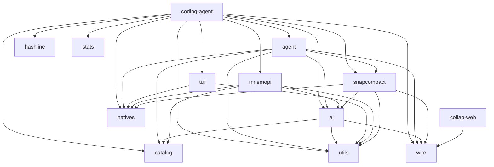

# 第 2 章　Monorepo 骨架与包依赖

> 大型仓库最危险的阅读方式是“看到哪个文件就读哪个文件”。本章先把包、crate 和依赖方向固定下来，后续每个类型就都有了坐标。

## 2.1 顶层不是一个应用，而是一组运行时

根 [`package.json`](https://github.com/can1357/oh-my-pi/blob/v17.1.3/package.json) 声明 `packages/*` workspace，包管理器是 Bun。当前快照有 16 个包：

| 目录 | 包名 | 主要责任 |
| --- | --- | --- |
| `packages/ai` | `@oh-my-pi/pi-ai` | 统一消息、流事件、provider 适配、鉴权重试、工具方言 |
| `packages/catalog` | `@oh-my-pi/pi-catalog` | 模型事实、provider 描述、模型发现和身份分类 |
| `packages/agent` | `@oh-my-pi/pi-agent-core` | Agent 状态、Agent Loop、工具执行调度、压缩算法 |
| `packages/coding-agent` | `@oh-my-pi/pi-coding-agent` | CLI、SDK、会话编排、工具、扩展、TUI 应用 |
| `packages/tui` | `@oh-my-pi/pi-tui` | 终端组件、布局、输入和追加式 renderer |
| `packages/natives` | `@oh-my-pi/pi-natives` | Rust N-API addon 的加载、声明和发布 |
| `packages/utils` | `@oh-my-pi/pi-utils` | 目录、日志、流、进程、postmortem 等公共机制 |
| `packages/wire` | `@oh-my-pi/pi-wire` | 无依赖的协作 JSON wire 类型和常量 |
| `packages/hashline` | `@oh-my-pi/hashline` | 基于快照标签与行锚点的编辑语言和执行器 |
| `packages/snapcompact` | `@oh-my-pi/snapcompact` | 会话文本转位图帧的压缩策略封装 |
| `packages/mnemopi` | `@oh-my-pi/pi-mnemopi` | SQLite、向量/FTS、事实图和记忆整合引擎 |
| `packages/stats` | `@oh-my-pi/omp-stats` | 增量解析会话日志、SQLite 聚合、Web dashboard |
| `packages/collab-web` | `@oh-my-pi/collab-web` | 实时共享会话的浏览器客户端 |
| `packages/swarm-extension` | `@oh-my-pi/swarm-extension` | 以扩展形式打包的多代理能力示例/产品 |
| `packages/metaharness` | `@oh-my-pi/pi-metaharness` | 元级 harness 实验能力 |
| `packages/typescript-edit-benchmark` | benchmark 包 | 编辑策略与模型表现基准 |

版本并不完全统一：大多数核心包是 `17.1.3`，`collab-web` 在快照中是 `16.3.6`，实验/benchmark 包是 `0.0.1`。因此，判断兼容性应该看依赖和 wire contract，而不是假设 workspace 内所有版本字符串一致。

## 2.2 关键依赖图

省略第三方依赖后，主干可以画成：

这张图透露三个事实。

### `coding-agent` 是 composition root

它几乎依赖所有核心包，因为它决定当前进程需要哪些能力。它不是“UI 包”，而是产品装配层。

### `agent` 仍然保持可嵌入

Agent core 依赖 AI、catalog 和少量基础设施，但不依赖 coding-agent。换句话说，核心循环可以被其他宿主直接创建。

### `wire` 刻意保持轻

协作 Web 客户端只需要 JSON 形状，不应把 Bun、SQLite、provider SDK 或 AgentSession 一起打进浏览器。于是 [`packages/wire/src/index.ts`](https://github.com/can1357/oh-my-pi/blob/v17.1.3/packages/wire/src/index.ts) 用重复但稳定的 dependency-free 类型定义，coding-agent 通过 type-only conformance 保证一致。

## 2.3 为什么 `catalog` 与 `ai` 要分开

这是最值得单独理解的边界。

`catalog` 回答的是事实问题：

- 有哪些 provider/model？
- 一个 model 的 API、上下文窗口、输出上限、成本和能力是什么？
- provider 的默认模型和动态发现策略是什么？
- 两个模型是否属于同一家族？

`ai` 回答的是运行问题：

- 这次请求走哪个协议？
- 如何拿 API key、OAuth token 或云凭证？
- 如何构造请求、解析 SSE/事件流并统一错误？
- 如何把工具 schema 和历史变成 provider 接受的 wire shape？

静态快照能看出两者不是一一对应：

- `models.json`：61 个 provider 分组、3,839 个模型条目；
- `CATALOG_PROVIDERS`：64 个 chat-model provider 描述；
- `pi-ai` 的 `PROVIDER_REGISTRY`：70 个 provider 定义。

鉴权注册表还包括搜索、特殊登录或没有内置模型条目的 provider，因此数字不同是职责分离的结果。

源码入口：

- [`packages/catalog/src/provider-models/descriptors.ts`](https://github.com/can1357/oh-my-pi/blob/v17.1.3/packages/catalog/src/provider-models/descriptors.ts)
- [`packages/ai/src/registry/registry.ts`](https://github.com/can1357/oh-my-pi/blob/v17.1.3/packages/ai/src/registry/registry.ts)
- [`packages/coding-agent/src/config/model-registry.ts`](https://github.com/can1357/oh-my-pi/blob/v17.1.3/packages/coding-agent/src/config/model-registry.ts)

第三个 `ModelRegistry` 位于 coding-agent，是运行时视图：它把 bundled catalog、用户 `models.yml`、动态发现和当前鉴权状态合并成“本会话可选的模型”。

## 2.4 `agent` 与 `coding-agent` 的边界

可以用一组“知道/不知道”来判断代码该放哪。

| 问题 | Agent core | coding-agent |
| --- | --- | --- |
| 消息和工具调用如何循环？ | 知道 | 使用 |
| shared/exclusive 工具如何排队？ | 知道 | 声明工具策略 |
| 用户怎样审批 bash？ | 只知道 before hook 可阻断 | 知道 UI 与配置 |
| session 存在哪？ | 不知道 | 知道 |
| `/tree`、`/model` 是什么？ | 不知道 | 知道 |
| AGENTS.md 从哪发现？ | 不知道 | 知道 |
| MCP server 怎么连接？ | 不知道 | 知道并桥成 AgentTool |
| provider stream 怎么调用？ | 通过注入的 streamFn | 选择带设置的 streamFn |

这使 `Agent` 可以在主会话、子代理、advisor、auto-learn capture 等多种环境复用；每个环境只需注入不同的工具、system prompt 和回调。

## 2.5 `AgentSession` 是“厚外壳”而不是坏味道

[`AgentSession`](https://github.com/can1357/oh-my-pi/blob/v17.1.3/packages/coding-agent/src/session/agent-session.ts) 很大。看到大类时，第一反应常是“应该拆”。但要先区分两件事：

- 实现文件是否过大；
- 是否存在一个真实的聚合根，需要维持跨子系统不变量。

AgentSession 的确是聚合根。它必须协调：

- Agent 的事件与运行状态；
- SessionManager 的持久化顺序；
- compaction/retry/TTSR 的互斥和继续条件；
- 模式（plan/goal/vibe）改变工具与提示词；
- extension runner 的 pre/post 生命周期；
- memory、advisor、async jobs、MCP 的启动与销毁；
- UI 所需的高阶事件。

项目已经把许多实现拆入 `session/`、`modes/`、`compaction/`、`task/` 等模块，但仍需要一个对象拥有“当前这次产品会话”。所以读它时应按生命周期和职责检索方法，而不是按行从头到尾。

## 2.6 Rust crate 地图

顶层有 8 个 crate：

| crate | 作用 |
| --- | --- |
| `pi-natives` | 汇总 N-API 导出，生成 `.node` addon |
| `pi-shell` | 内嵌 shell、PTY、process 和输出最小化 |
| `pi-ast` | tree-sitter 代码摘要和 AST 操作 |
| `pi-iso` | APFS/btrfs/zfs/overlayfs/projfs/rcopy 隔离后端 |
| `pi-walker` | 并行文件遍历、ignore 和 glob |
| `pi-uu-grep` | 进程内 grep 实现 |
| `pi-uu-diff` | 进程内 diff 能力 |
| `pi-uutils-ctx` | 给嵌入式 uutils 提供线程局部 stdio/cwd 上下文 |

`crates/vendor/` 还包含 fork 后的 shell 相关依赖，但不作为顶层产品 crate 计数。

Rust 与 TypeScript 的边界不是“所有重活都下沉”。判断标准更具体：

- 需要跨平台系统 API；
- 位于高频热路径；
- 需要稳定 PTY/进程控制；
- 依赖 tree-sitter、文件遍历或二进制处理；
- 能用窄、可生成声明的 N-API contract 暴露。

用户策略、错误文案、工具输出裁剪和会话语义仍留在 TypeScript。

## 2.7 四种数据平面

项目里同时存在四类数据，包边界也围绕它们建立。

### 对话平面

`pi-ai` 的 `Message`/`AssistantMessageEvent` → `agent` 的 `AgentEvent` → coding-agent 的 `AgentSessionEvent`。

### 能力平面

capability items、built-in tool factories、extensions、MCP tools → `toolRegistry` → 当前 active tools → provider tool schema。

### 持久化平面

`SessionEntry` JSONL、blobs、artifacts、SQLite agent storage、memory database、stats database。

### 展示平面

AgentSession events → TUI components 或 RPC/ACP/collab wire frames。

排查 bug 时，先问它属于哪个平面。比如“工具执行成功但重启后看不到结果”通常是持久化平面问题，而不是工具执行问题；“TUI 不显示但 JSON 模式有事件”是展示平面问题。

## 2.8 包依赖中的几个刻意约束

### 核心包不能反向依赖产品包

`agent`、`ai`、`catalog` 不能 import `coding-agent`。否则子代理和嵌入场景都会被 CLI 配置绑死。

### 浏览器包只依赖 wire contract

`collab-web` 不直接 import SessionManager。远端只能看到 host 明确序列化的字段，这也是安全边界。

### 原生包不决定产品策略

Rust `grep` 可以返回匹配，coding-agent 决定默认限制、展示格式、取消语义和 artifact spill。

### 生成文件有明确所有者

例如 `models.json` 不应手改。根 [`AGENTS.md`](https://github.com/can1357/oh-my-pi/blob/v17.1.3/AGENTS.md) 明确要求修改 resolver/descriptor/generator 后重新生成。生成物是下游快照，不是事实源。

## 2.9 从问题反查包

| 现象 | 第一落点 |
| --- | --- |
| provider 请求格式错 | `packages/ai/src/providers/` |
| 模型列表缺项 | `catalog` descriptor/generator + coding-agent ModelRegistry |
| 工具调用停不下来 | `packages/agent/src/agent-loop.ts` |
| 工具存在但模型看不见 | coding-agent `createTools()` / active registry / xdev |
| 恢复后历史错乱 | `session-manager.ts` / `session-entries.ts` |
| 终端出现重复或消行 | `packages/tui/src/tui.ts` 与 transcript/live seam |
| grep/PTY 跨平台异常 | `packages/natives` loader + 对应 Rust crate |
| 远程协作不同步 | `collab/protocol.ts`、host/guest、`packages/wire` |

## 2.10 本章小结

核心依赖方向可以压缩成一句话：

> `catalog` 描述模型，`ai` 驱动模型，`agent` 驱动循环，`coding-agent` 装配产品，`tui/ACP/RPC/collab` 驱动交互，`natives` 提供跨平台底座。

下一章从真正的进程入口开始：[CLI 启动与运行模式](./第03章-CLI启动与运行模式.md)。
