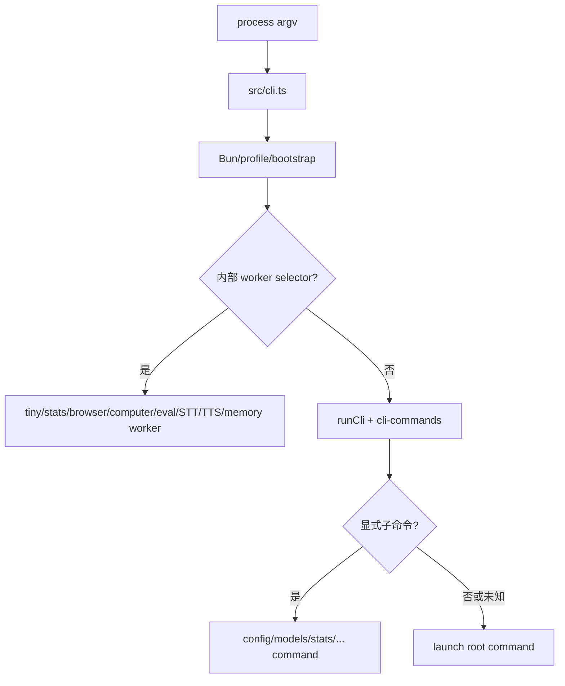
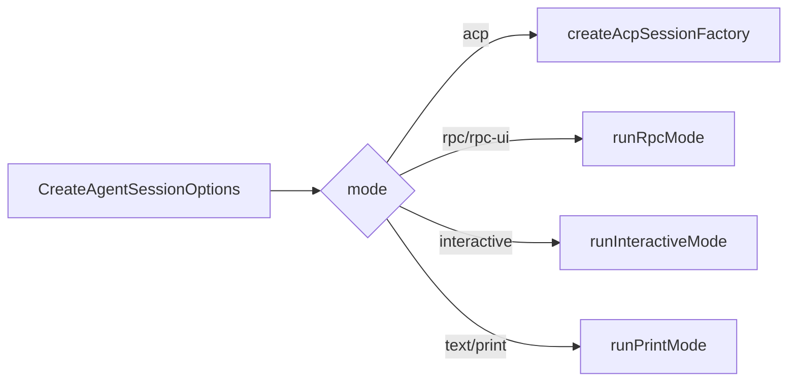

# 第 3 章　CLI 启动与运行模式

> 同一套 AgentSession 能运行在终端、一次性命令、RPC 和 ACP 中。理解启动分流，是理解“为什么某功能在某模式可用、在另一模式不可用”的前提。

## 3.1 真正入口在哪里

`packages/coding-agent/package.json` 把可执行命令 `omp` 指向 [`src/cli.ts`](https://github.com/can1357/oh-my-pi/blob/v17.1.3/packages/coding-agent/src/cli.ts)。但这个文件并不立刻 import 整个应用。它先做进程级准备：

1. 清理 macOS 特定 malloc 环境变量；
2. 检查 Bun 版本；
3. 在环境敏感模块加载前解析 profile；
4. 识别内部 worker selector；
5. 注册统一 worker host entry；
6. 处理 smoke test；
7. 最后才懒加载 CLI command graph。



这是一种“自分派二进制”设计：编译后的单个 `omp` 可执行文件既是主程序，也是若干 worker 的重新入口。

## 3.2 为什么 worker 要在命令图之前分派

内部 worker 包括：

- tiny inference；
- stats session parser；
- browser tab；
- computer control；
- JS eval worker/process；
- STT/TTS；
- Mnemopi embedding；
- daemon broker。

如果先加载普通命令图，会付出三个代价：

1. worker 启动时加载不相关的 TUI、配置和 provider 模块；
2. 某些模块可能抢占 stdin 或注册长生命周期句柄；
3. 编译二进制里 worker 与主进程的入口行为不再一致。

源码还对部分 ONNX worker 使用独立子进程并在结束时 `SIGKILL`，目的是避开 Bun/N-API finalizer 的退出崩溃。这说明进程隔离有时不是安全沙箱，而是 native runtime 的生命周期隔离。

## 3.3 命令图与默认 launch

[`src/cli-commands.ts`](https://github.com/can1357/oh-my-pi/blob/v17.1.3/packages/coding-agent/src/cli-commands.ts) 注册很多独立命令，例如：

- `acp`、`auth-broker`、`agents`；
- `commit`、`config`、`models`、`plugin`；
- `read`、`grep`、`search`；
- `stats`、`usage`；
- `setup`、`update`、`ssh`、`worktree`。

没有显式命令时进入 [`commands/launch.ts`](https://github.com/can1357/oh-my-pi/blob/v17.1.3/packages/coding-agent/src/commands/launch.ts)。未知输入也被有控制地路由到 launch，使 `omp 帮我修这个 bug` 可以直接把后续参数当初始消息。

但这个便利有风险：拼错的 flag 可能被误当 prompt，进而发起真实模型请求。项目的解决办法不是在最初 parse 阶段一刀切，因为扩展可以注册自己的 CLI flag；而是在扩展加载后再次校验未识别 flag，失败时用 exit code 2 退出。

## 3.4 `main.ts` 才是模式总控

[`src/main.ts`](https://github.com/can1357/oh-my-pi/blob/v17.1.3/packages/coding-agent/src/main.ts) 的 `runRootCommand()` 承担启动编排。高层顺序如下：

```text
初始化计时与 watchdog
  → 初始主题
  → 应用 cwd
  → AuthStorage + ModelRegistry
  → 判断 version/export/RPC stdin
  → 并行预加载 plugin roots
  → Settings.init + runtime overrides
  → 最终主题
  → 解析 scoped models
  → 创建/恢复 SessionManager
  → 等待 plugin preload
  → buildSessionOptions
  → 初始化 OTLP
  → 预加载扩展并解析扩展 flags
  → 处理 @file/stdin/初始消息
  → createAgentSession
  → 分流 interactive/RPC/print
```

启动 watchdog 每隔一段时间报告当前阶段，避免“看起来卡死”却不知道卡在模型发现、插件、session picker 还是原生加载。

## 3.5 profile 为什么必须非常早

profile 会改变 OMP 用户目录：默认 `~/.omp/agent`，命名 profile 则位于 `~/.omp/profiles/<name>/agent`。这个目录影响：

- settings；
- credentials 与 agent DB；
- sessions、blobs、artifacts；
- skills、extensions、MCP；
- memory；
- key material。

如果某个模块在 profile 解析前缓存了默认路径，后面再切 profile 会产生“一半数据在 A，一半数据在 B”的进程。因此 `cli.ts` 先 bootstrap profile，再 import 环境敏感模块。

## 3.6 SessionManager 的启动选择

`createSessionManager()` 把参数解析成四类结果：

| 参数 | 行为 |
| --- | --- |
| `--no-session` | 创建 in-memory manager |
| `--fork <id/path>` | 从已有 JSONL 复制成新会话 |
| `--resume <id/path>` | 打开指定会话；跨项目时可能提示 fork/move |
| `--continue` | 当前 cwd 最近会话 |
| 无参数 | 新会话；启用 `autoResume` 时尝试最近会话 |

`--resume` 不带值会进入 picker。若选择了另一个项目的 session，启动代码会：

1. 等旧 cwd 的 plugin preload 收敛；
2. 切换 project dir；
3. 清空 plugin/capability caches；
4. 重新加载新 cwd 的 project settings；
5. 再打开 session。

这比单纯 `chdir()` 多，因为配置发现结果本身带 cwd 作用域。

## 3.7 `buildSessionOptions()` 是 CLI 到 SDK 的翻译层

CLI 参数不能直接塞给 Agent。`buildSessionOptions()` 将它们翻译成 `CreateAgentSessionOptions`：

- cwd、additional directories、deadline；
- system/append/title prompt 文件；
- session manager 与 provider cache key；
- model/provider/role/thinking；
- scoped models；
- prewalk、plan-yolo；
- tools、LSP、skills、rules；
- extensions 与 discovery 开关；
- auto-approve。

关键点是“恢复优先级”。例如已有 session 的 model/thinking 只有在 CLI 没明确覆盖时才恢复；fork 如果改变 system prompt、tools 或 model，会认为 prompt-cache shape 已变化，不继承旧 cache key。

## 3.8 四种主运行模式

### Interactive TUI

条件：没有 `--print`、没有自动 pipe-to-print，也没有显式协议模式。

流程：创建 `InteractiveMode`，显示 setup/splash/历史，然后循环等待输入。主循环可以概括为：

```text
getUserInput()
  → submitInteractiveInput()
  → prompt / steer / follow-up / synthetic message
  → 等待下一次输入
```

Agent 正忙时，普通 Enter 默认作为 steering，而不是无条件等待当前 run 完成。

### Print/Text

用于一次性执行或 stdin 管道。它不构造完整交互 TUI，完成后 dispose session、停止 theme watcher，再由 postmortem 收尾退出。

### RPC / RPC-UI

RPC 模式先独占 stdin，防止插件或普通 piped-input 逻辑抢走 JSON-RPC frame。`rpc-ui` 允许工具 UI 上下文，但仍是协议宿主，不等同终端交互。

### ACP

ACP 通过一个 session factory 支持编辑器创建多个 session。它走独立的 lazy import 分支，正常 CLI 启动不加载 ACP server 代码。



## 3.9 为什么先加载扩展再解释全部 argv

扩展可以注册 flag。启动采用两阶段解析：

1. 早期 parse 识别核心 flag、模式和足够多的启动信息；
2. 加载 session extensions；
3. 聚合扩展 flags；
4. 重新把 raw argv 应用到完整 flag set；
5. 再判定 `@file` 是文件参数还是某个扩展 flag 的值；
6. 最后报告真正未知的 flag。

如果顺序反过来，`--target @notes.md` 可能把 `@notes.md` 当作 prompt 附件读取；更糟的是拼错 flag 后面的文本会变成真实 prompt。

## 3.10 启动时的并行化

主入口不会串行等待所有准备工作：

- plugin roots preload 与设置、模型、session 解析重叠；
- model registry 后台刷新在 session 创建后继续；
- 版本检查与交互初始化重叠；
- `createAgentSession()` 内部还会并行发现 context、skills、rules、MCP 和工具。

并行 promise 通常立即附加 `.catch(() => {})`，不是吞掉最终错误，而是防止同步拒绝在真正 await 点之前变成 unhandled rejection；消费者到达 await 点时仍会处理结果。

## 3.11 模式差异的调试表

| 现象 | 首先检查 |
| --- | --- |
| stdin 被提前消费 | 是否在 RPC/ACP 前执行了 piped-input 逻辑 |
| print 模式进程不退出 | theme watcher、worker、timer、postmortem 是否释放 |
| 扩展 flag 被当 prompt | 两阶段 flag parse 与 extension preload |
| resume 到错项目配置 | cwd 切换后是否 reset capability/plugin cache |
| headless 工具等待审批 | 是否正确应用 headless/subagent approval 策略 |
| 首次响应慢但后续快 | model host preconnect、plugin discovery、LSP warmup |

## 3.12 本章小结

启动链的核心不是“解析参数”，而是建立正确的作用域：profile、cwd、session、mode、settings、plugins、stdin ownership。只有这些确定后，SDK 才能安全装配 AgentSession。

下一章深入这个装配中心：[会话装配工厂 `createAgentSession()`](./第04章-会话装配工厂-createAgentSession.md)。
