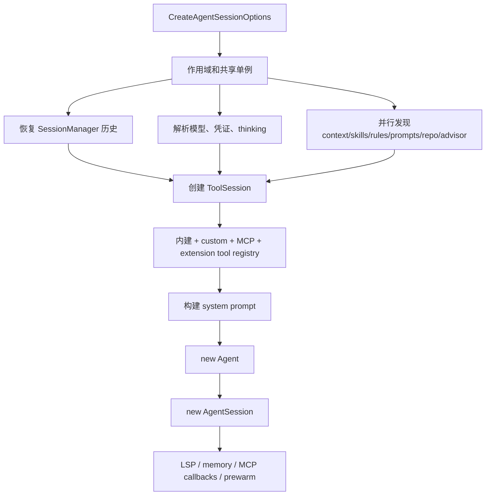
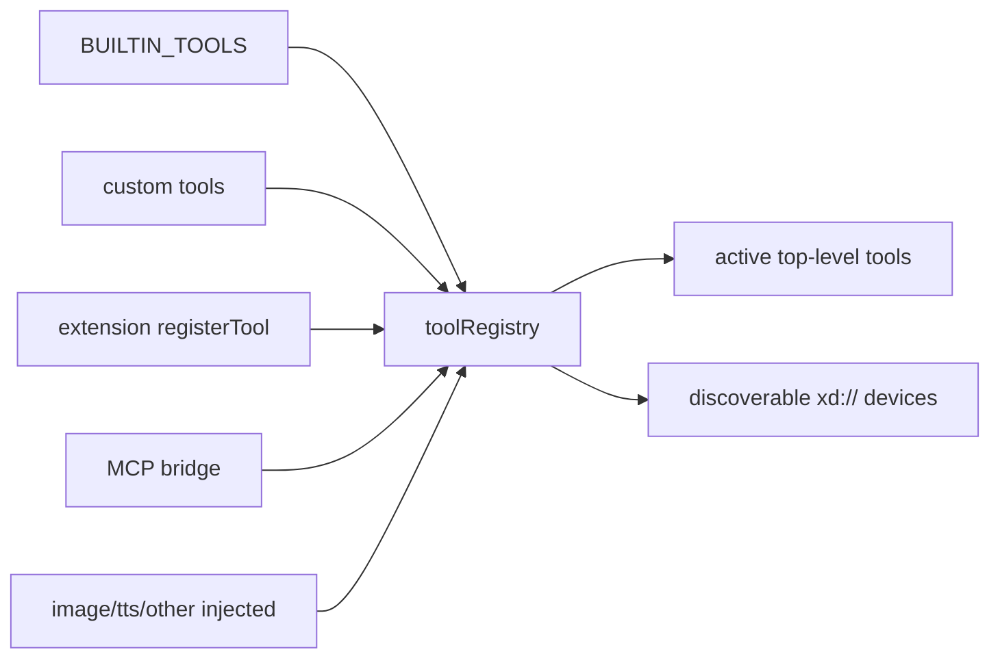

# 第 4 章　会话装配工厂：`createAgentSession()`

> Agent Loop 像发动机，`createAgentSession()` 像整车装配线。它把设置、模型、历史、工具、扩展、提示词和后台服务组合成一套具有明确所有权的运行时。

## 4.1 为什么需要一个 composition root

入口位于 [`packages/coding-agent/src/sdk.ts`](https://github.com/can1357/oh-my-pi/blob/v17.1.3/packages/coding-agent/src/sdk.ts) 的 `createAgentSession(options)`。它返回的核心结果包括：

- `session: AgentSession`；
- 工具 UI context setter；
- 模型 fallback 提示；
- LSP server 启动状态；
- MCP manager。

这个函数很长，但职责是集中的：**只在一个地方决定所有组件的实例、共享关系和销毁所有权**。如果把装配散到 CLI、TUI、Agent 和每个工具里，子代理、ACP、多 session 嵌入和恢复模式很快会出现不同配置。

## 4.2 输入不是一个配置对象，而是覆盖层

`CreateAgentSessionOptions` 同时服务 CLI、SDK、子代理和测试。可以按来源分成六组：

| 组 | 典型字段 | 作用 |
| --- | --- | --- |
| 作用域 | `cwd`、`agentDir`、`additionalDirectories` | 决定发现和文件访问范围 |
| 状态 | `sessionManager`、`providerSessionId`、cache key | 恢复/分叉和 provider 会话连续性 |
| 模型 | `model`、`modelPattern`、`thinkingLevel`、`scopedModels` | 初始模型与切换集合 |
| 能力 | `toolNames`、`customTools`、`skills`、`rules`、extensions | 直接提供或覆盖发现结果 |
| 子运行时 | `agentId`、`parentAgentId`、`taskDepth`、`spawns` | 子代理与受限 session contract |
| 宿主 | `hasUI`、`eventBus`、`settings`、telemetry hooks | 适配 TUI/RPC/ACP/嵌入环境 |

`undefined` 通常表示“按默认发现”；空数组则常表示“明确不要”。例如 `skills: []` 与没有 `skills` 的含义不同。

## 4.3 总装配图



注意箭头并不代表全部串行。源码会尽早启动独立 promise，在真正消费结果的位置才 await。

## 4.4 阶段一：锁定共享对象与所有权

函数首先确定：

- `cwd` 与 `agentDir`；
- `EventBus`；
- `ModelRegistry` 与其唯一 `AuthStorage`；
- `Settings`；
- `SessionManager`。

一个重要断言是：如果调用者同时传了 `authStorage` 和 `modelRegistry`，两者必须指向同一个 AuthStorage 实例。原因是 `ModelRegistry.getApiKey()` 会通过自己的 storage 刷新或禁用凭证，而 MCP、session 和 extension 也要观察同一批 `credential_disabled` 事件。两个 storage 会制造“模型认为凭证失效，但 UI/扩展不知道”的分裂状态。

函数还记录哪些资源由自己创建：

- 自己创建的 AuthStorage 在构造失败时需要关闭；
- 传入的 MCP manager 由父 session 拥有，子 session 不得断开；
- 只有第一个顶层 session 拥有全局 `AsyncJobManager`；
- 主 Agent dispose 时管理全局子代理生命周期，子代理 dispose 不能清空它。

这类 ownership flag 是装配函数最重要的产物之一。

## 4.5 阶段二：尽早发起独立发现

以下工作只依赖 cwd/agentDir/settings，因此并行启动：

- workspace tree；
- context files；
- active repo context；
- WATCHDOG 与 advisor 配置；
- prompt templates；
- slash commands；
- skills。

workspace scan 有 5 秒启动 deadline。超时不是取消整个扫描，而是本次装配先使用 fallback，后台扫描继续给缓存预热；构建 system prompt 时还会对同一 promise 再做受限等待。

这个选择体现了两类 deadline：

- **正确性 deadline**：超时必须失败；
- **交互 deadline**：超时先降级，结果仍可在后台产生价值。

工作区树属于后者。

## 4.6 阶段三：恢复历史前先修复异常尾部

SessionManager 可能来自新建、resume 或 fork。装配函数先读取当前 branch。如果上一次进程在非终结消息尾部异常退出，说明旧进程不可能再完成那个 turn，于是会追加一个 terminal aborted assistant record，再重建上下文。

这一步保留两个事实：

1. 已经流出的 partial 历史不能悄悄消失；
2. provider 所要求的 turn/tool 配对必须有终结状态。

之后通过 `sessionManager.buildSessionContext()` 得到：

- 当前 leaf 路径上的 messages；
- model/thinking/service-tier/mode 状态；
- compaction 作用后的上下文；
- 注入过的 TTSR 规则。

如果启用 secret obfuscation，恢复结果会先做 deobfuscation，让本地 UI 和后续本地逻辑看到真实值；真正发给 provider 前再重新混淆。

## 4.7 阶段四：模型选择是一套优先级算法

初始模型不是简单 `options.model ?? default`。大致优先级是：

1. 调用者明确给出的 `model` / `modelPattern`；
2. 已有 session 的 model change 历史；
3. settings 中 `default` role；
4. registry 可用集合中的 fallback。

恢复旧模型时只用同步、无副作用的 `hasConfiguredAuth()` 判断“是否配置过凭证”，不会提前真正刷新 OAuth 或调用 auth broker。真实 key 在每次请求中通过 resolver 懒获取，避免启动被网络鉴权路径串行阻塞。

thinking level 的优先级同样独立：

```text
显式 option
  → 持久化 thinking entry
  → 恢复 model selector 的后缀
  → default role 的显式级别
  → model 自身 defaultLevel
  → 全局 defaultThinkingLevel
```

`auto` 只是一种 session 级选择器。Agent 实际运行需要具体级别，因此启动时会得到 provisional concrete level，第一轮分类后再持久化真实选择。

## 4.8 阶段五：规则不是一股脑塞进 prompt

规则发现后被一次性分桶：

- `alwaysApplyRules`：稳定放入系统上下文；
- `rulebookRules`：由匹配管线按 turn 选择；
- TTSR rules：根据工具调用/结果动态注入；
- disabled/builtin 规则按设置过滤。

已有 session 里记录的 TTSR 注入会恢复到 `TtsrManager`，否则 resume 后模型可能丢失上一个工具结果引入的约束。

## 4.9 `ToolSession`：所有工具共享的会话能力句柄

工具工厂不直接依赖完整 AgentSession，因为创建工具时 AgentSession 还没构造。于是 SDK 先创建一个 `ToolSession`，其中很多字段是 getter 或晚绑定回调：

- 当前 cwd、多 workspace roots；
- context files、skills、rules、workspace tree；
- LSP/MCP/IRC 是否可用；
- task depth、spawn policy、output schema；
- session ID/file/agent ID getter；
- shared eval session 与 async job manager；
- snapshot store、artifact allocator；
- model/stream/completion/subagent bridge；
- approval、settings、EventBus。

这是一个“打破构造循环”的端口对象：工具先持有能力接口，待 AgentSession 创建后，闭包读取到 live session。

## 4.10 阶段六：四路能力汇入工具注册表

工具来源至少有四路：



`createTools()` 会按环境做真实 gating：

- LSP、debug、browser、computer 等按设置和可用性；
- task 按递归深度与 spawn policy；
- memory tools 按后端；
- autolearn tools 只在顶层且启动时启用；
- AST 工具可能随相关工具自动补齐；
- `yield`/`goal` 是隐藏工具，只在需要的 session/mode 中创建。

MCP 连接、custom tool 文件加载和 extension module 加载也尽量并行。加载错误被收集为 notification，不必让所有其他来源失效。

## 4.11 xdev：让 schema 规模可控

工具定义有 `loadMode`：

- `essential`：始终直接暴露给模型；
- `discoverable`：可在启用 xdev 时挂到设备目录。

当前 essential 集合包括 `read/write/bash/edit/glob/computer/eval/task/hub/learn/manage_skill`。其中 `read` 和 `write` 还是 xdev 传输层：

- `read xd://` 列设备；
- `write xd://<tool>` 执行设备。

因此它们不能被错误降级到 discoverable，否则连发现/调用设备的入口本身都会消失。`defaultLoadModeForToolName()` 在扩展重注册内建工具但没声明 loadMode 时，负责保住这个不变量。

## 4.12 阶段七：system prompt 是可重建函数

SDK 不只构建一次字符串，而是定义 `rebuildSystemPrompt(...)`。它把当前 live 状态传给 [`system-prompt.ts`](https://github.com/can1357/oh-my-pi/blob/v17.1.3/packages/coding-agent/src/system-prompt.ts)：

- 当前模型与工具元数据；
- skills/rules/context files；
- workspace tree 和 active repo；
- MCP server instructions；
- memory guidance；
- task/IRC peers；
- plan/goal/vibe 等模式；
- custom/append prompt。

为什么要可重建？因为 session 中途可能：

- 连接/断开 MCP；
- 激活/隐藏工具；
- 切换模型或 mode；
- 修改 skill；
- 召回 memory；
- 更新 Agent roster。

这些都会改变下一次请求的系统上下文。

## 4.13 阶段八：先构造 Agent，再构造 AgentSession

`new Agent({...})` 接收的是纯运行依赖：

- initial state（model、thinking、tools、messages）；
- stream function 和 API key resolver；
- convert/transform context 回调；
- steering/follow-up/interrupt 模式；
- tool hooks、argument transform、fallback tool；
- dialect、intent tracing、tool choice；
- deadline、telemetry、append-only context。

如果是恢复 session，随后 `agent.replaceMessages(existingSession.messages)`；新 session 则追加初始 model/thinking/service-tier entry。

接着构造 `AgentSession`，把产品级能力接上：

- SessionManager、Settings、ModelRegistry；
- extension runner、custom commands、skills；
- advisor 配置与独立 advisor toolset；
- compaction/TTSR/retry/memory；
- active tool 管理；
- MCP instructions 和 disconnect ownership；
- prompt rebuild、mode 与 title。

## 4.14 注册 Agent 要在“可寻址”和“可用”之间分两步

子代理/Hub/IRC 需要稳定 agent ID。装配期间会先在 `AgentRegistry` 预注册 ref，再在 AgentSession 完整创建后 `attachSession()` 并设为 running。

attach 使用 expected ref 做 compare-and-swap 风格校验：如果同名 ID 在异步构造期间被替换，当前构造不能覆盖新一代 ref。

dispose 被包装：

- 首先阻止新 eval 等工作；
- 主 session 负责暂停 vibe scope、销毁全局 AgentLifecycleManager；
- 调用原始 dispose；
- 除非正在 park，否则 unregister；
- 取消 credential listener。

“park” 与“dispose”不同：park 需要保留 ref/sessionFile 供未来 revive，所以不能被通用 teardown 顺手 unregister。

## 4.15 阶段九：让慢服务在后台进入稳态

返回 session 前后还会安排：

- OpenAI Codex websocket 预热；
- LSP server discovery/warmup，默认 lazy；
- memory backend startup；
- AutoLearnController；
- MCP tool/prompt/resource change callbacks；
- notification debounce；
- credential-disabled event 回放给 extension runner。

只有 auto-learn 依赖已初始化 memory 工具时，memory startup 会被显式 await；普通 session 则后台启动以保护首屏延迟。

## 4.16 构造失败如何收尾

装配期间已经可能创建：session file、AuthStorage、MCP connections、extensions、async manager、agent ref。函数用 ownership 标记和 `try/catch/finally` 风格路径确保：

- 自有资源关闭；
- 外部传入资源不误关；
- 预注册 ref 不残留；
- credential listener 解除；
- 错误保留原始上下文。

这也是为什么 composition root 虽长却值得集中：资源半构造失败只有这里能看见全局图。

## 4.17 本章小结

`createAgentSession()` 的本质不是“new 两个类”，而是建立四类契约：

1. 配置和恢复的优先级；
2. 工具与提示词的能力集合；
3. 单例、父子 session 与外部依赖的所有权；
4. 慢服务的启动、降级和销毁边界。

下一章进入装配完成后真正转动的内核：[Agent Loop](./第05章-AgentLoop-真正转动的内核.md)。
