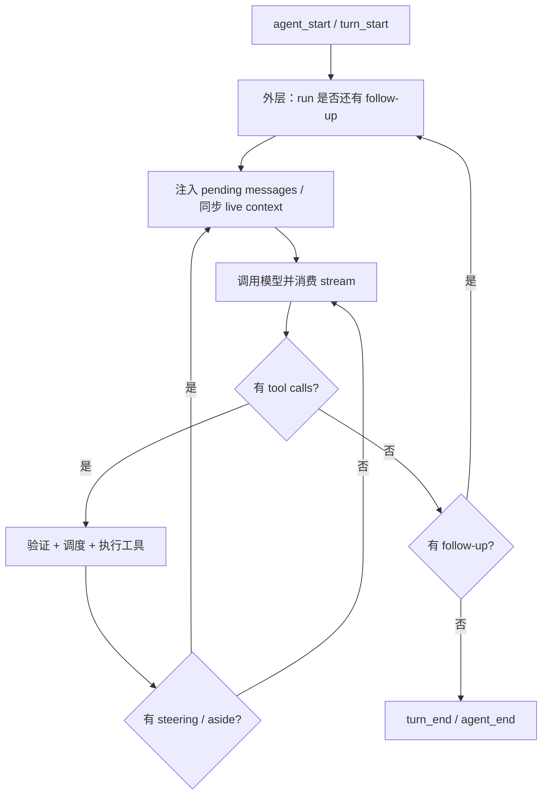

# 第 5 章　Agent Loop：真正转动的内核

> 一个 Agent 不是“调用一次模型”。它要持续接收流、执行工具、注入用户 steering、保证工具结果配对，并在正确时机决定继续还是交还控制权。

## 5.1 两个文件，两种责任

核心位于：

- [`packages/agent/src/agent.ts`](https://github.com/can1357/oh-my-pi/blob/v17.1.3/packages/agent/src/agent.ts)：有状态门面；
- [`packages/agent/src/agent-loop.ts`](https://github.com/can1357/oh-my-pi/blob/v17.1.3/packages/agent/src/agent-loop.ts)：一次 run 的纯执行流程。

`Agent` 持有长期状态：

- system prompt、model、thinking level、service tier；
- tools 与 messages；
- 当前 streaming/partial 状态；
- steering queue、follow-up queue；
- 当前 AbortController；
- listeners 与 hook；
- append-only provider context manager。

Agent Loop 接收一个快照式 `AgentLoopConfig` 和初始 messages，用 `EventStream` 输出过程事件。这样循环逻辑可以测试和复用，而 Agent 负责把事件折叠回当前状态。

## 5.2 先定义 run、turn 和 request

这三个词很容易混：

| 概念 | 边界 | 例子 |
| --- | --- | --- |
| run | 一次 `prompt()`/`continue()` 到最终交还控制 | 用户让修 bug，期间可能多次调用模型 |
| turn | 一个 assistant message 加其工具结果 | assistant 调 read，read result 属于同一 turn |
| request/step | 一次 provider chat 请求 | 工具结果后再次请求模型就是下一 step |

一个 run 可以有多个 turn；一个 turn 通常对应一次模型响应，但某些 provider/continue 路径还有更细的流事件。

Agent 事件集合把这些边界显式化：

```text
agent_start
  turn_start
    message_start/update/end   (assistant)
    tool_execution_start/update/end
    message_start/end          (toolResult)
  turn_end
  ...更多 turn...
agent_end
```

## 5.3 `prompt()` 与 `continue()` 的区别

`Agent.prompt()`：

1. 如果已经 streaming，直接拒绝；
2. 把输入规范化成 user message；
3. 启动 `#runLoop`。

`Agent.continue()` 用于没有新普通用户输入时继续：

- 处理已排队的 steering/follow-up；
- 从 assistant tail 或恢复后的上下文继续；
- 支持内部 auto-continue、retry、goal 等流程。

这避免伪造一条“空 user message”污染持久化历史和 provider cache。

## 5.4 双层循环

`runLoopBody()` 可以理解为两层循环：



内层解决“模型 ↔ 工具”的连续往返；外层解决“本来应该结束，但又有 follow-up”的新 turn。

## 5.5 每次模型请求前会重新同步什么

循环不是一直使用启动时快照。请求前可能执行：

- `syncContext`：让宿主更新 system prompt/tools 等 live 状态；
- `transformContext`：将 AgentMessage 转换或注入 steering 包装；
- `convertToLlm`：把 coding-agent 自定义消息变成 pi-ai `Message`；
- `transformProviderContext`：密钥混淆、图像限制、provider-specific 处理；
- `getToolChoice`：读取 session 的一次性 tool directive；
- `getApiKey`：为当前 model 取最新可用凭证；
- metadata/service tier/deadline 解析。

这就是为什么修改 active tools 或 model 可以在下一 step 生效，而无需重建 Agent 对象。

## 5.6 流事件如何变成一个 assistant message

pi-ai 输出 `AssistantMessageEvent`：

- `start`；
- `text_start/delta/end`；
- `thinking_start/delta/end`；
- `image_end`；
- `toolcall_start/delta/end`；
- `done` 或 `error`。

Agent Loop 把 provider partial 通过 `message_update` 继续向上游发出。事件里的 `partial` 是**当前完整累积消息**，不是只含本次 token 的 delta；UI 因此可以按最新快照渲染，不必自己重放 provider delta。

终结时：

- `done` 产生完整 assistant message；
- `error/aborted` 也产生结构化 assistant message，而不是只 throw 一个字符串；
- 这条消息随后进入上下文和持久化链。

## 5.7 工具调用的五道门

每个 tool call 依次经过：

1. **查找**：按内部 name、`customWireName`，再到 fallback resolver；
2. **验证**：用 Zod/ArkType/JSON Schema 验证参数；
3. **before hook**：审批/扩展可阻断；
4. **参数变换**：提取 intent、方言字段、内部 metadata；
5. **execute**：接受 AbortSignal 和 partial update callback；
6. **结果 coercion**：修复第三方结果形状；
7. **after hook**：允许扩展修改最终结果。

即便工具 throw，循环也尽量构造 `ToolResultMessage { isError: true }`。错误是对话的一部分，模型需要看见它才能恢复。

## 5.8 shared/exclusive 调度器

`AgentTool.concurrency` 可以是 `shared` 或 `exclusive`。多个 tool call 在同一 assistant message 中出现时，调度原则是：

- shared 等待前一个 exclusive，然后可以并行；
- exclusive 等待前一个 exclusive 和当前所有 shared；
- 下一个 shared 也必须排在这个 exclusive 之后。

```text
calls:  read(A)  grep(B)  edit(C)  read(D)
mode :  shared   shared   exclusive shared

time :  [ A ===== ]
        [ B === ]
                    [ C ==== ]
                               [ D === ]
```

这比简单 `Promise.all` 更安全：读操作可以并行，编辑/有状态工具可以声明串行屏障。也比“全部串行”更快。

## 5.9 工具结果配对是硬不变量

许多 provider 要求每个 tool call 后必须恰好出现匹配 result。现实中会发生：

- 用户中断；
- 工具不存在；
- 参数验证失败；
- before hook 阻断；
- 某工具执行后另一个被跳过；
- provider 给出坏 ID；
- 恢复时 transcript 尾部不完整。

Agent Loop 会为没执行的调用生成 synthetic result，例如“因用户 steering 而跳过”。对不可中断工具，若 steering 到达，它可以完成并保留真实结果；对 `interruptible` 工具则可 abort。

“每个 call 有 result”不是美观要求，而是保证下一次 provider 请求仍合法。

## 5.10 steering、follow-up 与 aside

### Steering

用户在 Agent 工作中途追加方向。它在工具批次边界被消费；循环每约 250ms 轮询，以便对可中断工具尽快 abort。steering message 带 `steering` 标记，送模型前可被强调包装，但 UI 不展示这个内部字段。

### Follow-up

当前 run 本可结束时才注入，相当于“做完后再处理这个”。它不打断当前工具链。

### Aside

后台系统产生的附加上下文，如 async job、MCP notification、late diagnostics。它们通过 session 的 yield/aside 通道批量进入合适边界，而不是任意改写正在发送的 provider context。

队列策略可为 `all` 或 `one-at-a-time`。一次只取一个能避免用户连续输入被合成一个难以区分的巨大 turn。

## 5.11 暂停、deadline 与继续上限

循环有多层保险：

- process-wide pause gate；
- run deadline；
- AbortSignal；
- paused-turn continuation 最多 8 次；
- soft tool-choice escalation 最多 3 次；
- AgentSession 的 stop hook continuation 也有上限。

为什么要给“继续”设上限？只靠 prompt 说“现在停下”并不可靠。扩展、goal、tool-choice 或模型都可能反复要求继续，必须在代码层防无限循环。

## 5.12 事件消费者不能拖住 Agent

`Agent.subscribe(listener)` 的 listener 返回 promise 时，Agent 不 await 它；拒绝会被记录。核心 loop 不能因为一个 UI、日志或扩展观察者慢而停止消费 provider stream。

需要影响控制流的逻辑必须走明确的 awaited hook（如 beforeToolCall、transformContext），不能偷偷放在普通观察 listener 里。

这把事件分成两类：

| 类型 | 语义 | 是否阻塞主流程 |
| --- | --- | --- |
| notification event | 展示、统计、日志 | 否 |
| decision hook | 变换、审批、阻断、替换 | 是 |

## 5.13 Harmony 与 owned dialect

某些模型不原生支持标准 function calling，或会把工具语法泄漏到普通文本。Agent Loop 支持：

- owned/in-band dialect：从模型文本中解析自己拥有的工具块；
- Harmony leak mitigation：阻止/修复工具通道语法泄漏；
- fallback tool：把未知工具名映射到 xdev/device；
- custom wire name：provider 看到 `apply_patch`，内部仍路由到 `edit`。

因此“工具调用”不总是 provider SDK 原生 event；进入 Agent Loop 后才统一成 `ToolCall`。

## 5.14 telemetry 在循环哪里接入

Agent core 能记录：

- 每次 chat 的 model/provider/token/cost/latency/stop reason；
- 每次 tool 的 name/status/latency；
- run 的 step count、错误、可用与实际调用工具覆盖；
- spans 与 warning。

这些钩子是可选的。没有 OTLP endpoint 时，CLI 不必为每个事件付出完整 exporter 成本。

## 5.15 调试 Agent Loop 的最小观察集

若出现“Agent 卡住/多跑/少跑”，先记录：

1. `agent_start/agent_end` 是否配对；
2. 每个 `turn_start/turn_end` 的 assistant stopReason；
3. tool call ID 与 tool result ID；
4. steering/follow-up 队列长度；
5. 当前 AbortSignal 和 deadline；
6. 是否有 extension stop hook 或强制 tool choice；
7. provider stream 是否发出 terminal event。

不要只看最终文本。循环 bug 通常存在于“最后一个正常文本之前”的控制事件。

## 5.16 本章小结

Agent Loop 的核心不变量是：

- 每个 run 有明确开始和结束；
- 每个 tool call 有且只有一个 provider-visible result；
- steering 在安全边界改变方向，follow-up 在结束边界继续；
- notification 不阻塞，decision hook 明确 await；
- shared/exclusive 调度既保留并行，又建立副作用屏障。

下一章看 Loop 最重要的外部依赖：[模型目录、鉴权与流式调用](./第06章-模型目录鉴权与流式调用.md)。
