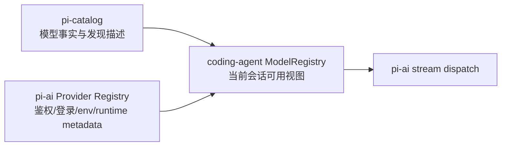

# 第 6 章　模型目录、鉴权与流式调用

> “支持很多模型”不只是写一个 base URL。系统要同时解决模型事实、运行时发现、凭证生命周期、协议分派、流式错误、重试安全和跨模型切换。

## 6.1 三个注册表，不是一个大对象

模型子系统有三层：



### Catalog

[`packages/catalog/src/models.json`](https://github.com/can1357/oh-my-pi/blob/v17.1.3/packages/catalog/src/models.json) 是生成快照，保存 model id、API、provider、base URL、能力、成本、context window、max tokens 等。

[`provider-models/descriptors.ts`](https://github.com/can1357/oh-my-pi/blob/v17.1.3/packages/catalog/src/provider-models/descriptors.ts) 是 provider 级事实源：默认模型、环境变量、动态 model manager、发现是否权威等。

### Provider registry

[`packages/ai/src/registry/registry.ts`](https://github.com/can1357/oh-my-pi/blob/v17.1.3/packages/ai/src/registry/registry.ts) 的 `ALL` 是单一 provider 定义列表。登录流程、env map、OAuth union、刷新 dispatch 等结构都从它派生，并用 TypeScript 类型检查覆盖 catalog 的 KnownProvider。

### Runtime ModelRegistry

[`packages/coding-agent/src/config/model-registry.ts`](https://github.com/can1357/oh-my-pi/blob/v17.1.3/packages/coding-agent/src/config/model-registry.ts) 合并：

- bundled catalog；
- 用户 `models.yml`；
- provider runtime discovery；
- auth 状态；
- path-scoped enabled/disabled 配置；
- extension 注册的 provider/model。

它回答的是“此刻这个 session 能选什么”。

## 6.2 为什么生成模型表不能手改

根 `AGENTS.md` 明确规定 `models.json` 是生成物。改模型应该定位到：

- id 解析/覆盖：provider resolver；
- provider 默认和 discovery：descriptor；
- 成本/fallback/fixup：generator；
- thinking policy：model-thinking；
- family/version 分类：identity classifier。

这是典型的 source-of-truth 分离：生成表方便启动和发布，但不应该承载维护意图。

## 6.3 模型选择不是精确字符串查表

用户可以提供：

- `provider/model`；
- bare model id；
- 模糊 pattern；
- role alias：`@smol`、`@slow`、`@plan`；
- thinking suffix；
- aggregator upstream routing。

`model-resolver` 结合 settings 的 match preferences 解析。若启动阶段找不到显式 pattern，也可能延迟到 extension load 之后再试，因为扩展可以注册 provider。

roles 把“任务意图”与具体 model 解耦：

| role | 常见用途 |
| --- | --- |
| `default` | 主会话 |
| `smol` | 标题、轻量任务、批量子代理 |
| `slow` | 深度推理 |
| `plan` | 计划模式 |
| `commit` | commit/changelog 等专门流程 |

role value 还可带 thinking level，解析时需要区分“模型默认 thinking”和“用户明确指定”。

## 6.4 AuthStorage：凭证是会变化的资源

凭证不只是一个 env string。运行时需要处理：

- env API key；
- SQLite 中的 OAuth/plan credential；
- 多 credential 轮转；
- session affinity；
- rate limit/backoff；
- token refresh；
- auth broker/gateway；
- runtime `--api-key` override；
- credential disabled 事件。

装配阶段只检查是否“配置了可用鉴权”，真正请求时调用 `modelRegistry.resolver(model, sessionId)`。这样每一步都能获得刷新后的 token，也能在一个 key 退避时换到另一个。

## 6.5 `stream()` 的分派顺序

统一入口在 [`packages/ai/src/stream.ts`](https://github.com/can1357/oh-my-pi/blob/v17.1.3/packages/ai/src/stream.ts)。高层顺序是：

1. Gemini thinking-loop guard；
2. provider in-flight limiter；
3. `streamDispatch()`；
4. 自定义 API registry；
5. GitLab/ADC/Bedrock 等特殊路径；
6. API key 解析；
7. 按 `model.api` 选择 provider adapter。

支持的 API family 包括：

- Anthropic Messages；
- OpenAI Completions/Responses/Codex Responses；
- Azure Responses；
- Google Generative AI/Gemini CLI/Vertex；
- Bedrock Converse Stream；
- Ollama chat；
- Cursor、Devin、GitLab agent 等特殊协议。

provider implementation 通过 `providers/register-builtins.ts` 懒注册，避免每个启动都加载全部 SDK 和协议代码。

## 6.6 `streamSimple()` 统一了什么

Agent 通常使用 simple options。`streamSimple()` 把统一参数映射为 provider-specific options：

- thinking budget/level；
- temperature/top-p/top-k/min-p；
- cache retention；
- service tier；
- tool choice；
- prompt cache key/session ID；
- websocket preference；
- deadline/AbortSignal；
- provider-specific metadata。

它还包裹 API key resolver 和 auth retry，使凭证轮换对上层 Agent Loop 透明。

## 6.7 为什么 auth retry 不能总是重放

流式请求有一个不可逆边界：一旦 assistant token/tool call 已经向调用者发出，重新发同一个请求可能让用户看到重复文本，甚至执行重复工具。

实现采用“安全重放窗口”：

- 初始 `start` 等事件可暂时缓冲；
- 若在任何有业务含义的内容逸出前遇到鉴权失败，可以换凭证重试；
- 一旦 replay-unsafe event 已交给消费者，就停止自动 credential replay。

```text
request A ── start(buffered) ── 401
             ↳ 可以换 key 重试

request B ── start ── text_delta("已") ── connection error
                       ↳ 已对外可见，不能静默整次重放
```

这是流式系统中最关键的 exactly-once 近似边界之一。

## 6.8 Provider 并发限制为什么用文件 lease

一个用户可能同时开多个 OMP 进程。进程内 semaphore 无法阻止总并发超过 provider 限制，因此 stream 层使用跨进程 filesystem lease 记录 in-flight slot。

设计需要处理：

- lease 获取与释放；
- 进程崩溃后的过期回收；
- provider/model 维度限制；
- AbortSignal 和等待 deadline。

它不是全局分布式锁，只解决同一用户机器上的多进程协调。

## 6.9 自定义 API 与 pi-native

Extension 可以注册 custom API stream function，并按 source 注销。dispatch 先查自定义 registry，使新 provider 不必修改核心 switch。

`pi-native` transport 更进一步：客户端把统一 context 交给 gateway，provider 与 credential 由服务端解析，因此跳过本地常规 provider dispatch。这条路径也说明“Model.provider”与真正上游可能不同。

## 6.10 Aggregator 与 upstream provider

模型消息同时可能记录：

- `provider`：实际调用的配置 gateway，如 `openrouter`；
- `upstreamProvider`：gateway 报告的真实上游，如 `Anthropic`。

成本、服务等级、统计和错误归因不能把两者混在一起。切换 gateway 但仍走同一上游，与切换模型家族是不同事件。

## 6.11 Service tier 是按模型家族存的

`ServiceTierByFamily` 是：

```ts
Partial<Record<"openai" | "anthropic" | "google", ServiceTier>>
```

这样用户可以让 OpenAI 走 priority，而切到 Anthropic 时保持默认。每个请求通过 `serviceTierFamily(model)` 只取相关家族的设置。

不同 provider 对 tier 的实现不同：

- OpenAI family 可能发送 `service_tier`；
- Google/Vertex 支持的值不同；
- 直接 Anthropic 的 priority 映射为 fast mode；
- 某些 aggregator 或 provider 会忽略/拒绝；
- 不真正实现 priority 的请求不能被算成 premium request。

统一枚举不代表 wire 行为完全相同。

## 6.12 Prompt cache 与 append-only context

provider cache 对“消息前缀字节是否稳定”非常敏感。OMP 同时维护：

- `providerPromptCacheKey`，可由显式设置、fork 继承或 session 生成；
- `AppendOnlyContextManager`，在适合的 model/provider 上保留稳定序列化前缀；
- system prompt rebuild 规则；
- 避免被动 auto-learn 在对话中插入隐藏消息。

fork 若改变 model、thinking、system prompt 或 tools，会被视为 cache shape 改变，不沿用旧 key。

## 6.13 错误也要统一成可计算数据

`AssistantMessage` 中不只有 `errorMessage`，还有：

- `errorStatus`；
- `errorId` 结构化分类；
- `stopReason`；
- `disabledFeatures`；
- `retryRecovery`；
- duration/ttft/usage。

AgentSession 的 retry/overflow/fallback 不应靠正则解析一段自然语言错误。provider adapter 的责任是尽早把错误变成稳定字段。

## 6.14 预连接与预热

模型确定后，SDK 会 fire-and-forget 预连接 model host，让 TLS/H2 handshake 与工具、skills、prompt 构建重叠。Codex websocket 若适用，也会在 session 创建后预热。

预热失败只记 debug，不阻断正常 HTTP fallback。预热属于性能优化，不能成为正确性依赖。

## 6.15 模型问题的排查顺序

1. Catalog 是否有这个 model，字段是否正确？
2. Runtime ModelRegistry 是否因 path scope/disabled provider 过滤？
3. 是否存在 configured auth？
4. resolver 在请求时拿到了哪一个 credential？
5. `model.api` dispatch 到哪个 adapter？
6. context 转换后是否仍包含 provider 不接受的字段？
7. stream 是否在 terminal event 前断开？是否已经越过安全重放边界？
8. 错误分类是否触发错误的 retry/overflow 分支？

## 6.16 本章小结

模型系统的稳定性来自职责拆分：catalog 管事实，provider registry 管鉴权元数据，ModelRegistry 管当前可用集合，stream adapter 管协议。流式重试必须尊重“内容是否已经逸出”的不可逆边界。

下一章看统一消息如何在这些协议间保持形状：[消息、方言与跨 Provider 回放](./第07章-消息方言与跨Provider回放.md)。
