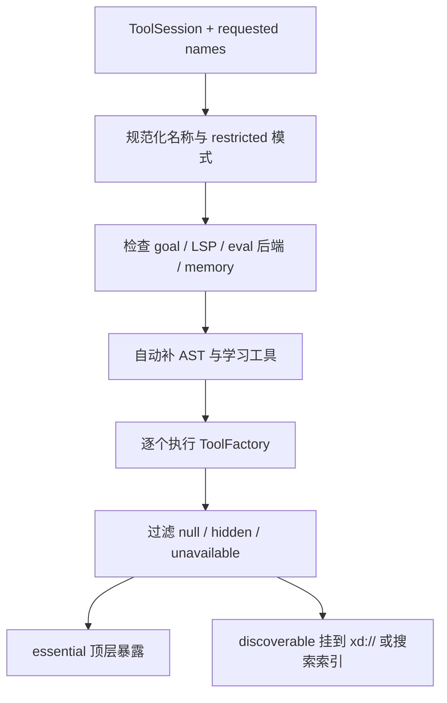
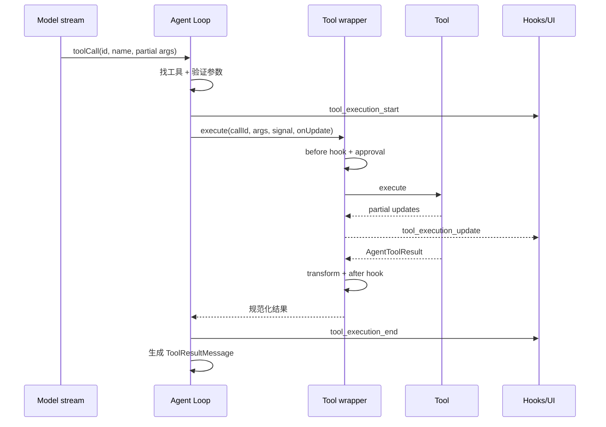

# 第 8 章　工具注册、调度与审批

> 模型只是在“建议调用工具”。真正决定工具是否存在、能否并发、是否要问用户、怎样失败并回到对话里的，是 Agent 运行时。

## 8.1 工具不是一个回调函数

工具的公共契约定义在 [`packages/agent/src/types.ts`](https://github.com/can1357/oh-my-pi/blob/v17.1.3/packages/agent/src/types.ts)。一项 `AgentTool` 至少同时服务四个消费者：

1. provider 需要 `name`、`description` 和参数 schema；
2. Agent Loop 需要 `execute()`、并发和中断语义；
3. 审批层需要能力等级和人类可读说明；
4. TUI 需要调用、增量结果和终态的 renderer。

因此它的元数据远比普通 function calling 丰富：

| 字段 | 回答的问题 |
| --- | --- |
| `label` | UI 怎样称呼它？ |
| `hidden` | 默认工具集是否隐藏？ |
| `loadMode` | 顶层暴露还是按需发现？ |
| `summary` | 工具搜索索引如何概括它？ |
| `concurrency` | 多个调用能否同时执行？ |
| `lenientArgValidation` | schema 错误是否仍可把原始参数交给工具？ |
| `interruptible` | steering 到来时能否安全中止？ |
| `intent` | 是否给模型注入意图字段 `i`？ |
| `matcherDigest/Paths/Entries` | 流式参数怎样交给 TTSR 匹配？ |
| `approval` | 属于 read/write/exec，或按参数动态判断？ |
| `formatApprovalDetails` | 审批框中展示什么？ |
| `renderCall/renderResult` | TUI 如何渲染？ |

这说明“工具协议”其实是执行、权限、提示词和 UI 的交叉边界。

## 8.2 规范化内建工具表

[`packages/coding-agent/src/tools/builtin-names.ts`](https://github.com/can1357/oh-my-pi/blob/v17.1.3/packages/coding-agent/src/tools/builtin-names.ts) 给出 28 个可见规范名：

```text
read bash edit ast_grep ast_edit ask debug eval github glob grep lsp
inspect_image browser computer checkpoint rewind task hub todo web_search
write memory_edit retain recall reflect learn manage_skill
```

另有两个隐藏工具：

- `yield`：子代理结构化交付；
- `goal`：目标模式的内部工具。

`search → grep`、`find → glob` 仍作为旧名称别名接受，但进入内部后会规范化。这很重要：配置、提示词、事件和 session replay 不应长期承载多套同义 ID。

根 README 所称“32 个工具”描述的是更宽的产品能力表面；这里的 28+2 是当前源码里 `BUILTIN_TOOL_NAMES` 与 `HIDDEN_TOOL_NAMES` 的静态注册事实，统计口径不同。

## 8.3 `createTools()` 是第一层筛选

真正的工厂在 [`packages/coding-agent/src/tools/index.ts`](https://github.com/can1357/oh-my-pi/blob/v17.1.3/packages/coding-agent/src/tools/index.ts) 的 `createTools()`。



它不是把 registry 全部 `new` 出来，而会参考：

- 显式 `--tools` 与 `restrictToolNames`；
- 是否要求 `yield`；
- goal mode 是否启用；
- LSP、AST、browser、computer 等设置；
- JS/Python/Ruby/Julia eval 后端是否可达；
- memory backend；
- `autolearn.enabled` 与当前 `taskDepth`；
- 子代理的允许深度和能力裁剪；
- 某个 factory 的运行时 preflight。

例如显式工具列表包含 `grep`，且 `astGrep.enabled` 打开，顶层非 restricted 会话可自动加入 `ast_grep`；但 restricted caller 自己拥有边界，工厂不会擅自扩宽它。

## 8.4 `ToolSession` 为什么是晚绑定接口

`ToolSession` 不是完整 `AgentSession`，而是工具可使用的能力集合。它包含 cwd、settings、model、session manager、artifact manager、LSP、MCP、registry、计划状态、记忆状态，以及向宿主排队消息的回调。

晚绑定解决一个装配环：

```text
AgentSession 需要 tools 才能构造
tools 又需要在执行时回调 AgentSession
```

`createAgentSession()` 先构造一个带闭包/引用槽的 `ToolSession`，创建工具和 Agent，最后再把真实宿主引用接回去。工具依赖的是最小接口，不是偷偷抓全局 singleton。

## 8.5 essential 与 discoverable

`loadMode` 把“是否启用”和“怎样展示”拆开：

- `essential`：以正常顶层 tool schema 发送给 provider；
- `discoverable`：从每次请求的顶层 schema 移走，通过 `xd://` 设备或 BM25 工具搜索按需发现。

这不是单纯的 UI 整理，而是上下文预算策略。几十个复杂 schema 每轮都出现，会增加 token、降低模型选对工具的概率，还可能破坏 prompt cache 稳定性。

[`packages/coding-agent/src/tools/xdev.ts`](https://github.com/can1357/oh-my-pi/blob/v17.1.3/packages/coding-agent/src/tools/xdev.ts) 中的 `XdevRegistry` 把可挂载工具变成设备地址。模型可以先读设备说明，再通过 `write xd://<tool>` 提交 JSON 参数。

这里有一个关键安全细节：设备写入不能只按外层 `write` 的等级审批。`WriteTool.approval()` 会解析目标设备并取被挂载工具自己的动态 approval，防止把 exec 工具藏进 write 通道降权。

## 8.6 从模型调用到执行结果

工具调用在 [`packages/agent/src/agent-loop.ts`](https://github.com/can1357/oh-my-pi/blob/v17.1.3/packages/agent/src/agent-loop.ts) 里走过以下阶段：



其中 wrapper 由 SDK 装配，保证即便没有任何用户扩展，审批逻辑也仍然包住每个工具。源码在 [`packages/coding-agent/src/sdk.ts`](https://github.com/can1357/oh-my-pi/blob/v17.1.3/packages/coding-agent/src/sdk.ts) 特别留下了这条约束，避免“只有加载扩展时才启用 wrapper”的条件错误。

## 8.7 参数验证与失败语义

模型给出的参数天然不可信。循环会：

1. 解析流式 JSON；
2. 按工具 schema 校验；
3. 在普通工具上把校验失败变成工具错误结果；
4. 仅当 `lenientArgValidation` 开启时，把原始参数交给工具自救；
5. 捕获异常并规范化为 `ToolResultMessage`。

失败通常不能直接让整轮历史断裂。只要 assistant 已经发出 tool call，就必须有同 ID 的 result；否则下一次 provider 请求可能因悬空调用被拒绝。因此循环会为未执行、被跳过、同批调用受前一错误影响等情况合成占位结果。

这条不变量可以写成：

```text
∀ assistant.toolCall(id)，送往下一轮的上下文中恰有一个 toolResult(id)
```

第 7 章里的消息修复是历史入口的兜底；本章执行器则尽量从源头不制造坏配对。

## 8.8 并发调度不是简单 `Promise.all`

同一 assistant message 可以产生多个 tool call。每个工具声明：

- `shared`：可与其他 shared 调用并行；
- `exclusive`：必须独占；
- 动态函数：根据原始参数决定。

调度器保留模型给出的调用顺序，同时按屏障切批。可以把它想成读写锁：连续 shared 形成并行段，exclusive 前后都要等边界清空。

适合 shared 的通常是只读搜索、互不相关的等待；编辑同一 workspace、终端交互或修改全局会话状态的工具往往需要更保守的语义。最终声明仍以各工具源码为准，不能仅凭名字推断。

## 8.9 steering 与工具中断

用户在模型/工具仍运行时发送新要求，消息会进入 steering 队列。循环约每 250ms 检查一次：

- 对 `interruptible: true` 的纯等待型工具，可发出 scoped abort；
- 对可能留下半个副作用的工具，不会为了抢响应而硬切断；
- 已完成结果仍然持久化，然后在下一次模型调用前注入 steering。

`interruptible` 的注释明确要求它只用于正确观察 `AbortSignal` 的等待操作。把一个文件写入工具标成可中断，会把“更及时”换成“磁盘状态不确定”，是错误优化。

## 8.10 三层能力等级

审批的基础等级定义在 agent core：

| tier | 含义 | 典型例子 |
| --- | --- | --- |
| `read` | 观察状态，不应修改 workspace/进程 | glob、只读 LSP、读取调试状态 |
| `write` | 修改 workspace 或受控产品数据 | write、edit、技能管理 |
| `exec` | 执行命令、控制进程/设备、广义外部副作用 | bash、eval、browser、调试运行 |

省略 `approval` 不等于安全，而是按 `exec` 处理。这是 fail-closed 的默认值。

声明还可以返回对象：

```ts
{ tier: "exec", reason, override: true, policy: "prompt" }
```

也可以是按参数计算的函数。比如 `debug` 的状态查询可为 read，而 launch、continue、断点修改和 memory write 为 exec；`bash` 会结合命令模式规则动态判断。

## 8.11 审批决策顺序

[`packages/coding-agent/src/tools/approval.ts`](https://github.com/can1357/oh-my-pi/blob/v17.1.3/packages/coding-agent/src/tools/approval.ts) 的 `resolveApproval()` 按以下信息合成最终 `allow | prompt | deny`：

1. 工具自己的动态 decision，缺省 tier 为 exec；
2. 用户 `tools.approval.<tool>` 的 allow/prompt/deny；
3. 当前 `tools.approvalMode` 对 tier 的默认覆盖；
4. 工具是否声明强制 `override` 或显式 policy。

三种模式可以概括为：

| 模式 | 默认自动批准 |
| --- | --- |
| always ask | read |
| write | read + write |
| yolo | read + write + exec |

注意两个细节：

- 工具或用户的 `deny` 始终能阻断；
- yolo 会忽略仅由 `override` 产生的强制提示，但工具显式 `policy` 和用户显式策略仍参与决策。

因此 yolo 是“默认放行全部 tier”，不是把策略系统整个删除。

## 8.12 特殊安全门

有些风险不能只靠通用 tier 表达。

### Bash

[`packages/coding-agent/src/tools/bash.ts`](https://github.com/can1357/oh-my-pi/blob/v17.1.3/packages/coding-agent/src/tools/bash.ts) 支持有序命令匹配规则，并对 shell control 语法保持谨慎。用户的 allow pattern 不能轻易被字符串拼接、重定向或复合命令拿来绕过。

### Computer

[`packages/coding-agent/src/tools/computer.ts`](https://github.com/can1357/oh-my-pi/blob/v17.1.3/packages/coding-agent/src/tools/computer.ts) 会处理 provider 发回的 pending safety checks。涉及输入动作时必须显式互动批准；无 UI 的 headless 环境不能假装“同意”，而是失败关闭。

### MCP

MCP 工具名带 `mcp__<server>_<tool>` 前缀。未声明 tier 时不会因为来自协议服务器就被信任；审批提示还会标明来源。MCP bridge 默认把它们视为会产生外部写入的能力，详见第 13 章。

### 子代理

子代理通常以 headless/yolo 运行，因为它不能自己弹批准框。但父代理发出的 `task` 已经是一次授权边界，且子代理仍受工具白名单、深度、workspace 隔离和显式 deny policy 约束。不能把“无 UI”误读为“无限权限”。

## 8.13 输出为什么要截断并落 artifact

工具输出若原样塞回上下文，`grep` 一次命中几万行就能挤掉所有推理历史。工具结果会应用字符/行数/字节预算，并可把完整内容交给 [`packages/coding-agent/src/session/artifacts.ts`](https://github.com/can1357/oh-my-pi/blob/v17.1.3/packages/coding-agent/src/session/artifacts.ts) 保存。

模型看到的是：

- 足够继续判断的摘要或头尾；
- 截断说明；
- 必要时可再次读取的 artifact 地址。

这比单纯 truncate 更完整：大结果从“对话正文”降级为“可寻址外部对象”，既保住上下文，也没有静默丢掉证据。

## 8.14 调试工具系统的落点

| 现象 | 首先检查 |
| --- | --- |
| 工具没出现在模型请求里 | `createTools()` 的 gate、`loadMode`、active tool names |
| 工具能发现但不能直接调用 | `XdevRegistry` 与 discoverable 配置 |
| 参数明明合法却失败 | provider schema 转换、intent 字段、validation 错误文本 |
| 不该弹框却弹框 | 工具动态 `approval(args)`、mode、用户策略 |
| yolo 中仍被拦截 | 工具/用户显式 deny 或安全专门门 |
| 一批调用看似串行 | `concurrency` 是否产生 exclusive 屏障 |
| steering 要等很久 | 工具是否故意 non-interruptible |
| 后续 provider 报 tool pairing 错 | 是否为每个 call 生成了 result |
| 输出消失 | 检查 artifact 地址和输出预算，而非只看 TUI 摘要 |

## 8.15 本章小结

Oh My Pi 的工具系统有四层保护：工厂决定“是否存在”，load mode 决定“怎样呈现”，Agent Loop 决定“怎样调度”，wrapper/approval 决定“能否执行”。工具结果再经过配对、截断和 artifact 化回到上下文。

下一章进入几个最能体现工程取舍的具体工具：[第 9 章：文件、Hashline、LSP、DAP 与 Eval](./第09章-编码工具纵深-文件HashlineLSPDAP与Eval.md)。
