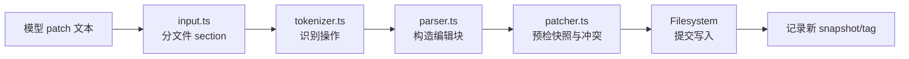
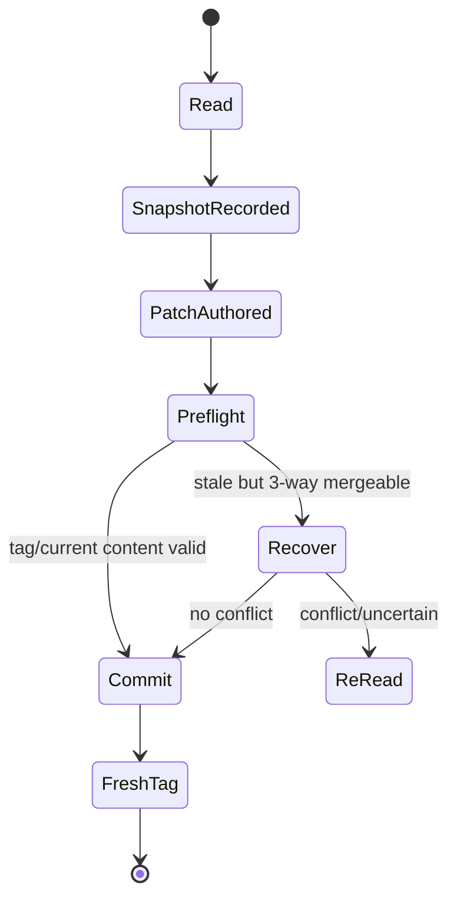
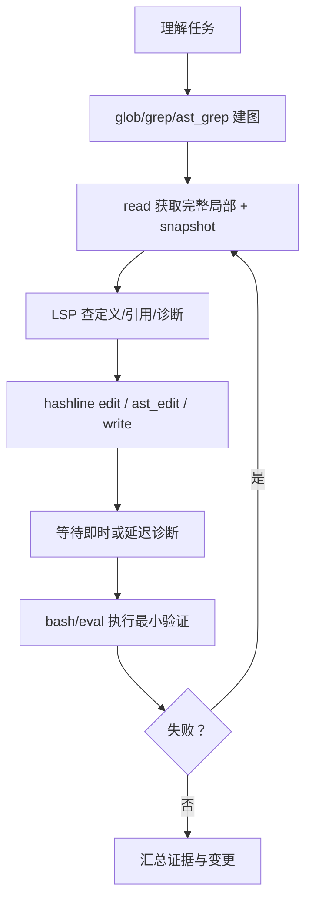

# 第 9 章　编码工具纵深：文件、Hashline、LSP、DAP 与 Eval

> “会读、会改、会跑命令”只是表面。可靠编码代理必须处理文件过期、超大输出、长驻进程、编辑器协议、调试器状态和可重入计算环境。

## 9.1 `read` 是统一资源读取器

[`packages/coding-agent/src/tools/read.ts`](https://github.com/can1357/oh-my-pi/blob/v17.1.3/packages/coding-agent/src/tools/read.ts) 的职责远超 `fs.readFile()`。它要识别并路由：

- 普通文本文件与目录；
- 压缩包/归档；
- SQLite 数据库；
- notebook、文档与 PDF；
- 图像；
- Web URL；
- Agent 内部 URL。

调用者仍只使用一个 read schema，内部根据 path、selector、MIME 和可用后端选择 renderer。统一入口的收益是模型无需先猜资源类型；风险则是权限判断也必须在路由前完成，不能等 URL 展开后才发现它指向 SSH 或内部设备。

## 9.2 内部 URL 把运行时变成可寻址文件系统

[`packages/coding-agent/src/internal-urls/index.ts`](https://github.com/can1357/oh-my-pi/blob/v17.1.3/packages/coding-agent/src/internal-urls/index.ts) 及相关 resolver 支持一组虚拟 scheme，例如：

```text
agent:// artifact:// history:// issue:// local:// mcp:// memory://
omp:// pr:// rule:// skill:// vault://
```

其设计意义是把“读取某种运行时对象”统一成地址，而不是给 read 不断添加布尔参数。技能正文、MCP resource、历史、artifact、记忆都可以延迟展开。

但虚拟地址不是绕过边界的后门。每个 resolver 要做 canonical path、scope 和访问策略检查；同名 scheme 冲突也需要稳定优先级。第 18 章会把这一层放回完整信任模型。

## 9.3 大文件读取的三个目标

read 同时追求：

1. 模型能定位内容——带行号、范围和截断标记；
2. 后续 edit 有可靠锚点——Hashline snapshot；
3. UI 不必反向解析模型文本——details 中保存结构化展示数据。

因此“模型收到的文本”和“TUI 展示的结构”不是同一对象。源码中多处刻意给 renderer 保留无 hashline 前缀、无模型提示噪声的内容，避免 UI 依赖脆弱的文本正则。

## 9.4 Hashline 解决了什么

传统搜索替换常遇到两个失败：

- 目标片段重复，替错位置；
- 模型读取后文件已被用户或另一个代理修改，旧补丁覆盖新内容。

Hashline 把一次读取绑定到内容快照。read/search 输出文件头：

```text
[src/app.ts#7A2F]
12:export function start() {
13:  return boot();
14:}
```

`TAG` 不是可由模型随意猜测的行号，而是 [`packages/hashline/src/snapshots.ts`](https://github.com/can1357/oh-my-pi/blob/v17.1.3/packages/hashline/src/snapshots.ts) 管理、与精确文件内容绑定的快照标签。协议说明嵌在 [`packages/hashline/src/prompt.md`](https://github.com/can1357/oh-my-pi/blob/v17.1.3/packages/hashline/src/prompt.md)。

## 9.5 Hashline 编辑语言

Hashline 使用面向块的操作，而不是 unified diff。核心操作包括：

- `SWAP`：替换范围；
- `DEL`：删除；
- `INS`：在锚点插入；
- `MV`：移动文件；
- `REM`：删除文件。

解析链位于 `packages/hashline/src/`：



`apply_patch` sentinel、unified diff `@@ -...` 等形态会被明确拒绝，而不是“尽量猜”。严格语法让错误更早、更可解释。

## 9.6 为什么要先全量预检再落盘

一个 patch 可以包含多个文件 section。patcher 在真正修改前会验证：

- 每个文件只有一个有效 section；
- section 带当前 snapshot tag；
- tag 指向的快照与路径关系合法；
- live content 是否仍匹配；
- 操作范围和块解析无冲突；
- move/remove 目标不会互相踩踏。

若边解析边写，第 3 个文件失败时前两个已经变更，用户得到半个事务。预检把大部分失败推到 commit 前。它不是数据库式强原子事务，但显著缩小了“半应用”窗口。

## 9.7 过期锚点与恢复

[`packages/hashline/src/mismatch.ts`](https://github.com/can1357/oh-my-pi/blob/v17.1.3/packages/hashline/src/mismatch.ts) 表达 snapshot 不匹配。编码层还保存 base snapshot，可在满足条件时做三方恢复：

```text
base：模型读取时的内容
ours：模型想生成的内容
theirs：当前磁盘内容
```

如果改动不冲突，可以重放到 live file；若无法证明安全，就要求重新读取。原则是“宁可让模型再看一遍，也不拿旧坐标静默覆盖新内容”。

Hashline 的完整闭环是：



## 9.8 `write` 与 Hashline 的关系

新文件使用 [`packages/coding-agent/src/tools/write.ts`](https://github.com/can1357/oh-my-pi/blob/v17.1.3/packages/coding-agent/src/tools/write.ts)，现有文件的精确改动交给 edit。write 仍会：

- 识别模型误复制的 `[PATH#TAG]` 与行号前缀；
- 在 Hashline 模式下谨慎剥离展示噪声；
- 写完记录新 snapshot，并返回 fresh header；
- 对 `xd://` 路径转交设备，同时沿用设备本身的审批等级。

这保证模型即便刚创建文件，也能在下一次 edit 使用当前 tag。

## 9.9 Bash 是长驻 shell，不是一次性 `exec`

[`packages/coding-agent/src/tools/bash.ts`](https://github.com/can1357/oh-my-pi/blob/v17.1.3/packages/coding-agent/src/tools/bash.ts) 与 [`packages/coding-agent/src/session/bash-runner.ts`](https://github.com/can1357/oh-my-pi/blob/v17.1.3/packages/coding-agent/src/session/bash-runner.ts) 共同提供：

- 持久 shell 状态；
- PTY 与交互命令；
- 当前客户端 terminal 接管；
- 后台 job；
- 流式输出；
- timeout/abort；
- 过量输出落 artifact；
- 命令审批与安全模式规则。

持久性意味着一次 `cd`、环境设置或启动服务可影响后续调用；也意味着 session 生命周期必须负责清理进程，而不能把它当纯函数。

[`packages/coding-agent/src/tools/bash-interceptor.ts`](https://github.com/can1357/oh-my-pi/blob/v17.1.3/packages/coding-agent/src/tools/bash-interceptor.ts) 还会识别某些明显应该交给专门工具的命令。专用工具能给出结构化输出、正确审批和更好的上下文预算，而 shell 文本很难做到。

## 9.10 后台任务与结果回流

长命令不能占住整条 Agent Loop。异步 job manager 会给任务分配 handle，工具可先返回状态，之后把完成结果通过 session 的 yield/async delivery 队列送回。

这形成两条时间线：

```text
前台 turn：启动任务 → 得到 job id → 继续推理
后台 job：运行 → 更新 → 完成 → 排队成为后续上下文
```

结果注入前还要做 stale 检查，避免旧 job 在用户已经换分支/重启 session 后突然污染当前推理。

## 9.11 Eval 是有状态计算内核

[`packages/coding-agent/src/tools/eval.ts`](https://github.com/can1357/oh-my-pi/blob/v17.1.3/packages/coding-agent/src/tools/eval.ts) 可以选择 JS、Python、Ruby、Julia 后端。与 bash 不同，它强调“cell”语义：

- 变量可跨调用保留；
- 返回值/展示对象结构化捕获；
- 每个语言有 prelude；
- 后端在第一次使用时检查可达性；
- 运行时与宿主之间有协议桥。

后端实现位于 [`packages/coding-agent/src/eval/`](https://github.com/can1357/oh-my-pi/tree/v17.1.3/packages/coding-agent/src/eval/)。JS 可在 worker/process 中隔离；Python/Ruby/Julia 使用各自 kernel/runner。

## 9.12 Eval 可以重新进入 Agent 能力

prelude 不只提供漂亮打印，还能通过 bridge：

- 调用允许的工具；
- 请求一次 completion；
- 启动受约束的 agent 计算；
- 把 host concurrency/预算传进去。

关键入口包括：

- [`eval/agent-bridge.ts`](https://github.com/can1357/oh-my-pi/blob/v17.1.3/packages/coding-agent/src/eval/agent-bridge.ts)；
- [`eval/completion-bridge.ts`](https://github.com/can1357/oh-my-pi/blob/v17.1.3/packages/coding-agent/src/eval/completion-bridge.ts)；
- [`eval/js/tool-bridge.ts`](https://github.com/can1357/oh-my-pi/blob/v17.1.3/packages/coding-agent/src/eval/js/tool-bridge.ts)；
- [`eval/budget-bridge.ts`](https://github.com/can1357/oh-my-pi/blob/v17.1.3/packages/coding-agent/src/eval/budget-bridge.ts)。

这是“代码调用 Agent”，不是只有“Agent 调代码”。为防止 host 调用消耗被误算作 cell 卡死，bridge timeout 会在宿主调用期间暂停/调整本地等待预算。

子代理可复用相同 eval session ID，所以它们能共享 notebook 式计算状态；这也要求状态归属和清理跟随生命周期管理器，而不是某个临时 Tool 实例。

## 9.13 LSP 把语义编辑器能力交给模型

[`packages/coding-agent/src/lsp/types.ts`](https://github.com/can1357/oh-my-pi/blob/v17.1.3/packages/coding-agent/src/lsp/types.ts) 定义 14 类 action：

```text
diagnostics definition references hover symbols rename rename_file
code_actions type_definition implementation status reload capabilities request
```

LSP 的价值在于把“字符串搜索”升级为“语言语义”：定义、引用、类型、workspace edit 和诊断都由语言服务器解释。

[`packages/coding-agent/src/lsp/client.ts`](https://github.com/can1357/oh-my-pi/blob/v17.1.3/packages/coding-agent/src/lsp/client.ts) 管协议和进程；[`lsp/config.ts`](https://github.com/can1357/oh-my-pi/blob/v17.1.3/packages/coding-agent/src/lsp/config.ts) 解析配置；[`lsp/edits.ts`](https://github.com/can1357/oh-my-pi/blob/v17.1.3/packages/coding-agent/src/lsp/edits.ts) 应用 workspace edits。

## 9.14 延迟诊断为什么需要 ledger

保存文件后，语言服务器未必立即返回诊断。若 edit 工具为了等它而永久阻塞，交互会很慢；若立刻结束，错误又可能丢失。

[`packages/coding-agent/src/lsp/deferred-diagnostics.ts`](https://github.com/can1357/oh-my-pi/blob/v17.1.3/packages/coding-agent/src/lsp/deferred-diagnostics.ts) 与 [`diagnostics-ledger.ts`](https://github.com/can1357/oh-my-pi/blob/v17.1.3/packages/coding-agent/src/lsp/diagnostics-ledger.ts) 把晚到结果排队，经 session yield 注入下一段上下文。注入时检查文件版本/状态，旧诊断不会覆盖新编辑事实。

## 9.15 DAP 是一个有状态调试会话

[`packages/coding-agent/src/tools/debug.ts`](https://github.com/can1357/oh-my-pi/blob/v17.1.3/packages/coding-agent/src/tools/debug.ts) 暴露 28 个动作：

```text
launch attach set_breakpoint remove_breakpoint
set_instruction_breakpoint remove_instruction_breakpoint
data_breakpoint_info set_data_breakpoint remove_data_breakpoint
continue step_over step_in step_out pause evaluate stack_trace threads
scopes variables disassemble read_memory write_memory modules loaded_sources
custom_request output terminate sessions
```

底层 [`packages/coding-agent/src/dap/`](https://github.com/can1357/oh-my-pi/tree/v17.1.3/packages/coding-agent/src/dap/) 管 adapter、协议 client 和多个调试 session。launch/attach 之后的 breakpoint、continue、stack 等都针对持久状态，调用顺序本身就是协议的一部分。

## 9.16 调试动作的动态权限

只读动作集合在 debug 工具中明确列出：

```text
output threads stack_trace scopes variables disassemble read_memory
loaded_sources modules sessions
```

它们可按 read tier 处理。launch、attach、continue、step、pause、evaluate、断点变更、write_memory、terminate 等是 exec。权限跟动作参数走，而不是笼统地给整个 debug 工具一个固定等级。

这正是第 8 章 `approval(args)` 设计的现实用途。

## 9.17 AST 工具与文本工具互补

`ast_grep` / `ast_edit` 不是 `grep` / `edit` 的升级替代，而是另一种坐标系：

- 文本工具适合任意格式、精确字节与未知语言；
- AST 工具适合结构匹配、语法节点替换和跨格式空白；
- LSP 适合项目语义、定义/引用与语言服务器支持的 refactor。

可靠代理会按证据需求选择坐标系：先用 LSP 找语义位置，用 read 获取当前内容与 Hashline 锚点，再用 edit 提交最小改动；或在结构模式明确时用 AST edit。

## 9.18 一次可靠代码修改的推荐闭环



这条闭环的核心不是工具数量，而是每一步产出下一步能验证的锚点。

## 9.19 调试落点

| 现象 | 源码入口 |
| --- | --- |
| read 类型识别错误 | `tools/read.ts` 的路径/selector 路由 |
| edit 报 snapshot stale | `packages/hashline/src/patcher.ts`、`mismatch.ts` |
| patch 部分应用 | 检查 preflight 与 filesystem commit 边界 |
| shell 状态丢失 | `session/bash-runner.ts` 与 runner 生命周期 |
| 后台结果迟到污染 | async delivery 的 stale/version gate |
| eval 变量不共享 | eval session id、context manager、worker ownership |
| LSP 修改后没有诊断 | deferred diagnostics ledger 与 server 状态 |
| debug 操作找不到 session | `dap/session.ts` 与 adapter launch/attach 状态 |
| 只读 debug 仍需 exec | action 是否在 `DEBUG_READONLY_ACTIONS` |

## 9.20 本章小结

Oh My Pi 的编码工具共同维护三个东西：地址、版本和生命周期。read 给内容加可复用地址与快照；Hashline 拒绝旧版本覆盖；bash/eval/LSP/DAP 把长驻进程变成受 session 管理的状态机。

下一章解释这些工具为什么能拿到恰当的项目知识：[第 10 章：上下文工程与能力发现](./第10章-上下文工程与能力发现.md)。
