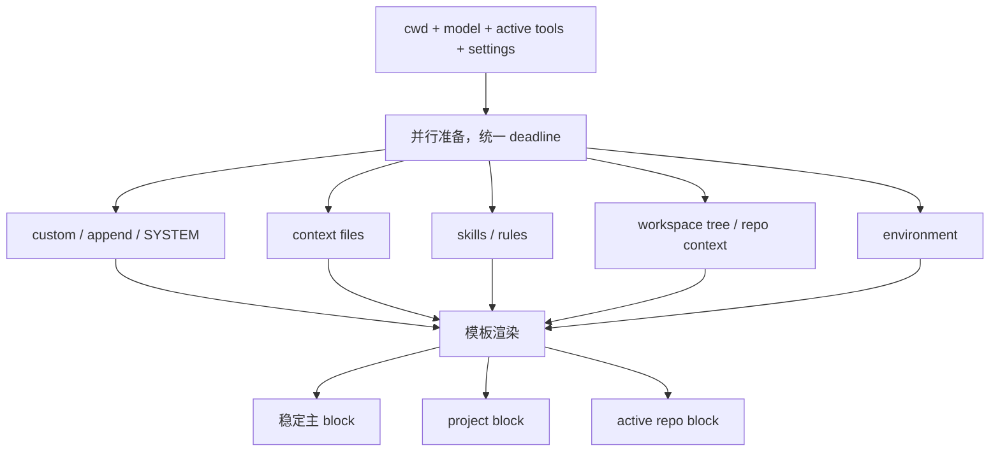
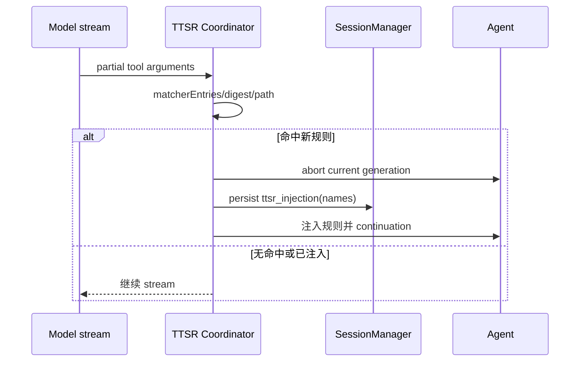

# 第 10 章　上下文工程与能力发现

> 一个编码 Agent 的“聪明程度”很大一部分取决于：在正确时刻，让模型看到正确规则；不是把仓库里所有文字一次性塞进 prompt。

## 10.1 Discovery 是兼容层，不只是找文件

[`packages/coding-agent/src/discovery/index.ts`](https://github.com/can1357/oh-my-pi/blob/v17.1.3/packages/coding-agent/src/discovery/index.ts) 通过 import 注册所有 capability provider。它能理解多套生态约定：

- Oh My Pi 原生 `.omp` / 用户目录；
- Claude；
- Codex；
- Gemini；
- OpenCode；
- Cursor、Windsurf、Cline；
- GitHub/Copilot；
- VS Code；
- `.agents` / `AGENTS.md`；
- OMP/Claude plugin；
- MCP JSON 与 SSH。

目标不是把所有文件拼成一坨，而是先翻译为统一 capability item，再按来源、优先级、层级和内容去重。

## 10.2 十二类能力

Discovery 首先注册这些 capability 类型：

```text
context-file  extension  extension-module  hook  instruction  mcp
prompt  rule  settings  skill  slash-command  ssh  system-prompt  tool
```

它们的生命周期不同：

| 能力 | 典型消费时机 |
| --- | --- |
| context file | 构建 project prompt |
| system prompt | 替换主系统提示词块 |
| rule | 启动时、工具流匹配或按需读取 |
| skill | 只注入目录，正文按需读 |
| prompt/slash command | 用户触发输入展开 |
| extension/hook/tool | 装配运行时代码 |
| MCP | 建连接后贡献 tools/resources/prompts |
| settings | 合并配置 |
| SSH | 提供远端目标发现 |

统一 registry 不代表统一注入方式；恰恰相反，它让不同类型保留正确的加载策略。

## 10.3 Provider 优先级

同名能力来自多个生态时，需要稳定胜负。当前源码中的主要优先级为：

| provider | priority |
| --- | ---: |
| OMP builtin/native | 100 |
| OMP plugins | 90 |
| Claude | 80 |
| Codex / `.agents` providers | 70 |
| Gemini | 60 |
| OpenCode | 55 |
| Cursor / Windsurf | 50 |
| Cline | 40 |
| GitHub | 30 |
| VS Code | 20 |
| standalone `AGENTS.md` | 10 |
| MCP JSON / SSH / managed skill fallback | 5 |
| builtin default rules | 1 |

这些数字定义在 [`packages/coding-agent/src/discovery/`](https://github.com/can1357/oh-my-pi/tree/v17.1.3/packages/coding-agent/src/discovery/) 各 provider 文件中。优先级解决的是同一 capability 的冲突，不等于低优先级来源完全不加载。

## 10.4 Context file 的层级算法

[`loadProjectContextFiles()`](https://github.com/can1357/oh-my-pi/blob/v17.1.3/packages/coding-agent/src/system-prompt.ts) 加载统一的 `context-file` capability，然后：

1. 展开每个文件的 `@import`；
2. 记录与 cwd 的 `depth`；
3. 远目录先、近目录后排序；
4. 对逐字节相同的内容保留离 cwd 最近者。

“近的放后面”是提示词中的 recency 策略：更具体的目录规则靠近模型最近阅读的位置，但上层全局约束仍然存在。

可以把合并顺序想成：

```text
用户级指导
仓库根指导
packages/ 指导
packages/feature/ 指导   ← 当前 cwd 最近，最后出现
```

## 10.5 为什么按 provider 和深度双重去重

一个物理 `AGENTS.md` 可能被不同 provider 发现；用户也可能把同一模板复制到多个目录。若不去重，规则会重复占 token，甚至因为重复强调改变模型权重。

系统既考虑 capability registry 的来源/名字冲突，也做最终内容级 exact dedupe。它不对相似文本做模糊去重，因为“看起来相近”的两条规则可能有关键一词不同，自动合并会篡改语义。

## 10.6 `@import` 是受限递归

[`packages/coding-agent/src/discovery/at-imports.ts`](https://github.com/can1357/oh-my-pi/blob/v17.1.3/packages/coding-agent/src/discovery/at-imports.ts) 支持 context 文件引用旁边的文档：

```md
@docs/architecture.md
@./rules/testing.md
```

展开器有三条重要约束：

- 相对路径以当前 context file 所在目录为基准；
- 默认最多递归 5 跳；
- 用 visited 集合跳过环；
- fenced/inline code 里的 `@...` 不当作 import。

深度限制和环检测让一个看似普通的提示词文件不能把 discovery 变成无界文件遍历。

## 10.7 `SYSTEM.md` 与普通上下文不同

[`loadSystemPromptFiles()`](https://github.com/can1357/oh-my-pi/blob/v17.1.3/packages/coding-agent/src/system-prompt.ts) 选择 project 级 `SYSTEM.md`，没有才用 user 级。它用于替换主系统提示词的稳定块，而非追加一条普通目录说明。

另外还有 append system prompt，可向主提示之后添加内容。二者语义应分清：

| 输入 | 语义 |
| --- | --- |
| `SYSTEM.md` / custom system | 控制 block 0 的主体 |
| append system | 在主体模板的追加槽加入内容 |
| context files | 作为项目/目录上下文渲染 |

如果 CLI 已显式提供 custom prompt，二级 `SYSTEM.md` capability 不会再暗中 augment 它，否则 CLI 优先级会失效。原生 project `SYSTEM.md` 取最近配置目录，不做无限祖先叠加。

## 10.8 `buildSystemPrompt()` 是并行编译器

核心函数位于 [`packages/coding-agent/src/system-prompt.ts`](https://github.com/can1357/oh-my-pi/blob/v17.1.3/packages/coding-agent/src/system-prompt.ts)。它并行准备：

- custom/append prompt；
- system prompt customization；
- context files；
- skills；
- workspace tree；
- active repository context；
- CPU/GPU 与环境信息。

所有步骤共享约 5 秒 deadline。超时项使用最小 fallback，但后台工作可继续暖 cache；单个失败也不会让 CLI 无法启动。



输出是 `string[]` 而非一个字符串，保留多个稳定 prompt block，有利于 provider cache 与按块替换。

## 10.9 系统提示词必须跟工具集一起重建

Prompt 会根据当前工具渲染：

- compact list 还是完整 schema 描述；
- 工具真实 wire name；
- `xd://` discoverable 工具说明；
- 是否存在 read/computer/task/memory 等能力；
- MCP server instructions。

所以动态启停工具后，不能只改 `Agent.tools`。[`packages/coding-agent/src/session/session-tools.ts`](https://github.com/can1357/oh-my-pi/blob/v17.1.3/packages/coding-agent/src/session/session-tools.ts) 维护 `rebuildSystemPrompt`，并对所有会影响 prompt 的输入构造签名；签名变化才重建。

这是重要的一致性不变量：

```text
模型在系统提示词里读到的可用能力 ≈ 实际 active tool registry
```

若二者漂移，模型会反复调用不存在的工具，或永远不知道刚加载的能力。

## 10.10 Native tool schema 与 inline descriptor

对原生 function calling 稳定的 provider，工具 schema 可留在 provider 的专门字段，系统 prompt 只列紧凑名称；不支持或使用 owned dialect 时，则把 `# Tool:` 描述内联进 prompt。

选择逻辑同时看：

- provider 是否支持 native tools；
- `inlineToolDescriptors`；
- discoverable/xdev 工具；
- 自定义 wire name。

这避免同一 schema 同时在 prompt 和 API tools 字段重复两遍。

## 10.11 Skills：只给目录，不提前塞正文

Skill 是带 frontmatter 的能力包。Prompt 只渲染名称、说明和地址，模型判断相关后再通过 read 打开 `skill://...` 或实际 `SKILL.md`。

规则很具体：

- 没有 `read` 工具时，不在 prompt 展示技能，因为模型无法取正文；
- `hide: true` 的技能不进目录，但仍可通过 URL 或 `/skill:<name>` 显式加载；
- 同名技能按 provider priority 和范围决胜；
- managed skills 使用低优先级，允许项目/用户更具体定义覆盖。

这种 progressive disclosure 把“能力存在”与“能力全文进入 context”拆开。

## 10.12 Rules 的三种加载方式

规则不是都在启动时全文注入：

| 类型 | 进入上下文时机 |
| --- | --- |
| `alwaysApply: true` | 构建系统提示词时注入全文 |
| rulebook/描述型 | 提示词列目录，按需读取 |
| TTSR | 流式工具调用命中特定条件时注入 |

原生 `RULES.md` 会被强制视为 always apply，符合其“常驻规则”定位。always-apply 内容还会与 SYSTEM/context sources 去重，避免同一段文本两次出现。

## 10.13 TTSR：在错误真正落盘前插规则

TTSR 可以理解为 Tool-Triggered Scoped Rules。规则可匹配工具名、路径 glob 和正在流出的参数内容，例如只在 `edit(*.ts)` 中出现某种模式时触发。

链路由 [`packages/coding-agent/src/session/ttsr-coordinator.ts`](https://github.com/can1357/oh-my-pi/blob/v17.1.3/packages/coding-agent/src/session/ttsr-coordinator.ts) 协调：



它被称为“time-traveling”，因为规则不是在工具执行后批评结果，而是在模型参数仍生成时打断，让下一次 continuation 带规则重写调用。

## 10.14 TTSR 为什么需要工具 matcher hooks

不同工具的“真实内容”不一定在顶层 `path`/`content`：

- Hashline 把多个路径和新增行编码在 patch 文本里；
- apply-patch 类工具有 envelope/sigil；
- JSON streaming delta 可能尚未闭合。

第 8 章提到的 `matcherDigest`、`matcherPaths`、`matcherEntries` 把工具 wire grammar 投影为：

```ts
[{ path: "src/a.ts", digest: "只属于 a.ts 的新增文本" }]
```

于是 `tool:edit(*.ts)` 不会因为同一个 multi-file patch 里 Markdown 文件的内容而误触发。

## 10.15 TTSR 注入必须持久化

命中的规则名写成 `ttsr_injection` session entry。恢复、换分支和 compaction 后，`SessionContext` 会重建已注入集合。

否则 resume 后同一规则会再次中断；更糟的是，摘要保留了规则影响，却没有保留“为什么曾经重试”的因果。持久化让 TTSR 从临时 stream hack 变成会话状态机的一部分。

## 10.16 Workspace tree 与 AGENTS 搜索

系统提示词还可包含裁剪后的 workspace tree，并收集树中发现的 `AGENTS.md` 地址。树有 timeout、行数上限和截断标记，额外 workspace root 分别扫描后合并。

这里的 tree 是导航提示，不是把源码内容装进 prompt。它告诉模型“哪里可能有东西”，真正内容仍由 glob/read 获取。

## 10.17 特殊触发词也是上下文路由

代码中还识别 `ultrathink`、`orchestrate`、`workflowz` 等精确 prose trigger，用来改变思考/编排提示。它们不是模型神秘能力，而是输入预处理层根据明确词形切换运行策略。

分析此类行为时应沿“输入展开 → session prompt 构建 → Agent”找，而不是在 provider adapter 里寻找。

## 10.18 上下文预算的四级策略

整个章节可以归纳成四级加载：

1. **常驻**：稳定系统约束、最近目录 context、always-apply rules；
2. **目录**：skill/rule/tool 的名称与摘要；
3. **按需**：read 某个 skill、rule、artifact、MCP resource；
4. **触发**：TTSR 在特定工具流中注入。

越具体、越昂贵的内容越晚进入。这样既保证关键约束常驻，也让大量长尾知识不破坏 prompt cache 和有效注意力。

## 10.19 调试落点

| 现象 | 首先检查 |
| --- | --- |
| AGENTS.md 没生效 | provider 是否启用、cwd/depth、context capability 结果 |
| 同一规则出现两次 | registry 冲突与 exact-content dedupe |
| `@import` 不展开 | 是否在 code span、相对基准、5 跳上限、环 |
| SYSTEM.md 被忽略 | CLI custom prompt 是否已经拥有 block 0 |
| 技能不在 prompt | 是否有 read、是否 `hide: true`、provider priority |
| 动态工具已加载但模型不知道 | `session-tools.ts` 的 prompt signature/rebuild |
| TTSR 一直重复触发 | `ttsr_injection` 是否持久化并恢复 |
| TTSR 匹配错文件 | 工具 `matcherEntries` 投影 |
| 启动卡在 prompt 准备 | 5 秒 deadline 日志及具体 timed-out step |

## 10.20 本章小结

Discovery 把多生态配置翻译为统一 capability；system prompt builder 再根据优先级、目录深度、当前工具和预算编译出分块上下文。Skills 延迟读取，TTSR 延迟到工具流命中，只有真正全局的规则常驻。

这些上下文最终必须可恢复。下一章进入持久化主干：[第 11 章：会话日志与树形历史](./第11章-会话日志与树形历史.md)。
