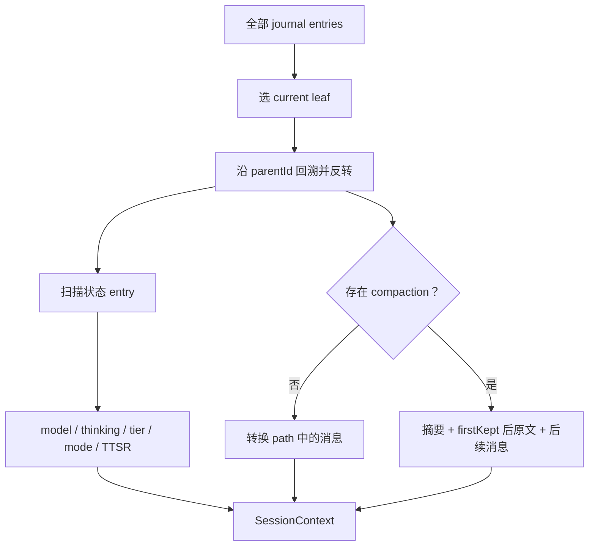

# 第 11 章　会话日志与树形历史

> 对话在内存里是一串 message；为了恢复、回退、分叉和审计，它在磁盘上必须是带父指针的追加日志。

## 11.1 三种“历史”不要混为一谈

Oh My Pi 同时维护：

| 视图 | 内容 | 用途 |
| --- | --- | --- |
| 物理 journal | 文件中所有 append entry | 持久化与审计 |
| 当前 branch path | root → 当前 leaf 的条目 | 恢复状态 |
| LLM context | branch path 经 compaction/转换后的消息 | 下一次 provider 请求 |

一个被用户从 `/tree` 放弃的 sibling 仍在 journal，却不属于当前 branch，也不会自动发给模型。一次 compaction 也不删除旧 entry，只改变如何从 path 编译 LLM context。

## 11.2 Session 文件在哪里

默认目录由 [`packages/coding-agent/src/session/session-paths.ts`](https://github.com/can1357/oh-my-pi/blob/v17.1.3/packages/coding-agent/src/session/session-paths.ts) 计算，大体形态是：

```text
~/.omp/agent/sessions/<encoded-cwd>/<timestamp>_<sessionId>.jsonl
```

cwd 会 canonicalize，再编码成文件夹名；home、临时目录和其他绝对路径使用不同前缀。旧目录命名会 best-effort 迁移。这样同一真实路径经 symlink/alias 访问时，尽可能仍落到同一 session 分区。

终端还有 breadcrumb：`TTY → cwd + 最近 session file`，用于 `--continue`。`/new` 可先只写一个 `fresh` breadcrumb，直到真正有可持久化输出才物化 JSONL，避免空 session 污染列表。

## 11.3 文件头与版本

逻辑 JSONL 第一项是 `SessionHeader`：

```ts
{
  type: "session",
  version: 3,
  id,
  timestamp,
  cwd,
  additionalDirectories?,
  parentSession?,
  providerPromptCacheKey?
}
```

定义位于 [`packages/coding-agent/src/session/session-entries.ts`](https://github.com/can1357/oh-my-pi/blob/v17.1.3/packages/coding-agent/src/session/session-entries.ts)。`additionalDirectories` 支持多根 workspace；`parentSession` 记录跨文件分支/交接关系；`providerPromptCacheKey` 允许精确路由的完整 fork 继承缓存身份。

当前版本是 3。迁移逻辑在 [`session-migrations.ts`](https://github.com/can1357/oh-my-pi/blob/v17.1.3/packages/coding-agent/src/session/session-migrations.ts)：

- v1 → v2：给线性 entry 补 `id/parentId`，把 compaction 的数组下标边界改成 ID；
- v2 → v3：把旧 `hookMessage` role 迁成 `custom`。

加载时迁移内存结构，下一次完整 rewrite 再发布新格式。

## 11.4 可变标题为何有固定宽度槽

物理文件还可在最前面保存固定 256 bytes 的 title slot，随后才是逻辑 header/entries。标题是少数允许更新的元数据；固定宽度让它原地改写，不必每次重写整个长 session。

同时 `title_change` entry 仍作为追加审计记录保留 previous title、source 与 trigger。于是：

- 列表读取能快速拿当前标题；
- 完整 journal 仍能解释标题何时、为何变化。

这是“读取性能”和“追加审计”并存的设计。

## 11.5 所有普通 entry 都有父指针

```ts
interface SessionEntryBase {
  type: string;
  id: string;
  parentId: string | null;
  timestamp: string;
}
```

新 entry 默认把当前 leaf 作为 `parentId`，然后自己成为 leaf。`SessionEntryIndex` 同时维护：

- `entriesById`；
- `parent → children` adjacency；
- labels；
- 当前 leaf。

沿 parent 指针向上再 reverse，就得到 root → leaf 的 branch。构建时有 seen set，遇到损坏文件中的 parent cycle 会停止，保证恢复有界。

## 11.6 Entry 类型全表

当前 union 包含：

| type | 记录什么 | 进入 LLM context？ |
| --- | --- | --- |
| `message` | user/developer/assistant/tool result | 是 |
| `thinking_level_change` | 实际与 configured thinking | 状态，不直接成消息 |
| `model_change` | `provider/model`，可带 role | 状态 |
| `service_tier_change` | family tier | 状态 |
| `compaction` | 摘要、保留边界、token、preserve data | 变成压缩摘要/帧 |
| `branch_summary` | 被放弃路径的摘要 | 是 |
| `custom` | 扩展私有状态 | 否 |
| `custom_message` | 扩展注入内容 | 是，经 `convertToLlm()` |
| `label` | 某 entry 的书签 | 否 |
| `title_change` | 标题审计 | 否 |
| `ttsr_injection` | 已注入规则名 | 状态 |
| `session_init` | 子代理初始 prompt/task/tools/schema | 复活元数据 |
| `mode_change` | plan 等模式与数据 | 状态 |

这里体现一个重要区分：`custom` 用来恢复扩展自己的机器状态，`custom_message` 才有权影响模型上下文。

## 11.7 一个小型树例子

```text
u1 用户问题
└─ a1 助手回答
   ├─ u2 原路线追问
   │  └─ a2 原路线回答
   └─ u3 从 a1 重写的新问题   ← current leaf
      └─ a3 新路线回答
```

文件追加顺序可能是 `u1, a1, u2, a2, u3, a3`，但当前 context 只走：

```text
u1 → a1 → u3 → a3
```

这就是为什么不能用“JSONL 最后 N 行”恢复对话。

## 11.8 `/tree`、`/branch` 与 fork

三个动作看起来都像分支，物理语义不同：

- `/tree`：在同一 manager/file 中移动 leaf；下一次 append 从旧 entry 长出 sibling；
- `branchWithSummary()`：移动 leaf，并在新路线记录被放弃路径的摘要；
- `/branch` / `createBranchedSession()`：把选定 root→leaf path 复制到新 JSONL，生成新 session header，可带 `parentSession`。

同文件分叉适合快速 time travel；新文件分支适合独立命名、分享、继续和生命周期管理。

## 11.9 `buildSessionContext()` 怎样恢复状态

核心函数在 [`packages/coding-agent/src/session/session-context.ts`](https://github.com/can1357/oh-my-pi/blob/v17.1.3/packages/coding-agent/src/session/session-context.ts)：



扫描 path 时采用最后一次状态变化，但有细致兼容逻辑。例如显式 `model_change(role=default)` 一旦出现，后续 assistant message 里的临时 fallback model 不能覆盖用户选择；老 session 没有 model entry 时才从 assistant 推断。

## 11.10 Transcript 与 LLM context 是两种编译模式

`buildSessionContext({ transcript: true })` 服务 TUI：

- 可展示所有压缩前历史；
- compaction 在发生位置显示 divider；
- 可选择 collapse compacted history；
- 可保留正在执行、尚无 result 的 dangling tool call；
- 被剥离的 dangling call 会留下 display marker，不让活动静默消失。

默认模式服务 provider：

- 只保留最新有效 compaction 语义；
- 修复/过滤不合法的悬空工具配对；
- 忽略纯私有 entry；
- 将 branch summary、custom message 转成标准 AgentMessage。

因此 UI 上“我还能看到旧消息”不代表旧消息仍占模型 token。

## 11.11 Blob store 把大二进制移出 JSONL

[`packages/coding-agent/src/session/blob-store.ts`](https://github.com/can1357/oh-my-pi/blob/v17.1.3/packages/coding-agent/src/session/blob-store.ts) 用 SHA-256 地址保存大 blob，journal 中保留引用。好处包括：

- JSONL 仍可逐行解析；
- 图片/大内容可去重；
- collab replication 可在 entry hook 处先拿到尚未 externalize 的内联内容；
- session listing 不必读入所有二进制。

恢复时 loader 解析引用；缺 blob 应作为可诊断损坏，不应把整个 journal 当非法 JSON。

## 11.12 追加写与原子重写

[`SessionManager`](https://github.com/can1357/oh-my-pi/blob/v17.1.3/packages/coding-agent/src/session/session-manager.ts) 的持久性注释非常明确：

- 普通 append 在方法返回前交给 OS，能抵抗软件 crash/OOM/SIGKILL；
- 不调用 `fsync`，所以不承诺断电级 durability；
- migration、sanitize、批量修改使用 temp-write + rename 原子替换；
- append writer 只有一个；
- atomic rewrite 有 epoch/fence，避免重写期间的新 append 被旧快照覆盖。

最危险的竞争是：

```text
开始用旧 entries 写临时文件
与此同时新 message append
临时文件 rename 覆盖正式文件
```

manager 通过 persistence lock、epoch、dirty 标记和 commit guard 让过期 publish 放弃，或把并发 entry 重新挂接到权威 journal。

## 11.13 原子 entry 批次

`appendEntriesAtomically()` 允许一组同步 append 先在内存 staging，再一次完整发布。失败则回滚批次；成功前观察者通知被延迟。

它用于需要“要么一组 entry 都成为事实，要么都不是”的维护操作。这里的 atomic 指 session journal 发布原子性，不是工具对 workspace 的事务。

## 11.14 中断尾部修复

启动装配会检查未完整结束的 session tail。常见情况包括：

- assistant 开始 streaming 后进程被杀；
- tool call 已落盘，result 尚未落盘；
- thinking block 未签名/未闭合；
- 最后一行 JSONL 只写了一部分。

[`packages/coding-agent/src/session/turn-recovery.ts`](https://github.com/can1357/oh-my-pi/blob/v17.1.3/packages/coding-agent/src/session/turn-recovery.ts)、[`session-loader.ts`](https://github.com/can1357/oh-my-pi/blob/v17.1.3/packages/coding-agent/src/session/session-loader.ts) 和消息规范化共同处理：保留可展示证据，给 provider 构造合法上下文，必要时把不完整 thinking 降级成文本提示，而不是重发非法 provider payload。

## 11.15 SessionManager 与 AgentSession 的边界

SessionManager 只负责 journal/tree/context 编译，不决定用户何时 prompt、何时 retry、何时 compact。后者属于 [`packages/coding-agent/src/session/agent-session.ts`](https://github.com/can1357/oh-my-pi/blob/v17.1.3/packages/coding-agent/src/session/agent-session.ts)。

典型协作是：

```text
AgentSession 收到 agent event
→ turn persistence 把 message 追加到 SessionManager
→ SessionManager 维护 leaf 和磁盘
→ AgentSession 在下一轮调用 buildSessionContext
→ 用恢复的状态更新 Agent
```

这个边界让同一个 journal 可以被 interactive、RPC、ACP、collab 和 stats 读取，而不必启动完整模型运行时。

## 11.16 调试落点

| 现象 | 首先检查 |
| --- | --- |
| resume 到错误路线 | header/file 选择、breadcrumb、current leaf |
| `/tree` 后旧消息仍送模型 | `pathTo(leaf)` 与 `buildSessionContext()` |
| 标题丢失 | fixed title slot 与 `title_change` 是否一致 |
| 模型恢复成 fallback | 显式 default `model_change` 是否存在 |
| TTSR resume 后重复 | branch path 上的 `ttsr_injection` |
| UI 看不到运行中 tool call | transcript 的 `keepDanglingToolCalls` |
| JSONL 尾损坏 | loader 对 incomplete record 的处理 |
| atomic rewrite 后少消息 | epoch/fence/dirty/commit guard 日志 |
| 分支后 artifact 丢失 | blob/artifact ownership 与新 session 路径 |

## 11.17 本章小结

SessionManager 把 JSONL 当成追加 journal、把 `id/parentId` 当成树、把 leaf 当成当前视图。LLM context 是从这棵树编译出来的派生物，不是磁盘文件本身。

下一章解释历史太长时如何改变这次编译：[第 12 章：压缩、恢复与 Snapcompact](./第12章-压缩恢复与Snapcompact.md)。
