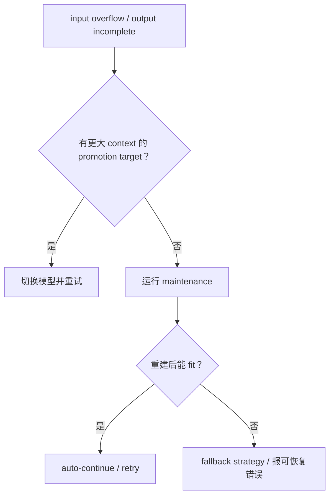

# 第 12 章　压缩、恢复与 Snapcompact

> 压缩的目标不是“删聊天记录”，而是在不破坏可恢复 journal 的前提下，给下一次模型调用编译一个能放进 context window 的等价工作状态。

## 12.1 Compaction entry 是新视图边界

一次压缩最终写入：

```ts
{
  type: "compaction",
  summary,
  shortSummary?,
  firstKeptEntryId,
  tokensBefore,
  details?,
  preserveData?,
  fromExtension?,
  warning?
}
```

旧消息仍在 JSONL。下一次 [`buildSessionContext()`](https://github.com/can1357/oh-my-pi/blob/v17.1.3/packages/coding-agent/src/session/session-context.ts) 生成：

```text
压缩摘要（以及可选 Snapcompact frames）
+ firstKeptEntryId 起保留的最近原文
+ compaction entry 之后的新消息
```

这就是“日志不变，视图变短”。

## 12.2 当前默认设置

静态默认值来自 [`packages/coding-agent/src/config/settings-schema.ts`](https://github.com/can1357/oh-my-pi/blob/v17.1.3/packages/coding-agent/src/config/settings-schema.ts)：

| 设置 | 默认 |
| --- | --- |
| `compaction.enabled` | `true` |
| `compaction.strategy` | `snapcompact` |
| `compaction.midTurnEnabled` | `true` |
| `compaction.keepRecentTokens` | `20,000` |
| `compaction.autoContinue` | `true` |
| `compaction.remoteEnabled` | `true` |
| `compaction.remoteStreamingV2Enabled` | `true` |
| `compaction.v2RetainedMessageBudget` | `64,000` |
| `compaction.idleEnabled` | `false` |

这点值得强调：当前 17.1.3 快照默认 strategy 是 `snapcompact`，不是早期 Pi 教程里的单一摘要方案。

## 12.3 阈值怎样计算

[`packages/agent/src/compaction/compaction.ts`](https://github.com/can1357/oh-my-pi/blob/v17.1.3/packages/agent/src/compaction/compaction.ts) 支持固定 token 阈值、百分比阈值和 reserve-based 默认：

1. 有效 `thresholdTokens > 0` 优先；
2. 否则有效 `thresholdPercent > 0` 使用 context window 百分比；
3. 否则阈值为 `contextWindow - reserve`。

默认 reserve 的基础是 16,384 token，并至少保留 context window 的 15%。可近似写为：

```text
reserve = max(16,384, floor(contextWindow × 15%))
threshold = contextWindow - reserve
```

用户显式设置 reserve 时保留其 provenance；小窗口恢复可以对“未显式设置”的默认值采用比例策略，避免 16K reserve 吃掉小模型的大半窗口。

## 12.4 六条触发路径

Compaction/maintenance 不是只有“达到 80%”一种入口：

| 路径 | 何时 |
| --- | --- |
| 手动 | 用户执行 `/compact [soft|remote|snapcompact]` |
| post-turn threshold | 一轮完成后 usage 超阈值 |
| mid-turn threshold | 工具循环的安全边界、下次 provider request 前 |
| overflow recovery | provider 报 input context overflow |
| incomplete recovery | output 因 `length` / `response.incomplete` 截断 |
| idle | 启用 idle compaction 后，空闲且超独立阈值 |

事件 reason 统一为 `threshold | overflow | idle | incomplete`；手动调用走显式命令路径。

## 12.5 Mid-turn 为什么只在安全边界检查

长任务可能在一个 user turn 中经历很多“模型 → 工具 → 模型”。若只在 turn 结束检查，工具结果可在中途把上下文撑爆。

`midTurnEnabled` 会在一次工具批次已完整持久化、下一次 provider 请求尚未发出时维护。它不会在 assistant tool call 和对应 result 之间硬切历史，因为那会破坏配对。

## 12.6 五种 strategy

| strategy | 做什么 | 是否调用摘要模型 |
| --- | --- | --- |
| `context-full` | 原地生成结构化摘要并保留最近消息 | 通常是；也可能走 provider-native/remote |
| `handoff` | 生成 handoff 文档，在新 session 继续 | 是 |
| `shake` | 原地移除重型块/工具输出，保留 artifact 可恢复 | 否或很少，当前为 plain shake |
| `snapcompact` | 把历史编码成稠密位图 frame + 文本边缘 | 否 |
| `off` | 禁用自动维护 | 否 |

手动 [`/compact` modes](https://github.com/can1357/oh-my-pi/blob/v17.1.3/packages/coding-agent/src/session/compact-modes.ts) 是一次性 override：

- `soft`：本地 active model 摘要，跳过 remote；
- `remote`：要求 remote/provider-native 路径，不可用则告警并 fallback；
- `snapcompact`：本地位图归档，不接受 focus instructions。

它们不永久修改 settings。

## 12.7 Context-full 摘要保留什么

摘要逻辑会序列化会话，并显式跟踪：

- 用户目标与当前进度；
- 关键决定和约束；
- 未完成工作；
- 读过/修改过的文件；
- 错误、验证与下一步；
- 前一次摘要需要更新的内容。

[`packages/agent/src/compaction/compaction.ts`](https://github.com/can1357/oh-my-pi/blob/v17.1.3/packages/agent/src/compaction/compaction.ts) 从历史 tool calls 提取 file operations，并把 `readFiles/modifiedFiles` 放进 details。后续再压缩时会合并之前 details，而不是只看最近尾部。

## 12.8 cut point 不能切断一个 turn

Compaction 要找 `firstKeptEntryId`。简单按 token 从后往前截可能落在：

```text
assistant toolCall
--- cut ---
toolResult
```

或切开一个 user turn 的多次工具循环。准备逻辑识别 turn start 和 tool pairing，把边界移动到合法位置。宁可多保留一段，也不生成 provider 无法接受的半轮消息。

## 12.9 工具结果先剪枝，再摘要

[`packages/agent/src/compaction/pruning.ts`](https://github.com/can1357/oh-my-pi/blob/v17.1.3/packages/agent/src/compaction/pruning.ts) 默认：

- 保护最近 40,000 token 的工具输出；
- 至少能省 20,000 token 才做普通批量剪枝；
- 保护 skill 读取等关键结果；
- `useless` 结果可更早变成 `[Uneventful result elided]`；
- 同一文件被新 read 覆盖时，旧结果可变成 `[Superseded by a newer read of this file]`。

剪枝还考虑 provider prompt cache：改写一个很老、仍处在 warm prefix 的结果，可能为省一点 input token 付出更高 cache-write 代价。因此它会优先改动便宜尾部，把深层回收留给本来就重建 cache 的 compaction/shake。

## 12.10 为什么保护技能、计划和配对

某些文本体积不大但因果权重高：

- skill body 定义了当前工作方法；
- plan/goal 记录尚未完成的承诺；
- tool call/result 配对决定 provider 协议合法；
- 最近编辑结果决定当前 workspace 认知。

压缩按 token 价值而不是纯大小排序。一个 2K 的计划可能比 20K 已被新读取覆盖的旧日志更值得保留。

## 12.11 Remote 与 provider-native compaction

context-full 可以：

- 用 active model 做普通摘要；
- 调配置的 remote endpoint；
- 对兼容 Responses 模型使用 streaming v2；
- 对 OpenAI/Codex 使用 provider-native replacement history。

remote preserve data 必须写进 compaction entry，恢复时才能重建 provider 期望的特殊历史形状。若后续改用 Snapcompact，会移除不再适用的 remote replacement 数据，避免两种压缩表示叠加。

## 12.12 Overflow 先尝试 context promotion

[`packages/coding-agent/src/session/session-maintenance.ts`](https://github.com/can1357/oh-my-pi/blob/v17.1.3/packages/coding-agent/src/session/session-maintenance.ts) 的恢复优先级是：



input overflow 时 `handoff` 不可靠，因为生成 handoff 的 LLM 请求可能使用同一份已经装不下的输入；恢复路径会强制使用能处理 overflow 的原地方案。output incomplete 则输入本身可放下，但应先删除/降级截断的 assistant 输出，再重试，不能执行其不完整 tool arguments。

## 12.13 回滚与防止“维护后更糟”

恢复 compaction 修改了 branch/context。如果维护失败或几乎没有回收空间，系统不能留下半个摘要状态再让用户手工救场。

maintenance 与 turn recovery 维护 rollback 信息，并在 pass 后重新估算：

- 是否低于阈值或至少进入 recovery band；
- overflow recovery 是否已经 fit；
- Snapcompact frame charge 是否反而导致更大输入；
- shake 是否真正 reclaim。

进度守卫会在 compaction entry 上写 warning，避免无收益维护循环。

## 12.14 Handoff 是会话迁移，不只是摘要

`handoff` 生成一份面向“下一个 Agent”的文档，随后创建新 session 并把它作为初始上下文。它可以选择把 handoff Markdown 另存到磁盘。

与同文件 compaction 的区别：

- 新 session 有新 header、生命周期和列表项；
- 旧 session 完整保留；
- parent/telemetry 可记录 from/to；
- prompt cache identity 是否继承取决于具体 fork/route。

因此 handoff 适合阶段切换，不是最紧急 overflow 的首选。

## 12.15 Snapcompact 的核心思路

[`packages/snapcompact/src/snapcompact.ts`](https://github.com/can1357/oh-my-pi/blob/v17.1.3/packages/snapcompact/src/snapcompact.ts) 完全本地地把可压缩历史序列化成文本，再渲染为高密度 PNG frames。多模态模型下一轮直接“看”这些图片。


它不调用 LLM，所以没有摘要幻觉、网络延迟和额外模型费用；代价是依赖目标模型的视觉读取能力，并要精确估算图片 token charge。

## 12.16 为什么还保留文本 head/tail

纯图片归档有两个风险：

- provider/模型不支持视觉或视觉预算太高；
- 最近指令、开头目标在图中不够稳定。

Snapcompact 会按 shape/frame budget 保留文本边缘，把中间主体放入 frame；超帧预算时优先保留首/尾或最新区域，并记录 truncated chars。文件操作和摘要 stub 仍以可读结构传递。

## 12.17 Frames 是可恢复数据，不是 TUI 截图

Archive 保存在 `compaction.preserveData`，包含 shape/font/variant 等元数据。恢复 LLM context 时转成 image history blocks；恢复 transcript 时也可展示 frame preview。

旧版本 archive 可能缺 shape metadata，且曾存在过大 frame payload 的 crash 风险。`session-context.ts` 对 legacy archive 使用保守 guard，可不给 LLM 附带危险 frame data，但仍保留 transcript 证据。

## 12.18 图像输入也必须遵守 provider 形状

不同 provider 对历史 image block 的位置、detail、数量和总预算有不同限制。Snapcompact 不能随便把 N 张 PNG 插进 message：它要结合第 7 章的 provider transform，选择合法 frame 形状。

原始用户图片不能被“压缩成对话截图”后丢失语义；Snapcompact 的序列化会对图像内容做明确占位/保留策略，provider image budget 再决定下一次实际发送形态。

## 12.19 自动继续与恢复语义

`autoContinue: true` 并不是压缩完无条件多跑一轮。系统区分：

- threshold maintenance：在原任务尚未终止时继续；
- overflow/incomplete：重试被维护打断的请求；
- idle：不能凭空制造一个未经用户要求的 assistant turn；
- manual `/compact`：由命令语义决定是否等待下一输入。

尤其动态工具变化和 idle 维护只应更新状态，不应意外触发 unsolicited response。

## 12.20 调试落点

| 现象 | 首先检查 |
| --- | --- |
| 很早就 compact | fixed/percent/reserve 阈值优先级 |
| 一直不 compact | enabled、strategy off、mid-turn/idle gate |
| compaction 后 provider 报配对错误 | cut point 与 tool pairing normalization |
| 摘要忘记修改文件 | fileOps details 是否从旧 compaction 合并 |
| overflow 后 handoff 又 overflow | 是否走了强制原地恢复策略 |
| incomplete tool 被执行 | length stop 的 synthetic result/rollback 路径 |
| Snapcompact 后反而超窗 | frame charge projection、shape 和 fallback |
| resume 后看不到 frames | preserveData archive 与 legacy guard |
| 重复无收益 compact | post-pass progress/recovery-band warning |

## 12.21 本章小结

压缩是一套维护状态机：先剪便宜且低价值的工具结果，再选择摘要、handoff、shake 或本地图像归档；写入 compaction 边界后，从同一追加 journal 编译更短的 LLM context。overflow/incomplete 还带 promotion、回滚和重试语义。

下一章看外部能力如何接进这套状态机：[第 13 章：扩展、插件与 MCP](./第13章-扩展插件与MCP.md)。
