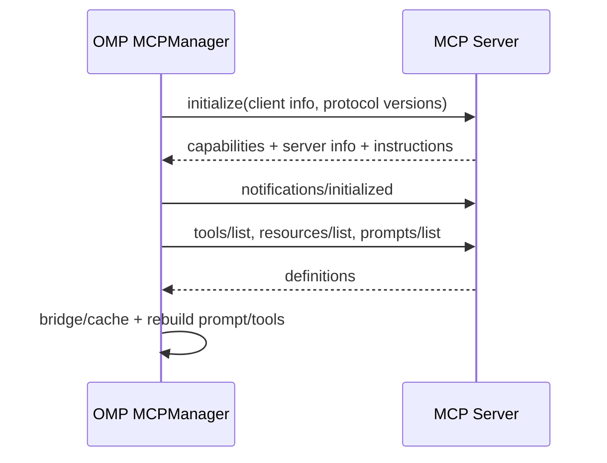

# 第 13 章　扩展、插件与 MCP

> Extension、plugin、MCP 都能“增加能力”，但它们处在完全不同的信任域：进程内代码、分发包装，以及进程外协议服务器。

## 13.1 三个概念先分开

| 概念 | 本质 | 运行位置 | 主要贡献 |
| --- | --- | --- | --- |
| Extension | TypeScript/JavaScript 运行时代码 | OMP 同一 Bun 进程 | events、tools、commands、UI、model/provider 控制 |
| Plugin | 安装/版本/manifest/marketplace 包 | 包本身可含多类资源 | extension、skill、rule、prompt、MCP 配置等 |
| MCP server | JSON-RPC 能力服务 | 子进程或远端 HTTP/SSE | tools、resources、prompts、instructions |

Plugin 是包装和交付单元，不是第四套 Agent Loop；MCP 是协议边界，不等于被 sandbox 的 extension。

## 13.2 Extension 从哪里来

[`packages/coding-agent/src/extensibility/extensions/loader.ts`](https://github.com/can1357/oh-my-pi/blob/v17.1.3/packages/coding-agent/src/extensibility/extensions/loader.ts) 使用 Bun 原生 import 加载模块。来源包括：

- capability discovery 找到的 native extension module；
- hook/legacy extension；
- 已安装 plugin 的 extension entry；
- settings/CLI 显式路径。

装配阶段会规范化为绝对路径并去重，先出现的绝对路径拥有该模块，避免同一 extension 因多种发现约定执行两遍。加载错误收集为 diagnostics，单个可选 extension 失败不应抹掉整个 session。

## 13.3 Extension factory 的注册阶段

模块导出 factory，loader 给它 `ExtensionAPI`。此时允许注册定义：

```ts
export default function (pi) {
  pi.on("tool_call", handler);
  pi.registerTool(tool);
  pi.registerCommand("hello", { handler });
  pi.registerShortcut("ctrl+x", { handler });
  pi.registerFlag("demo", { type: "boolean" });
}
```

但 `sendMessage()`、`setModel()`、`setActiveTools()` 等 action 在 runtime 尚未绑定时会抛 `ExtensionRuntimeNotInitializedError`。这把生命周期分成：

```text
load/register（声明能力）
→ runner initialize（接入真实 AgentSession）
→ events/actions（改变运行状态）
→ session_shutdown（清理）
```

如果 factory 顶层直接发送消息，它依赖的是尚不存在的 session；明确报错比把动作静默丢掉更安全。

## 13.4 ExtensionAPI 能做什么

[`packages/coding-agent/src/extensibility/extensions/types.ts`](https://github.com/can1357/oh-my-pi/blob/v17.1.3/packages/coding-agent/src/extensibility/extensions/types.ts) 的 API 大致分六组：

1. **订阅**：`on(event, handler)`；
2. **注册**：tool、command、shortcut、flag、message/thinking renderer；
3. **会话动作**：发送 custom/user message、追加私有 entry、label/name；
4. **运行控制**：读写 active tools、model、thinking、service tier；
5. **Provider**：动态注册 provider 配置；
6. **宿主能力**：exec、logger、schema 库、event bus、managed timers。

API 还暴露 `pi` namespace 和 TypeBox/ArkType/Zod，降低 extension 自己打包多套 schema runtime 的需要。

## 13.5 事件面比 Agent core 更宽

除了第 5 章的 agent/turn/message/tool execution 事件，扩展还能观察：

- session start/switch/branch/tree/compact/shutdown；
- context 和 before-agent-start；
- auto retry/compaction；
- TTSR/todo reminder；
- tool approval requested/resolved；
- user bash/python/input；
- credential disabled；
- model/service tier/settings 等产品事件。

定义分布在 [`extensions/types.ts`](https://github.com/can1357/oh-my-pi/blob/v17.1.3/packages/coding-agent/src/extensibility/extensions/types.ts) 与 [`extensibility/shared-events.ts`](https://github.com/can1357/oh-my-pi/blob/v17.1.3/packages/coding-agent/src/extensibility/shared-events.ts)。

## 13.6 Hook 的同步语义

并非所有事件都只是通知：

- `tool_call` 可阻断或改写调用；
- `tool_result` 可修改结果；
- `context` 可调整送模型的 messages；
- session-before-* 可取消切换/分支；
- compact handler 可提供自定义 compaction result/preserve data。

这些 handler 必须 await，因为下一阶段依赖返回值；普通观察型 UI/listener 则应隔离异常，不能让一个 telemetry extension 把模型循环打断。

工具 middleware 链由 [`extensibility/extensions/wrapper.ts`](https://github.com/can1357/oh-my-pi/blob/v17.1.3/packages/coding-agent/src/extensibility/extensions/wrapper.ts) 和 hooks wrapper 接入。第 8 章的审批也位于这个统一 wrapper 边界。

## 13.7 Managed timers 防止扩展泄漏

扩展若直接 `setInterval()`，session 关闭后 callback 仍可持有 AgentSession、阻止进程退出或写入已销毁 UI。

[`extensions/managed-timers.ts`](https://github.com/can1357/oh-my-pi/blob/v17.1.3/packages/coding-agent/src/extensibility/extensions/managed-timers.ts) 提供 API 版 timeout/interval：

- 跟踪 owner extension；
- callback 同步 throw/rejection 被捕获记录；
- `session_shutdown` 自动 clear；
- 仍允许 extension 主动取消。

这是进程内 extension 最容易被忽略的资源边界。

## 13.8 Extension 是不受沙箱保护的

它与 OMP 同进程运行，能 import Node/Bun API，也能通过 `exec()` 运行命令。审批只包 tool call，不会自动拦截 extension factory 内部任意文件/网络操作。

因此安装 extension 等价于信任本地代码。manifest、marketplace 和 doctor 能帮助追踪来源，但不是安全 sandbox。第 18 章会据此划出信任边界。

## 13.9 Plugin 负责分发与组合

[`packages/coding-agent/src/extensibility/plugins/`](https://github.com/can1357/oh-my-pi/tree/v17.1.3/packages/coding-agent/src/extensibility/plugins/) 负责：

- 解析 plugin spec 与 manifest；
- Git/本地源安装；
- 版本和 Bun Git cache；
- enable/disable/remove/update；
- marketplace registry 与自动更新；
- doctor 检查；
- 兼容旧 Pi package/virtual module。

一个 plugin 可以贡献 extension 路径，也可以通过 discovery 贡献 skill、rule、prompt、command 等。安装完成后，这些资源仍回到第 10 章的 capability priority/dedupe 系统。

## 13.10 MCP 配置也走 capability discovery

MCP server 不只来自一个 `mcp.json`。第 10 章的 Claude、Codex、Gemini、OpenCode、VS Code、OMP plugin 等 provider 都可贡献统一 [`MCPServer`](https://github.com/can1357/oh-my-pi/blob/v17.1.3/packages/coding-agent/src/capability/mcp.ts) item。

[`packages/coding-agent/src/mcp/loader.ts`](https://github.com/can1357/oh-my-pi/blob/v17.1.3/packages/coding-agent/src/mcp/loader.ts) 汇总配置，交给 `MCPManager`。同名 server 仍按 capability 来源优先级解决，而不是无序覆盖。

## 13.11 三种 MCP transport

[`packages/coding-agent/src/mcp/config.ts`](https://github.com/can1357/oh-my-pi/blob/v17.1.3/packages/coding-agent/src/mcp/config.ts) 规范化：

| transport | 配置特征 | 实现 |
| --- | --- | --- |
| stdio | `command + args + env` | 子进程 stdin/stdout JSON-RPC |
| http | `url`，Streamable HTTP | HTTP POST，可选 SSE server push |
| sse | legacy HTTP+SSE | 2024-11-05 兼容 transport |

若 transport 未写，有 command 推断 stdio，有 URL 推断 http。command 与 URL 同时出现会校验报错，防止模糊选择。

跨平台 stdio 还处理 Windows executable/wrapper、进程组终止，以及 macOS TCC/Apple Events 等会受 session detach 影响的场景，详见 [`mcp/transports/stdio.ts`](https://github.com/can1357/oh-my-pi/blob/v17.1.3/packages/coding-agent/src/mcp/transports/stdio.ts)。

## 13.12 MCP 初始化与能力协商

连接成功后 client 进行 initialize/initialized，再获取 server capabilities：



Server instructions 会进入 system prompt signature；tools/list changed 等通知触发 reactive refresh。能力变化后必须重建 active tool registry 与 prompt，不能只改 manager cache。

## 13.13 MCP tool 如何变成 AgentTool

[`packages/coding-agent/src/mcp/tool-bridge.ts`](https://github.com/can1357/oh-my-pi/blob/v17.1.3/packages/coding-agent/src/mcp/tool-bridge.ts) 把定义转换为 custom tool：

1. 规范化 JSON Schema；
2. 生成不冲突的 `mcp__<server>_<tool>` 名；
3. 补来源与 renderer；
4. 执行时调用 `tools/call`；
5. 把 text/image/resource content 转成 `AgentToolResult`；
6. 保留 raw content、`_meta` 和 server name 供 UI/调试。

名称前缀既是避免冲突的 namespace，也让审批框能识别外部来源。

## 13.14 出站参数的三重清洗

Bridge 在发给 server 前：

- 若 server schema 没声明 harness intent 字段 `i`，就剥掉它；
- 删除 schema 中可选且为空字符串/空对象的 placeholder；
- 递归把 session-local `local://` URL 解析为外部 server 可读的真实文件路径。

这三步都必须在最终 MCP 边界做，而不能要求所有调用者记住。特别是 Eval 的 `tool.*` bridge 会直接传参数，若不在这里剥 `i`，`additionalProperties:false` 的严格 server 会拒绝每次调用。

## 13.15 连接失败与一次安全重试

Tool bridge 对 ECONNRESET、EPIPE、transport closed、部分 404/502/503 等保守判定为 stale connection：

```text
第一次 tools/call
→ 网络/旧 session 错误
→ manager teardown + reconnect
→ 最多重试一次
```

若 result `_meta.mcp/www_authenticate` 带 challenge，则先走 OAuth/重新授权再 reconnect。AbortSignal 在重连和请求之间贯穿；用户中止不能被 catch 后伪装成普通 MCP error result。

它不会对任意业务错误无限重放，因为外部工具可能已经产生副作用。

## 13.16 Resources 与 Prompts 不应伪装成 Tools

MCP 三类能力有不同入口：

- tools：进入 Agent tool registry；
- resources：通过 `mcp://` / read 按需取内容；
- prompts：进入命令/提示模板发现；
- server instructions：进入系统提示词。

把 resource 全转成工具会让 schema 爆炸；把 tool 当 resource 又绕过审批与执行事件。Manager 保留协议类型，只有产品表面统一。

## 13.17 MCP 输出同样受 artifact 策略

Server 可返回巨大日志或嵌入 resource。bridge 先保留 raw content/details，外层 spill wrapper 再根据预算截断并写 artifact。模型得到摘要与地址，renderer 仍可说明是哪个 server/tool 产生。

MCP 并不会因为来自外部协议就绕过第 8 章的输出预算、工具配对和 approval。

## 13.18 生命周期所有权

`createAgentSession()` 可接收外部传入的 AuthStorage、MCPManager、AsyncJobManager 等，也可自己创建。只有 owner 才能在 dispose 时关闭资源。

这一点对 SDK embedding 很关键：如果宿主复用一个 MCP manager 给多个 session，任意一个 session 退出都不应把共享连接关掉；若 session 自建 manager，又必须回收 stdio 子进程与 SSE listener。

## 13.19 选择哪种扩展方式

| 需求 | 更合适的入口 |
| --- | --- |
| 拦截每次 tool result、改 TUI | Extension |
| 分发一组 extension+skill+rule | Plugin |
| 对接已有跨语言/远程服务 | MCP |
| 只加静态工作方法 | Skill/Rule，不必写代码 |
| 只加项目说明 | AGENTS/context file |
| 只加一个本地 schema+execute | custom tool 或 Extension |

优先选最小权限、最晚加载的机制。能用 skill 表达的工作方法，不值得引入同进程任意代码。

## 13.20 调试落点

| 现象 | 首先检查 |
| --- | --- |
| Extension 加载两次 | 绝对路径 dedupe 和多来源 discovery |
| factory 中 action 报未初始化 | 是否在 register phase 调了 runtime action |
| event handler 没触发 | runner 是否 initialize、事件名/阶段是否正确 |
| 退出后进程不结束 | extension 是否绕过 managed timers/留下 handle |
| Plugin 已装但资源没出现 | manifest entry、provider enable、capability priority |
| MCP server 连上但无工具 | initialize capabilities、tools/list cache |
| MCP 严格 schema 报额外 `i` | tool bridge 的 intent stripping |
| `local://` 文件 server 看不到 | outbound local URL resolution |
| MCP 更新工具后 prompt 仍旧 | reactive refresh 与 session tool rebuild |
| MCP 调用重复副作用 | 是否把业务错误错误分类为 retriable |

## 13.21 本章小结

Extension 是进程内可编程运行时，Plugin 是资源分发单元，MCP 是进程外协议边界。三者最后都通过 capability、tool registry、prompt rebuild、approval 和 session lifecycle 接入同一套 AgentSession。

下一章转向用户实际看到的终端表面：[第 14 章：TUI 与追加式终端渲染](./第14章-TUI与追加式终端渲染.md)。
