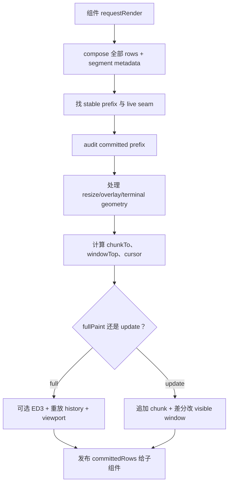

# 第 14 章　TUI 与追加式终端渲染

> 浏览器 UI 可以随时重画 DOM；终端的 scrollback 是用户正在阅读的历史磁带。已经滚上去的字节，普通更新不应再假装能改掉。

## 14.1 为什么不用全屏 alternate screen

Oh My Pi 的主交互界面把对话写进 terminal native scrollback，而不是把整个应用锁在 alternate screen。这样用户可以：

- 用终端原生滚动、选择与复制；
- 退出后仍看到会话；
- 在 tmux/zellij/Warp 等宿主中保留连续历史；
- 让普通 shell 输出与 Agent 对话处于同一视觉时间线。

代价是渲染器不能任意重写已经离开 viewport 的旧行。核心实现集中在 [`packages/tui/src/tui.ts`](https://github.com/can1357/oh-my-pi/blob/v17.1.3/packages/tui/src/tui.ts)。

## 14.2 最核心的不变量

源码顶部把契约写得很清楚：

```text
进入 native scrollback 的行是不可变的视觉记录。
普通 frame 只能追加新历史或重绘仍在 viewport 的 live suffix。
```

如果一个流式工具块先显示“运行中”，滚出屏幕后又变成“完成”，终端无法回头修改旧字节。系统只能：

- 在安全终端上做显式全量 erase + replay；或
- 在不安全的 multiplexer 中保留旧快照，再把最终内容重新提交——允许重复，不允许丢失。

## 14.3 用五个量理解渲染 ledger

代码字段名更具体，但可用以下记号建立心智模型：

| 记号 | 对应概念 |
| --- | --- |
| `C` | `committedRows`：已进入终端历史的 frame 行数 |
| `W` | `windowTopRow`：当前 screen row 0 对应的 frame 行 |
| `B` | `committedPrefix`：引擎声称已提交的原始字节行 |
| `D` | component live-region seam：其上方已 final 的边界 |
| `A` | `committedPrefixAuditRows`：已硬验证 byte-stable 的前缀终点 |

常态关系大致为：

```text
0 ≤ A ≤ C ≤ W ≤ frame.length
0..C       已在 terminal tape
W..W+H     当前 viewport
D..end     仍可能变化的 live region
```

`C` 不等于“所有内容都最终完成”。仍在变化的行若滚出 viewport，也可能以 frozen visual snapshot 进入历史；它们直到 block finalization 时才做一次严格审计。

## 14.4 Component 的引用相等契约

`Component.render(width)` 返回只读行数组。约定是：

- 内容不变时，返回完全相同的 array reference；
- 内容变化时，返回新 reference；
- 若必须原地修改缓存数组，则实现 `RenderStablePrefix` 告诉引擎前多少行没变。

引用相等让 container 和 TUI 在热路径无需逐字节比较整个长 transcript，就能证明前缀稳定。违反约定会让引擎误以为内容没变，因此它是组件作者必须遵守的协议，不只是性能建议。

## 14.5 `NativeScrollbackLiveRegion` 是组件与引擎的接缝

接口定义在 [`tui.ts`](https://github.com/can1357/oh-my-pi/blob/v17.1.3/packages/tui/src/tui.ts)：

```ts
interface NativeScrollbackLiveRegion {
  getNativeScrollbackLiveRegionStart(): number | undefined;
  isNativeScrollbackLiveRegionPinned?(): boolean;
}
```

组件报告本地哪一行起仍可变化。边界之前的行声明为当前宽度下 byte-stable，可精确提交；边界之后留在 live suffix。

若 `pinned`，变化区保持 viewport-local，滚出区域也不作为 frozen snapshot 提交，适合固定高度 dashboard；普通 transcript 则允许屏幕上真实出现过的 live 行成为视觉历史。

## 14.6 `TranscriptContainer` 怎样算边界

[`packages/coding-agent/src/modes/components/transcript-container.ts`](https://github.com/can1357/oh-my-pi/blob/v17.1.3/packages/coding-agent/src/modes/components/transcript-container.ts) 管一串 chat/tool/custom blocks。它寻找第一个未 final 的 block：

```text
final block 1
final block 2
live tool block       ← 整个 transcript 的 seam 从这里开始
final TTSR card
final assistant block
```

即使 live block 后面已有 final card，提交边界也不能越过它，因为 terminal history 只能提交连续前缀。否则 live block 完成后增加/收缩行数，下面已提交内容会错位。

block 还可报告“已 settled 的内部前缀”，因此一个长流式 Markdown 块的完整段落可以逐步成为 final，不必等整个回答结束。

## 14.7 已提交的临时块不能被删除

Todo 快照、Hub poll、IRC card 常希望“后一个替换前一个”。Container 的 `isBlockUncommitted()` 先判断旧块是否仍完全位于 live region：

- 未提交：可以从 children 删除/替换；
- 已有行进入 scrollback：不能做 interior deletion，只能 seal 成历史并追加新块。

这把“displaceable UI”限制在物理上仍可重绘的区域，防止 TUI 内存树和用户眼中的 scrollback 分叉。

## 14.8 一帧的完整流水线



`#prepareFrame()` 还负责 ANSI normalize、宽度 clamp、hyperlink/SGR 终止和 cache。内部 cursor marker 会在真正写终端前剥掉，绝不进入 scrollback 字节。

## 14.9 Incremental update 的三种字节形状

普通 update 可能同时做：

1. 把 `[C, chunkTo)` 追加为新 scrollback；
2. 因 windowTop 下移滚动 viewport；
3. 用相对 cursor movement 重写仍可见的差异行。

它不会发 ED2/ED3，也不使用绝对 home 清整个窗口。硬件 cursor 在写前隐藏，autowrap 临时关闭；每个非图像行结尾显式 reset SGR 和 OSC 8 hyperlink，避免颜色或链接泄漏到下一行。

## 14.10 ED3 是受限的破坏性重放

`CSI 3 J` 清 terminal scrollback。源码把它收敛到 full-paint emitter 的单一调用点，典型来源：

- 用户明确切换/替换 session；
- reset display；
- 安全终端上的 resize/几何重建；
- 已提交 final prefix 被证明发生结构性变化。

普通 streaming token、spinner 或 tool update 不得触发 ED3。否则一段长历史每个 token 都 O(history) 重放，还会闪屏、破坏选择。

## 14.11 为什么 tmux 等环境采用“重复不丢失”

Multiplexer 自己维护 pane scrollback、reflow 和 alternate buffer。外层程序发 ED3 可能清错层、无法重建宿主历史或产生重复 reflow。

因此 committed-prefix audit 发现差异时：

- 安全直接终端：可 erase + replay，让最终内容只出现一次；
- ED3-unsafe 环境：把 `C` re-anchor 到首个差异行，旧视觉快照留在历史，再在下方 recommit 最终内容。

这条降级契约明确选择 duplication over loss。终端日志多一小段可解释；少掉用户刚读过的输出则不可恢复。

## 14.12 Audit 为什么分 frozen 与 exact-final

`committedPrefixAuditRows` 之前的行已经证明 final；每帧可低成本检查引用/字节稳定性。其后到 `committedRows` 之间可能是仍 live 时滚出去的 frozen snapshots，不应每次变化都 re-anchor，否则一个 collapsing preview 会不断复制。

当 block 最终 finalize，边界 `D` 上升，系统只对这批 frozen 行做一次 strict scan：

- 未变：加入 exact verified 区；
- 已变：从差异处 re-anchor/replay。

这是“流式稳定”和“最终一致”之间的折中。

## 14.13 Overlay 为什么临时用 alternate buffer

Fullscreen selector/modal 可进入 `?1049h` alternate screen，只画 overlay；正常 screen 与 scrollback ledger 完全冻结。退出时恢复 normal screen。

这样 modal 可以自由重绘、响应鼠标，却不会把临时菜单写进对话历史。非 fullscreen overlay 可与窗口 compositing，但会阻止被覆盖区域在该帧提交。

## 14.14 Resize 是最难的路径

终端宽度变化会重排所有 Markdown 和宿主 scrollback。TUI 需要区分：

- 直接终端可做 settle 后全量重放；
- multiplexer 已自行 reflow，OMP 不应再清历史；
- 拖动期间只画 viewport tail，避免每个 SIGWINCH 都 O(history)；
- settle frame 才更新权威 ledger；
- Warp 类 alternate-buffer 切换会假装 resize，需要 latch 特殊行为。

这解释了 `tui.ts` 大量 geometry、drag/settle、alt-toggle 分支：不是业务 UI 复杂，而是终端没有统一可查询的屏幕模型。

## 14.15 图片也受 live/history 边界约束

Kitty/Sixel 图像不是普通字符串。`ImageBudget` 限制 live inline images，旧图可降级成文本并发 purge command；已提交行不会为了删除像素而重写文本历史。

full paint 时图像 data transmit 必须放在 clear 与 placement 的正确顺序；update 时则只传新资源。Windows ConPTY 对超大 frame 还会保留尾部并显示“older lines hidden”标记，避免 resume 卡死。

## 14.16 EventController 把运行时事件翻译成组件

[`packages/coding-agent/src/modes/controllers/event-controller.ts`](https://github.com/can1357/oh-my-pi/blob/v17.1.3/packages/coding-agent/src/modes/controllers/event-controller.ts) 订阅 `AgentSessionEvent`：

- message start/update/end → assistant blocks；
- tool execution → tool component 与 partial result；
- 连续 read → 合并成 read group；
- retry/compaction → banner/divider；
- TTSR/todo/IRC → 临时或可替换 card；
- approval → terminal title attention；
- goal/usage → 状态行。

Controller 维护 toolCallId → component 的 map，确保流式 args、result 与原 assistant timeline 对齐。TUI core 完全不知道 Agent 是什么；它只渲染 component tree。

## 14.17 Session 恢复如何重建 UI

第 11 章的 transcript mode 先把 branch 编译成 display messages，[`chat-transcript-builder.ts`](https://github.com/can1357/oh-my-pi/blob/v17.1.3/packages/coding-agent/src/modes/components/chat-transcript-builder.ts) 再构建 component tree。

这条路径与实时 event path 应产生同样视觉结构。正在执行的 dangling tool call可保留为 pending；已失去配对的历史 call 显示占位，而不是静默消失。

## 14.18 性能来自稳定前缀，不来自少渲染

TranscriptContainer 每帧仍可调用 block.render，但通过：

- array reference equality；
- segment offset/generation/version；
- persistent assembled rows；
- stable prefix floor；
- prepared ANSI line cache；

只从首个差异 block 重新拼接。复杂度趋近“变化尾部”而非“整个历史”。这与 provider prompt cache 的 append-only 优化是同一种思想：保护稳定前缀。

## 14.19 调试落点

| 现象 | 首先检查 |
| --- | --- |
| 旧工具块卡在 running | block finalization 与 committed snapshot seal |
| 一段内容出现两次 | 是否处在 ED3-unsafe re-anchor 降级 |
| 历史消失 | 是否错误触发 clearScrollback/full paint |
| 每 token 全屏闪 | requestRender 是否被错误升级为 resetDisplay |
| TUI 看不到晚到 result | toolCallId → component map、block version bump |
| resize 反复滚全历史 | drag fast path、settle timer、multiplexer detection |
| 颜色/链接污染下一行 | line terminator 与 ANSI normalize |
| spinner 让历史一直不提交 | live seam/pinning 是否被未 finalize block 卡住 |
| 图片文字重叠 | transmit/purge/placement 顺序与 image budget |

## 14.20 本章小结

Oh My Pi TUI 把 native scrollback 当不可变磁带：组件声明 live seam，引擎记录 committed prefix、审计最终字节，并只重画 viewport 尾部。全量 ED3 是用户手势或结构修复，不是普通更新。

下一章进入同一进程里更复杂的并发主体：[第 15 章：多代理、Hub、Advisor 与协作](./第15章-多代理HubAdvisor与协作.md)。
