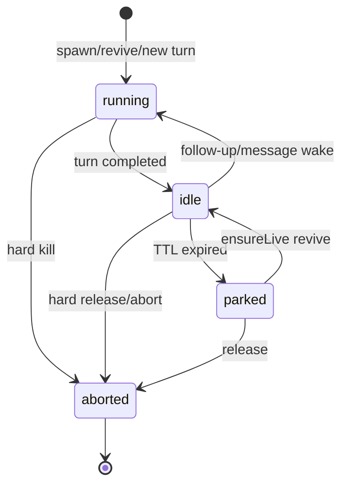
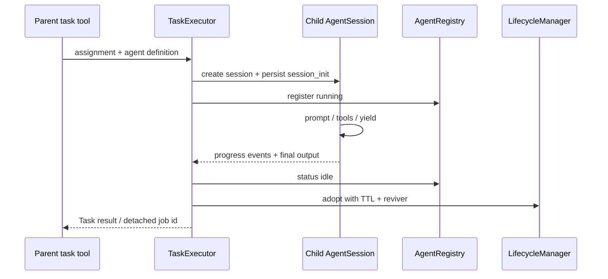

# 第 15 章　多代理、Hub、Advisor 与协作

> 子代理不是一次 `Promise<string>`。它有稳定身份、独立 session、可停放生命周期、消息邮箱、输出契约和可能的隔离 worktree。

## 15.1 `AgentRegistry` 是进程内名字服务

[`packages/coding-agent/src/registry/agent-registry.ts`](https://github.com/can1357/oh-my-pi/blob/v17.1.3/packages/coding-agent/src/registry/agent-registry.ts) 是 process-global registry，以稳定 ID 保存 `AgentRef`：

```ts
{
  id, displayName,
  kind: "main" | "sub" | "advisor",
  parentId?,
  status: "running" | "idle" | "parked" | "aborted",
  session: AgentSession | null,
  sessionFile,
  createdAt, lastActivity, activity?
}
```

Main 的固定 ID 是 `Main`。完成工作的子代理不会立即 unregister，而是变成 `idle`，因此还能接收 follow-up、被 Hub 查询或继续同一上下文。

## 15.2 四个状态的含义



- `idle` 仍有 live `AgentSession`；
- `parked` 已 dispose 内存对象，但保留 ref + sessionFile，可复活；
- `aborted` 是 terminal，不允许消息/复活；
- advisor ref 只用于观测，不是可通信 peer。

## 15.3 为什么需要停放

长任务可创建许多子代理。若每个完成后都保留：

- provider/session state；
- LSP/MCP/terminal/eval handle；
- event subscription；
- 大 message arrays；

进程内存和文件描述符会随历史代理数增长。直接删除又失去 follow-up 能力。`parked` 是中间态：释放昂贵运行时，保留可重建的 JSONL 合同。

## 15.4 `AgentLifecycleManager` 如何避免竞态

[`packages/coding-agent/src/registry/agent-lifecycle.ts`](https://github.com/can1357/oh-my-pi/blob/v17.1.3/packages/coding-agent/src/registry/agent-lifecycle.ts) 独占 `idle ↔ parked` 转换。

最危险场景是 TTL 正在 dispose，同时 Hub 来消息：

```text
park 读取 live session
Hub ensureLive 读取同一 session
park dispose
Hub 把消息发进 dying object
```

实现规则是：

1. park 在 dispose 前先 detach session、状态设 parked；
2. detach 前到达的 `ensureLive()` 可取消 park；
3. detach 后到达的调用等待 park 完成，再 revive；
4. 同 ID 的并发 park/revive promise coalesce；
5. 每个异步操作绑定发起时的确切 `AgentRef`。

## 15.5 Expected-ref CAS 防 ABA

Agent ID 可在旧 ref 被 release 后重新使用。一个迟到的旧 finalizer 若只按字符串 ID 更新，会把新一代同名 agent 设成 parked/aborted。

Registry 的 `registerIfAvailable`、`setStatus`、attach/detach/unregister 支持 expected ref 或 expected session：只有对象身份仍匹配才修改。这是 compare-and-swap 式代际保护。

## 15.6 冷复活靠 `session_init`

进程重启后 registry 扫描到 subagent JSONL，只能看到 parked ref，没有内存里的 reviver closure。顶层 session 安装 persisted reviver factory，读取 `session_init` entry 恢复：

- 完整 system prompt；
- 初始 task；
- tool names 与 restricted 标志；
- output schema/mode；
- spawn allowlist；
- read summarization 设置；
- cwd 与 model/session 状态。

若工作目录消失或持久合同不足，ref 仍可通过 `history://<id>` 阅读，但不会伪造不忠实的 live agent。

## 15.7 `task` 工具的两种 wire shape

[`packages/coding-agent/src/task/types.ts`](https://github.com/can1357/oh-my-pi/blob/v17.1.3/packages/coding-agent/src/task/types.ts) 根据配置只向模型展示一种 schema：

```ts
// single
{ name?, agent?, task, effort?, outputSchema?, schemaMode?, isolated? }

// batch
{ context, tasks: [{ name?, agent?, task, effort?, ... }] }
```

Runtime 仍接受两种，兼容旧 transcript 和内部 caller。Agent definition 可指定 tools、spawns、model 候选、thinking、output schema、skills、prewalk 等。

## 15.8 Spawn policy 是递归权限

子代理只有在以下条件共同满足时才能再 spawn：

- 当前 depth 小于 `maxRecursionDepth`（负数代表不设 cap）；
- parent/agent definition 的 `spawns` allowlist 允许目标 agent；
- 当前工具集真的包含 `task`；
- session 模式没有额外禁止。

因此“给子代理 task 工具”本身是一项能力授予。restricted tool list 不能被工厂自动补宽，避免子代理从无 spawn 权限变成可无限递归。

## 15.9 单个子代理的执行链



[`packages/coding-agent/src/task/executor.ts`](https://github.com/can1357/oh-my-pi/blob/v17.1.3/packages/coding-agent/src/task/executor.ts) 收集请求数、token、context、cost、当前工具和最近输出，供 parent TUI/Hub/collab 观察。

## 15.10 同步、批量与 detached

- 同步 task：父工具等待 child 完成；
- batch：多个 assignment 受并发限制并行；
- detached：注册后台 job，父 turn 可继续，完成结果异步回流；
- eval `agent()`：子代理进度嵌在 cell 内，不作为 detached HUD 项。

并发还受 provider 级 limiter 约束，避免一批 child 同时打爆同一 provider credential。任务的 request/token budget 多为 soft guard：到阈值时提示 agent 收尾，而非任意时刻硬切副作用工具。

## 15.11 输出不是只取最后一段文字

子代理可以调用隐藏 `yield`：

- `data` 提交结构化 payload；
- `type` 可表达增量标签或 terminal 类型；
- `status` 表达 success/aborted；
- `useLastTurn` 从最新 durable assistant text 取结果；
- output schema 以 permissive/strict 校验。

[`task/yield-assembly.ts`](https://github.com/can1357/oh-my-pi/blob/v17.1.3/packages/coding-agent/src/task/yield-assembly.ts) 组合多次 yield；[`structured-subagent.ts`](https://github.com/can1357/oh-my-pi/blob/v17.1.3/packages/coding-agent/src/task/structured-subagent.ts) 解析/验证。strict 下耗尽重试仍无效就是 `schema_violation`，不能把错误 JSON 当成功。

原始输出另有默认 500,000 bytes / 5,000 lines 上限，避免 child 用日志填满 parent context。

## 15.12 Worktree isolation

`isolated: true` 通过 [`packages/coding-agent/src/task/isolation-runner.ts`](https://github.com/can1357/oh-my-pi/blob/v17.1.3/packages/coding-agent/src/task/isolation-runner.ts) 与 [`task/worktree.ts`](https://github.com/can1357/oh-my-pi/blob/v17.1.3/packages/coding-agent/src/task/worktree.ts) 给 child 单独 Git worktree。

它解决并行 agent 同改一个文件的磁盘竞争，但不自动解决语义冲突。结束后仍需把 patch/commit 带回 parent，由 parent 决定合并。非 Git workspace 或嵌套 repo 要有明确 fallback/error。

## 15.13 Hub 是统一协调工具

[`packages/coding-agent/src/tools/hub/index.ts`](https://github.com/can1357/oh-my-pi/blob/v17.1.3/packages/coding-agent/src/tools/hub/index.ts) 合并三族操作：

- peer messaging：send/inbox/list/wait；
- async jobs：jobs/wait/cancel；
- project process：start/ps/logs/stop/restart/describe/send。

统一 `wait` 返回第一个发生的事件：匹配消息、job settle、process 条件、timeout 或 steering interrupt。等待是 interruptible；启动/停止/写进程 stdin 属 exec，消息和查看状态通常 read。

## 15.14 IRC bus 是平面 mailbox

[`packages/coding-agent/src/irc/bus.ts`](https://github.com/can1357/oh-my-pi/blob/v17.1.3/packages/coding-agent/src/irc/bus.ts) 使用 flat namespace：所有非 advisor live peer 可互相看到，不强制只能 parent-child 通信。

发送不等待 recipient 生成回复：

- running recipient：作为非中断 aside，在 step boundary 送达；
- idle：唤醒真实 turn；
- parked：先 `ensureLive()`；
- 有 matching waiter：直接交给 waiter；
- live hand-off 失败：才放 mailbox，最多 100 条，超出丢最老。

成功注入的消息不再保留 mailbox，否则 `inbox` 会双重投递。

## 15.15 `send await:true` 如何避免死锁

Sender 可以要求等 reply。但 recipient 可能正同步等待包含 sender 的 task batch，或处于禁止自主 wake 的 plan mode。若强制真实 turn，形成循环等待。

IrcBus 把 `expectsReply` 传给 recipient；无法及时跑真实 reply 时，可用 ephemeral side-channel auto-reply。该回复解决协调等待，但不污染 recipient 主 append-only transcript。

## 15.16 Advisor 不是 peer 子代理

Advisor/watchdog 有独立模型、transcript 和 usage 归属，持续查看 primary 增量并用 `advise` 发建议。但它：

- `kind = advisor`，不出现在 peer roster；
- 不可 Hub message/revive；
- 默认只给 read/grep/glob，可配置其他内建工具；
- 处理在后台，不阻塞 primary turn；
- advice 通过 yield queue 插入 primary；
- 自己维护 append-only context/promotion/compaction。

入口在 [`packages/coding-agent/src/advisor/`](https://github.com/can1357/oh-my-pi/tree/v17.1.3/packages/coding-agent/src/advisor/) 和 [`session/session-advisors.ts`](https://github.com/can1357/oh-my-pi/blob/v17.1.3/packages/coding-agent/src/session/session-advisors.ts)。

## 15.17 Advisor 为什么需要输出隔离

Passive reviewer 仍是 LLM，可能重复“Stop.”、调用未授权工具或生成危险指令。两道代码门：

- [`advisor/emission-guard.ts`](https://github.com/can1357/oh-my-pi/blob/v17.1.3/packages/coding-agent/src/advisor/emission-guard.ts)：过滤无内容短语、session 内去重、每 update 最多一条有效建议；
- [`advisor/runtime.ts`](https://github.com/can1357/oh-my-pi/blob/v17.1.3/packages/coding-agent/src/advisor/runtime.ts)：对未授权 tool call 和 output-only destructive directive 做 quarantine。

Guard 对被抑制调用仍向 advisor 返回“Recorded”，避免模型通过不断改写同一句噪声来绕过 filter。

## 15.18 Collab 是 host-authoritative 复制

[`packages/coding-agent/src/collab/`](https://github.com/can1357/oh-my-pi/tree/v17.1.3/packages/coding-agent/src/collab/) 让 Web/远端 guest 观看或操作 live session：

- host 是权威 journal/AgentSession；
- guest 只持 replica，不进行 peer-to-peer 合并；
- welcome 后分块发送 snapshot，再增量发送 entry/event/state；
- registry/task progress 也镜像；
- 大 transcript 可按需 fetch。

协议类型放在依赖轻、浏览器安全的 [`packages/wire`](https://github.com/can1357/oh-my-pi/blob/v17.1.3/packages/wire/src/index.ts)，当前 `COLLAB_PROTO = 3`。

## 15.19 端到端加密与只读链接

[`collab/crypto.ts`](https://github.com/can1357/oh-my-pi/blob/v17.1.3/packages/coding-agent/src/collab/crypto.ts) 使用 AES-256-GCM：

```text
sealed frame = 12-byte random IV + ciphertext + authentication tag
```

32-byte room key 只在分享 link secret 中，relay 只看 peer ID envelope 和 opaque bytes。完整编辑链接还带 16-byte write token；只有 room key 的 view link 是只读。

这保护 relay 不读 session payload，但拿到完整 URL secret 的人仍拥有对应权限，所以链接本身是 bearer credential。

## 15.20 Snapshot 为什么分 chunk

大 session 可能数 MB。若 welcome 携带全部 entries，一个巨帧必须在首次握手 deadline 内传完，容易 timeout/内存峰值。

协议先发 `welcome(entryCount)`，再发多个 `snapshot-chunk`，最后一块 `final: true`。每块到达都刷新 progress timeout；随后才切换到 live `entry` 增量流。

## 15.21 调试落点

| 现象 | 首先检查 |
| --- | --- |
| idle agent 突然消失 | registry 是否仍有 parked ref/sessionFile |
| Hub 消息发进 disposed session | lifecycle detach-before-dispose gate |
| 同名新 agent 被旧任务 abort | expected-ref CAS 是否传递 |
| 进程重启后不能 resume child | `session_init` 是否完整、reviver factory |
| batch 永远等待 | provider concurrency、IRC await 环、child retry state |
| structured output 看似成功但无数据 | schema source/mode/status 与 yield assembly |
| isolated child 改动不见了 | worktree patch/merge handoff |
| advisor 建议刷屏 | emission guard reset/dedupe/rate gate |
| collab guest 一直 loading | entryCount、snapshot final/chunk timeout |
| view link 能发送 prompt | write token 校验与 readOnly state |

## 15.22 本章小结

多代理系统由 registry 提供稳定身份，lifecycle manager 管 idle/park/revive，task executor 管能力与输出，Hub/IRC 管协调，Advisor 管只读旁路审阅，Collab 再把权威状态加密复制给 guest。

下一章看这些 session 如何共享跨会话知识：[第 16 章：长期记忆与自动学习](./第16章-长期记忆与自动学习.md)。
