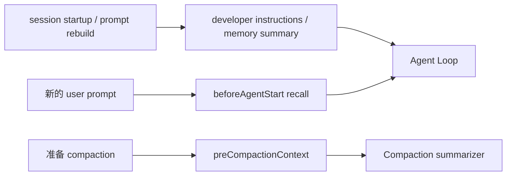
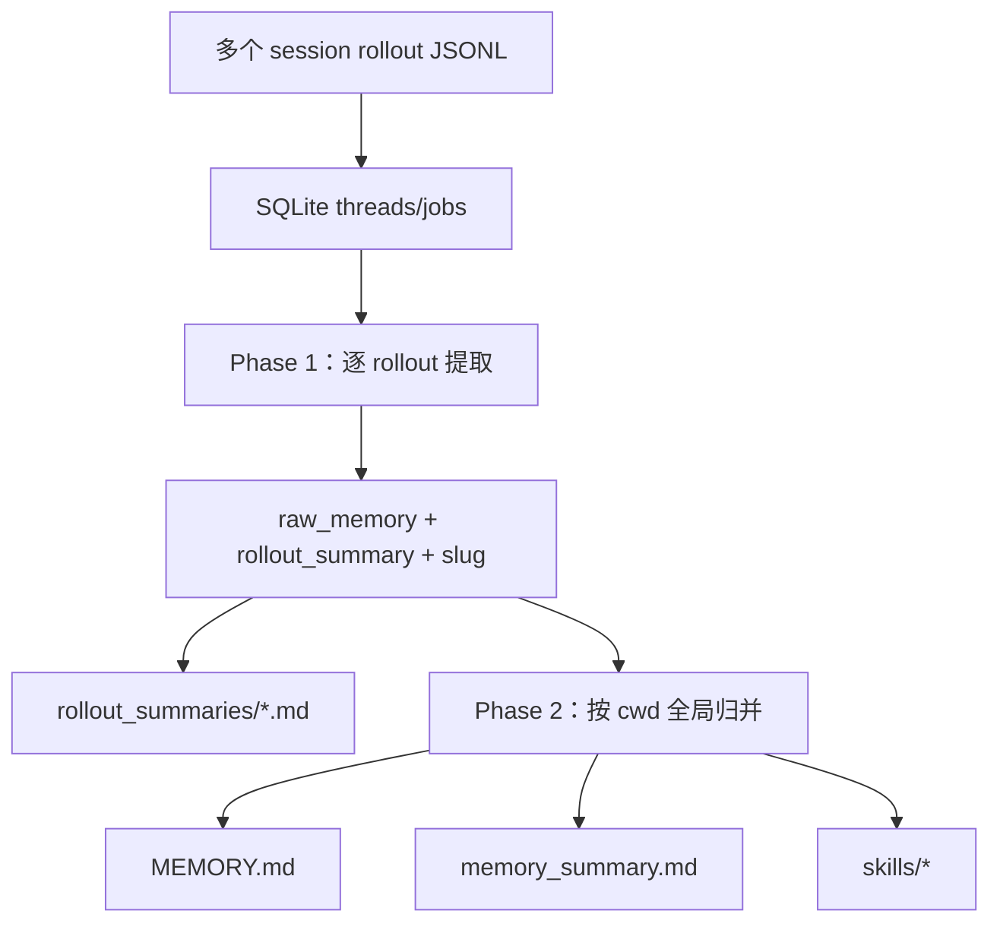

# 第 16 章　长期记忆与自动学习

> Session 记录“这次发生了什么”，Memory 试图回答“以后哪部分还值得知道”。两者若不分开，历史会无限增长，旧事实也会伪装成当前指令。

## 16.1 统一后端接口

[`packages/coding-agent/src/memory-backend/types.ts`](https://github.com/can1357/oh-my-pi/blob/v17.1.3/packages/coding-agent/src/memory-backend/types.ts) 定义四个 ID：

```ts
type MemoryBackendId = "off" | "local" | "hindsight" | "mnemopi";
```

每个 backend 可实现：

- `start()` / lifecycle；
- `buildDeveloperInstructions()`；
- `status/search/save`；
- `clear/enqueue/stats/diagnose`；
- `beforeAgentStartPrompt()`；
- `preCompactionContext()`。

[`resolveMemoryBackend()`](https://github.com/can1357/oh-my-pi/blob/v17.1.3/packages/coding-agent/src/memory-backend/resolve.ts) 只看 `memory.backend`，每次恰选一个；旧 `memories.enabled` 只作为配置迁移输入，不再是运行时第二开关。

## 16.2 四后端对照

| 后端 | 存储/服务 | 搜索 | 自动行为 | 适合 |
| --- | --- | --- | --- | --- |
| `off` | 无 | 无 | 无 | 完全禁用 |
| `local` | 本地 SQLite job + Markdown artifacts | 无结构化 search | rollout 两阶段归纳 | 可审阅的文件式长期知识 |
| `hindsight` | 远端 Hindsight bank | 语义 recall/reflect | retain、mental models | 跨设备托管记忆 |
| `mnemopi` | 本地 SQLite banks + embeddings/FTS/graph | 混合检索 | recall/retain/consolidate | 完整本地语义记忆 |

“local”不等于 Mnemopi：前者是 rollout → 文档的异步整理管线，后者是可查询的本地记忆数据库。

## 16.3 Memory 进入上下文的三个时机



- 稳定指南/摘要放 system prompt；
- 与当前问题相关的记忆在第一轮生成前动态 recall；
- 压缩前额外 recall 避免摘要丢失长期相关背景。

动态注入文字明确标为 `<memories>` 背景知识，并提醒模型：当前用户与工具证据冲突时，后者优先。

## 16.4 `SessionMemory` 管后端切换

[`packages/coding-agent/src/session/session-memory.ts`](https://github.com/can1357/oh-my-pi/blob/v17.1.3/packages/coding-agent/src/session/session-memory.ts) 串行化设置变化：

1. dispose/flush 旧 Hindsight/Mnemopi state；
2. 顶层 session 启动新 backend；
3. 重建 memory tools；
4. 刷新 base system prompt。

并发 config reload 不会并行建立两套 state；transition promise 依序执行。切换失败会清旧状态、移除 memory tools，不能留下“prompt 说有记忆，但 tool 指向已销毁 state”的半切换。

## 16.5 Local backend 的两阶段管线

入口在 [`packages/coding-agent/src/memories/index.ts`](https://github.com/can1357/oh-my-pi/blob/v17.1.3/packages/coding-agent/src/memories/index.ts)，job/lease 在 [`memories/storage.ts`](https://github.com/can1357/oh-my-pi/blob/v17.1.3/packages/coding-agent/src/memories/storage.ts)。



Phase 1 可并发处理多个更新后的 thread；Phase 2 读取项目范围的 stage1 outputs，合并成短摘要、可搜索手册和候选 skills。

## 16.6 Lease 让多个 OMP 进程不重复归纳

SQLite jobs 保存 status、worker/ownership token、lease_until、retry_at 和 input watermark。

Worker claim 时只有过期/未占用任务能更新为 running；完成前再次验证 ownership token。若 lease 已被另一进程接管，旧 worker 的迟到结果不能覆盖新结果。

Phase 2 job key 按 cwd 分区，所以一个项目的 consolidation 不会吞进另一个 workspace 的 rollout。

## 16.7 Local 输出为什么分三层

- `memory_summary.md`：短，适合每次 prompt 注入；
- `MEMORY.md`：长索引/手册，模型先搜索再按需读；
- `rollout_summaries/`：证据级回顾；
- `skills/`：可执行工作方法；
- `learned.md`：`learn` 工具直接捕获、不会被 consolidation 覆盖。

这是与第 10 章相同的 progressive disclosure。把全部 rollout summary 放 system prompt 会让记忆本身成为新的上下文问题。

## 16.8 Local 管线的内容安全

管线只提取可持久化消息，模型输出必须满足精确 JSON schema。写入前：

- secret pattern redaction；
- prompt-injection delimiter neutralization；
- 字符/token 上限；
- 空 durable signal 允许返回空，不强迫编造记忆；
- consolidation 结果再次 redaction/validation。

这并不保证自动记忆永远正确，所以 prompt 明确提示记忆可能 stale，遇到当前 repo 事实应重新验证。

## 16.9 Hindsight 的 bank 与 mental model

[`packages/coding-agent/src/hindsight/`](https://github.com/can1357/oh-my-pi/tree/v17.1.3/packages/coding-agent/src/hindsight/) 对接远端 Hindsight：

- bank ID/前缀与 cwd/tag scope；
- per-turn recall；
- retain queue；
- reflect/mental models；
- compaction recall；
- 本地 recall cache。

Scope 设置变化时先 flush 旧 retain queue，再创建新 state；否则本来属于旧 bank 的排队内容会落入新 bank。

`clear` 只能清本地 state/cache，不能声称删除远端 bank；源码会明确告警用户需要在 Hindsight UI 删除 upstream state。

## 16.10 Hindsight 只保留对话正文

[`packages/coding-agent/src/hindsight/transcript.ts`](https://github.com/can1357/oh-my-pi/blob/v17.1.3/packages/coding-agent/src/hindsight/transcript.ts) 从 session entries 只取：

- user 文本；
- assistant 的可见 text blocks。

它丢弃 thinking、tool call、tool result、custom message 等。原因是内部 monologue/工具日志会污染长期检索，也可能含不应固化的瞬时数据。

[`hindsight/content.ts`](https://github.com/can1357/oh-my-pi/blob/v17.1.3/packages/coding-agent/src/hindsight/content.ts) 还会在 retain 前剥掉 `<memories>`、mental models 和旧标签，阻断“召回内容再次被保留、越滚越真”的反馈环。

## 16.11 Mnemopi 的数据层

独立包 [`packages/mnemopi`](https://github.com/can1357/oh-my-pi/blob/v17.1.3/packages/mnemopi/src/index.ts) 提供本地记忆引擎，包含：

- working memory；
- episodic graph；
- typed facts/entities/triples；
- SQLite storage/migrations；
- FTS、vector index、MMR；
- polyphonic recall 与 query intent；
- temporal parsing；
- veracity consolidation；
- embeddings/local LLM/provider backend。

Coding-agent 适配位于 [`packages/coding-agent/src/mnemopi/backend.ts`](https://github.com/can1357/oh-my-pi/blob/v17.1.3/packages/coding-agent/src/mnemopi/backend.ts) 和 `state.ts`，延迟 import 重模块，避免 CLI 启动时就加载 embedding/N-API 依赖。

## 16.12 Banks 与 scope

Mnemopi 可从多个 scoped bank recall、向一个 retain target 写入，例如：

- 全局 bank：用户偏好；
- 项目 bank：架构决策；
- tag/channel：更细范围。

每个 bank 可映射独立 SQLite 文件。`status/stats` 去重 target，报告 working/episodic/triples 数和数据库路径。清理前会关闭缓存 handle，尤其避免 Windows 上 SQLite 文件仍锁定。

## 16.13 混合召回而非只做向量相似度

Mnemopi 的 recall 可以组合：

- lexical FTS；
- dense/binary vector；
- entity/triple graph；
- query intent 与时间线索；
- MMR 多样性；
- synonyms/polyphonic paths；
- relevance/veracity/decay。

因此“过去我们为什么选 X”不只匹配相似句子，还可沿决定实体、时间和关系取相关 episode。具体策略在 [`packages/mnemopi/src/core/`](https://github.com/can1357/oh-my-pi/tree/v17.1.3/packages/mnemopi/src/core/) 分模块实现。

## 16.14 Mnemopi 的自动循环

顶层 `MnemopiSessionState` 订阅 session：

```text
首轮/每轮前：按 prompt recall → 注入 <memories>
完成 turn：抽取 durable fact/entity → retain
达到条件/退出：consolidate working → episodic/facts/triples
compaction 前：recall 相关背景给 summarizer
```

Extraction/consolidation model 可由在线角色或 tiny/local model 提供。失败被记录并让 backend inert/降级，不应阻断 Agent 主循环。

## 16.15 子代理为何 alias 父记忆 state

Hindsight/Mnemopi 在 `taskDepth > 0` 不启动独立自动 retain/recall loop，而创建 `aliasOf` parent state：

- 共享 bank/scope 和基础能力；
- 标记首轮已 recall，避免每个 child 重复注入；
- child 完成不把同一 parent 任务重复 retain 多次；
- clear/dispose 不误删父 state。

子代理可显式使用获得授权的 memory tools，但长期学习的主所有者是顶层 session。

## 16.16 四个面向模型的记忆工具

| 工具 | 意图 |
| --- | --- |
| `recall` | 查询相关记忆 |
| `retain` | 保存 durable fact/decision/preference |
| `reflect` | 对多条记忆综合回答 |
| `memory_edit` | Mnemopi 的更直接管理操作 |

另有 `learn`：把事实写入所选 backend，并可同时创建/增强 managed skill；`manage_skill` 专门管理可复用流程。

Tool factory 根据 backend 自动加入相应工具。Local backend 支持 `learn`/save，但 status 明确 `searchable: false`；不能因为统一接口存在就假装它支持 recall。

## 16.17 Fact 与 Skill 的边界

```text
“这个项目使用 Bun 1.3.14”       → durable fact / memory
“发布前依次做 A、B、C”            → procedure / skill
“用户这一次让我暂时不要跑测试”    → 通常不应长期记忆
“当前还剩三个 TODO”               → session/goal，不是长期记忆
```

自动学习的质量关键不是“记得更多”，而是正确分类稳定性和复用范围。

## 16.18 AutoLearnController

[`packages/coding-agent/src/autolearn/controller.ts`](https://github.com/can1357/oh-my-pi/blob/v17.1.3/packages/coding-agent/src/autolearn/controller.ts) 只安装在顶层 session。它统计每个 turn 的完成 tool calls，默认至少 5 次才认为有足够实质工作。

结束时还会跳过：

- aborted turn；
- 当前设置已关闭；
- plan mode；
- turn 开始时或结束时在 goal mode；
- tool call 数不足。

若 `autolearn.autoContinue` 显式开启，才运行一次私有 capture turn，提示用 `learn/manage_skill` 保存真正可复用内容。

## 16.19 Passive 模式为何不插隐藏消息

旧式做法是在下一真实 turn 前偷偷插一条 reminder。但这会修改 provider 已缓存的 conversation prefix，导致 Anthropic 等 cache miss。

当前 passive 模式只保留稳定 system guidance，不往 session journal 注入中途提醒；只有显式 autoContinue 才运行 capture。这个细节说明长期学习也必须遵守 prompt-cache 经济性。

## 16.20 多个 capture 如何合并

AutoLearn 不允许两个私有 capture 并发：

- 一个正在运行时，新 eligible turn 只设置 pending boolean；
- 当前结束后再跑一次最新需求；
- 多个中间事件 coalesce，不无限排队。

这避免学习任务反过来抢占主 Agent 的 provider 并发和 session 状态。

## 16.21 记忆的优先级与可信度

运行时提示把记忆定位为 background knowledge：

```text
当前用户明确说明
> 当前 workspace/tool 证据
> 经验证的 memory
> 模糊/旧 memory
```

这是必要的，因为长期记忆可能：

- 来自旧版本；
- 被模型摘要时简化；
- scope 配错；
- 用户后来改变偏好；
- 与当前分支不同。

因此 memory search 提供 source/timestamp/score，最终回答仍应在高风险处回查源码。

## 16.22 调试落点

| 现象 | 首先检查 |
| --- | --- |
| prompt 说有 memory 但工具没有 | backend transition 与 tool rebuild |
| local 长期不更新 | SQLite lease/job watermark/retry |
| 两个进程互相覆盖 consolidation | ownership token 与 phase2 cwd key |
| 召回内容越来越重复 | memory tag anti-feedback stripping |
| Hindsight clear 后远端仍有数据 | 这是预期；clear 只清本地 state/cache |
| Mnemopi 首轮没召回 | `beforeAgentStartPrompt`、state startup race |
| 子代理重复保存同一事实 | 是否正确建立 `aliasOf` |
| AutoLearn 从不触发 | 5-call threshold、plan/goal/abort、autoContinue |
| AutoLearn 导致 cache miss | 是否仍在 passive 模式插 custom reminder |
| 旧记忆压过当前事实 | prompt precedence 与调用方验证 |

## 16.23 本章小结

四种后端共享 lifecycle、prompt、search/save 与 compaction 接口，但保留不同能力边界。Local 归纳 rollout 文档，Hindsight 使用远端 bank，Mnemopi 提供本地混合检索；AutoLearn 只在实质性顶层 turn 后谨慎捕获。

下一章下沉到支撑这些高层能力的原生执行层：[第 17 章：Rust 原生层与跨平台执行](./第17章-Rust原生层与跨平台执行.md)。
