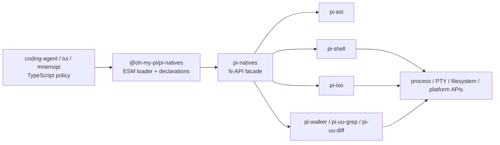
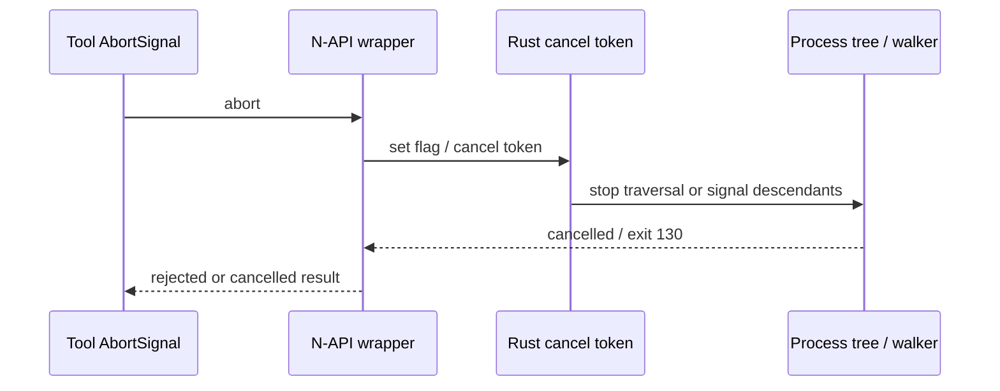

# 第 17 章　Rust 原生层与跨平台执行

> TypeScript 决定“允许做什么、何时做”，Rust 负责“怎样在不同操作系统上可靠而高效地做”。原生层不是另一套 Agent，而是 coding-agent 的机制层。

## 17.1 为什么一个 Bun 项目需要 Rust

若所有功能都写成 TypeScript，普通配置、会话和网络调用没有问题；真正棘手的是这些工作：

- 在大仓库中并行遍历、grep、glob；
- 维护可取消的持久 shell、PTY 和完整进程树；
- 解析多语言 AST、做结构化编辑与代码摘要；
- 调用 APFS、Btrfs、OverlayFS、ProjFS 等平台能力；
- 编码 SIXEL、访问剪贴板、音频和桌面；
- 在高频 TUI 路径上计算 ANSI 宽度、换行和高亮；
- 在本地做 token、向量、MMR 和 Snapcompact 位图渲染。

这些任务要么受 CPU/系统调用约束，要么依赖平台 API。OMP 的选择不是“把整个应用改写成 Rust”，而是保留 TypeScript 编排层，在边界处通过 N-API 调用原生机制。

## 17.2 三层结构



边界职责很重要：

- TypeScript 负责配置、审批、工具 schema、session ownership 和展示；
- [`packages/natives/native/index.js`](https://github.com/can1357/oh-my-pi/blob/v17.1.3/packages/natives/native/index.js) 负责加载后导出稳定的 JS 表面；
- [`crates/pi-natives`](https://github.com/can1357/oh-my-pi/blob/v17.1.3/crates/pi-natives/src/lib.rs) 把内部 crate 包装成 N-API 类、函数和 Promise；
- 专用 crate 负责算法与平台实现。

因此 `pi-natives` 更像一块“总配电板”，不是所有原生逻辑的实际所在地。

## 17.3 八个顶层 crate 的分工

| crate | 主要责任 | 典型消费者 |
| --- | --- | --- |
| [`pi-ast`](https://github.com/can1357/oh-my-pi/blob/v17.1.3/crates/pi-ast/src/lib.rs) | Tree-sitter 解析、block、match/edit、代码摘要 | AST 工具、read 摘要 |
| [`pi-iso`](https://github.com/can1357/oh-my-pi/blob/v17.1.3/crates/pi-iso/src/lib.rs) | 跨平台隔离后端与差异提取 | task worktree/isolation |
| [`pi-natives`](https://github.com/can1357/oh-my-pi/blob/v17.1.3/crates/pi-natives/src/lib.rs) | N-API 门面及设备能力 | 所有 TS 包 |
| [`pi-shell`](https://github.com/can1357/oh-my-pi/blob/v17.1.3/crates/pi-shell/src/lib.rs) | shell、进程、内建命令、输出最小化 | bash/eval/后台进程 |
| [`pi-uu-diff`](https://github.com/can1357/oh-my-pi/blob/v17.1.3/crates/pi-uu-diff/src/lib.rs) | diff 算法封装 | edit 展示、变更比较 |
| [`pi-uu-grep`](https://github.com/can1357/oh-my-pi/blob/v17.1.3/crates/pi-uu-grep/src/lib.rs) | ripgrep 风格匹配 | grep 工具 |
| [`pi-uutils-ctx`](https://github.com/can1357/oh-my-pi/blob/v17.1.3/crates/pi-uutils-ctx/src/lib.rs) | uutils 调用上下文与取消 | shell 内建命令 |
| [`pi-walker`](https://github.com/can1357/oh-my-pi/blob/v17.1.3/crates/pi-walker/src/lib.rs) | 并行目录遍历、缓存、heartbeat | glob、grep、workspace 列举 |

这张表也解释了为什么不能只读 `crates/pi-natives/src/lib.rs`：它会告诉你导出了什么，却不会完整解释 shell、隔离或 walker 的内部不变量。

## 17.4 JS 导出层是生成的稳定门面

[`packages/natives/native/index.js`](https://github.com/can1357/oh-my-pi/blob/v17.1.3/packages/natives/native/index.js) 手写部分几乎只有：

```js
import { loadNative } from "./loader-state.js";
const nativeBindings = loadNative();
```

后面的 class、function 和 enum 映射由生成脚本根据 napi-rs 的声明更新。当前表面包括：

- `Shell`、`Process`、`PtySession`；
- `AudioCapture`、`AudioPlayback`、`LiveWebRtcPeer`；
- `grep`、`glob`、`listWorkspace`；
- `astMatch`、`astEdit`、`summarizeCode`；
- `isoProbe/start/stop/diff`；
- `highlightCode`、`htmlToMarkdown`、SIXEL；
- token、vector、MMR、Snapcompact 渲染；
- ANSI 可见宽度与键盘协议解析。

生成导出避免了 Rust 已增加符号而 JS 忘记转发的手工漂移；版本哨兵则解决了更隐蔽的“JS 与 `.node` 来自不同版本”问题。

## 17.5 发布不是一个跨平台万能二进制

[`packages/natives/README.md`](https://github.com/can1357/oh-my-pi/blob/v17.1.3/packages/natives/README.md) 描述了 core package + platform leaf package：

```text
@oh-my-pi/pi-natives                 JS loader、类型、README
@oh-my-pi/pi-natives-linux-x64       Linux x64 .node
@oh-my-pi/pi-natives-linux-arm64     Linux arm64 .node
@oh-my-pi/pi-natives-darwin-x64      macOS x64 .node
@oh-my-pi/pi-natives-darwin-arm64    macOS arm64 .node
@oh-my-pi/pi-natives-win32-x64       Windows x64 .node
```

leaf packages 作为固定版本的 `optionalDependencies` 注入 core manifest。包管理器只安装与当前 `os/cpu` 相容的叶包，避免每个用户下载全部平台产物。

## 17.6 x64 为什么还有 modern 与 baseline

x64 并不代表所有 CPU 都支持相同指令集。构建产物可包含：

```text
pi_natives.<platform>-x64-modern.node
pi_natives.<platform>-x64-baseline.node
```

[`selectCpuVariant()`](https://github.com/can1357/oh-my-pi/blob/v17.1.3/packages/natives/native/loader-state.js) 的优先级是：

1. 用户显式 `PI_NATIVE_VARIANT=modern|baseline`；
2. 私有环境缓存 `__PI_NATIVE_VARIANT_CACHE`；
3. 实际检测 AVX2；
4. 检测失败按 baseline。

Linux 读 `/proc/cpuinfo`，macOS 尝试 `/usr/sbin/sysctl`，Windows 调 PowerShell 的运行时 intrinsic。结果写入私有环境变量，让后续 Bun worker/child 继承，避免每个 worker 重做检测，也避免 worker 环境里 `sysctl` 启动失败后错误降级。

modern 加载失败时，候选顺序仍会尝试 baseline，再尝试无后缀默认文件；这是能力降级，不是静默吞掉所有 native 错误。

## 17.7 Loader 的候选路径不是随便试文件

[`resolveLoaderCandidates()`](https://github.com/can1357/oh-my-pi/blob/v17.1.3/packages/natives/native/loader-state.js) 根据运行形态建立有序候选集：

- platform leaf package 目录；
- core package 的 `native/`；
- 可执行文件所在目录；
- `~/.omp/natives/<version>/`；
- 旧兼容 user data 目录；
- 独立编译二进制解出的文件。

普通 npm/Bun 安装优先 leaf package；compiled binary 优先分版本缓存；Windows node_modules 安装先使用暂存副本。路径去重后逐个 `require()`、验证，失败原因被聚合进最终诊断。

这种设计比“捕获异常后说 addon not found”更有运维价值：用户能看到每个实际探测路径和每次 `dlopen` 的具体错误。

## 17.8 独立 Bun 二进制如何带上 `.node`

`.node` 不能像普通 JS 一样直接在 Bun 的虚拟文件系统中 `dlopen`。构建流程因此生成 [`embedded-addon.js`](https://github.com/can1357/oh-my-pi/blob/v17.1.3/packages/natives/native/embedded-addon.js) 元数据，可指向单文件或 `tar.gz` 归档；运行时将选中的 addon 解到：

```text
~/.omp/natives/<package-version>/
```

Loader 以 embedded metadata、`PI_COMPILED` 和 `import.meta.url` 的 bunfs 形态判断 compiled mode。真正可靠的主信号是 embedded metadata 是否存在，因为编译期 define 不等于运行时环境变量。

解包实现还检查：

- metadata 的 platform/version 必须与当前包一致；
- tar entry 只能是预期的普通文件；
- filename 不得含 `/`、`\` 或目录穿越；
- 截断归档、未知 entry type、缺文件均报错；
- 先写临时文件，再移动到目标；
- 已存在且尺寸匹配的产物可复用。

这使“从自身提取可执行原生代码”仍有明确的边界，而不是把任意归档内容释放到用户目录。

## 17.9 Windows 为什么要多一次 staging

Windows 会锁住已加载的 `.node`。全局更新时，旧 `omp` 进程可能仍持有 `node_modules` 中的文件，导致包管理器更新 JS 却无法覆盖原生模块。

[`shouldStageNodeModulesAddon()`](https://github.com/can1357/oh-my-pi/blob/v17.1.3/packages/natives/native/loader-state.js) 只在这些条件成立时暂存：

- Windows；
- 非 compiled binary；
- 原生文件确实来自 `node_modules`；
- 不是 workspace 开发产物。

Loader 把 addon 复制到版本固定目录再加载。运行进程锁的是 cache copy，下一次安装可更新 node_modules；不同版本的进程也不会抢同一个路径。

## 17.10 版本哨兵防止“半升级”

Rust addon 导出形如：

```text
__piNativesV17_1_3
```

Loader 根据 `package.json` 动态计算预期符号，并在 `require()` 后验证。缺失时会区分：

1. 磁盘就是旧 `.node`；
2. 磁盘已更新，但当前进程的动态模块缓存仍驻留旧 addon。

第二种情况不能靠再次 `require` 修复，必须重启进程。错误信息会同时报告 resident version、expected version 和候选路径，比后续出现模糊的“某函数不是 function”更早、更准确。

成功加载后，旧版本缓存目录只做 best-effort 清理；权限失败不能反过来让已经加载成功的应用启动失败。

## 17.11 N-API 边界有三类执行形态

原生函数大致分为：

- 很短的同步计算：直接返回，例如部分宽度和解析函数；
- napi-rs `Task`：在线程池执行 CPU/阻塞工作；
- Rust async future：映射为 JS Promise。

例如 [`crates/pi-natives/src/iso.rs`](https://github.com/can1357/oh-my-pi/blob/v17.1.3/crates/pi-natives/src/iso.rs) 明确把阻塞文件系统调用放进 `tokio::task::spawn_blocking`。否则 APFS clone 或 mount 操作会卡住 Bun 事件循环，TUI、stream 和取消事件都无法推进。

反过来，也不应把每个微小纯函数都变成 Promise；跨线程调度本身有成本。N-API façade 的价值之一就是按工作性质选择边界形态。

## 17.12 Promise 不自动等于可取消

JS 的 `AbortSignal`、Rust 的 `CancellationToken`、shell 的进程信号是三个不同层级。可靠取消要把信号逐层传递：



[`pi-shell/src/cancel.rs`](https://github.com/can1357/oh-my-pi/blob/v17.1.3/crates/pi-shell/src/cancel.rs) 区分 signal、timeout 等原因；[`pi-shell/src/process.rs`](https://github.com/can1357/oh-my-pi/blob/v17.1.3/crates/pi-shell/src/process.rs) 维护后代进程身份，避免 PID 重用时误杀用户的无关进程；walker 的 heartbeat 则让阻塞目录遍历周期性看到取消标志。

因此“前端 Promise 已 reject”不能作为后台工作已经停止的证明。

## 17.13 `pi-shell` 不只是 `spawn(command)`

[`crates/pi-shell/src/shell.rs`](https://github.com/can1357/oh-my-pi/blob/v17.1.3/crates/pi-shell/src/shell.rs) 支撑：

- one-shot 与 persistent shell；
- PTY/非 PTY 输出；
- cwd、env 与 shell snapshot；
- timeout、abort、后代进程回收；
- 流式 chunk 回调；
- 后台任务继续运行；
- 部分 coreutils/moreutils 内建执行。

持久 shell 使连续 bash 调用可以保留 `cd`、环境和 shell 状态；但每次命令仍要有独立的运行结果和取消边界，不能因为共享 shell 就把不同 tool call 的输出混成一条不可配对流。

## 17.14 输出最小化也是上下文工程

[`crates/pi-shell/src/minimizer`](https://github.com/can1357/oh-my-pi/tree/v17.1.3/crates/pi-shell/src/minimizer) 为 cargo、git、npm、Gradle、Docker、Terraform 等命令定义专用过滤器和规则。

目标不是美化终端，而是：

- 保留错误、失败测试、关键摘要和退出码；
- 去掉重复进度条、成功噪声和超长常规列表；
- 降低 tool result 占用的 token；
- 仍可把完整原始输出保存为 artifact。

这和第 8 章的 output spill 是互补关系：Rust 尽早做语义压缩，TS 在最终 provider boundary 再做长度预算与 artifact 引用。

## 17.15 Walker、grep 与 glob 的组合

[`pi-walker`](https://github.com/can1357/oh-my-pi/blob/v17.1.3/crates/pi-walker/src/lib.rs) 负责并行走目录与缓存；[`pi-uu-grep`](https://github.com/can1357/oh-my-pi/blob/v17.1.3/crates/pi-uu-grep/src/rg.rs) 负责匹配语义；[`pi-natives/src/grep.rs`](https://github.com/can1357/oh-my-pi/blob/v17.1.3/crates/pi-natives/src/grep.rs) 把参数与结果变成 JS 可用结构。

分开后可以复用同一 traversal 基础设施：

- `glob` 只按路径条件收集；
- `grep` 还执行内容匹配；
- `listWorkspace` 建立项目概览；
- fd/coreutils 路径也可共享 walker heartbeat。

缓存失效通过显式 `invalidateFsScanCache` 暴露；文件修改后若从不失效，速度优化就会变成错误结果。

## 17.16 AST 层的正确位置

[`pi-ast`](https://github.com/can1357/oh-my-pi/blob/v17.1.3/crates/pi-ast/src/lib.rs) 将语言 parser、block、ops 和 summary 分开。N-API 层导出 `astMatch`、`astEdit`、`blockRangeAt`、`summarizeCode` 等较稳定操作，而 TypeScript 工具仍负责：

- tool schema；
- 路径解析；
- Hashline/并发写保护；
- approval tier；
- 将 diff 作为可审阅结果返回。

换言之，AST 能判断“结构上怎么改”，但不能自行决定“模型是否有权改这个文件”。

## 17.17 `pi-iso` 是平台抽象层，不是单一容器

[`pi-iso`](https://github.com/can1357/oh-my-pi/blob/v17.1.3/crates/pi-iso/src/lib.rs) 的后端包括：

- APFS；
- Btrfs；
- ZFS；
- Linux reflink；
- OverlayFS；
- Windows block clone；
- ProjFS；
- recursive copy fallback。

上层调用 `isoProbe` 选择可用机制，再用 `isoStart/isoStop/isoDiff` 管生命周期。不同平台的隔离强度与实现不同，所以文档应称其为“workspace isolation PAL”，不能笼统承诺为安全容器。

它主要解决子代理并行修改的工作区隔离和差异回收；网络、凭据、进程权限是否隔离仍取决于实际 backend 与宿主配置。

## 17.18 设备与媒体能力为何也放在这里

剪贴板、音频、桌面、SIXEL、WebRTC 都有高平台差异或原生依赖。集中到 `pi-natives` 后：

- TS 只面对稳定的 class/function API；
- 平台 feature 可在构建时条件编译；
- loader 统一给出缺失/不支持诊断；
- 同一取消与 Tokio runtime 能被复用。

但这些能力仍由上层工具决定何时注册和请求审批。原生模块“能录音”不等于 Agent 默认获准录音。

## 17.19 原生失败为什么通常不能静默换 JS fallback

若 fallback 与原实现语义完全一致，降级是合理的；若它在 gitignore、正则、进程回收、文件隔离上有差异，静默 fallback 会制造更难定位的数据错误。

OMP loader 因此偏向：

1. 尝试清晰有序的兼容候选；
2. 验证版本与符号；
3. 聚合每条失败原因；
4. 给出删除 cache、重启或下载产物的具体提示；
5. 无等价实现时启动失败。

这是“fail with diagnosis”，不是“为了可启动而隐藏能力损坏”。

## 17.20 原生层的信任边界

必须明确三个事实：

1. `.node` 是当前进程内的本机代码，拥有与 `omp` 相同的 OS 权限；
2. N-API 类型检查不是安全沙箱；
3. tool approval、路径约束和 isolation policy 主要在 TypeScript 上层。

因此供应链完整性、版本锁定、平台包匹配和版本哨兵都不是“安装细节”，而是执行可信代码的前提。第 18 章会继续把原生代码、扩展、MCP、模型与协作端放进同一张信任边界图。

## 17.21 调试落点

| 现象 | 首先检查 |
| --- | --- |
| 启动时报 `.node` 不存在 | `loader-state.js` 打印的候选路径、platform leaf 是否安装 |
| 老 CPU 启动崩溃 | `PI_NATIVE_VARIANT=baseline` 与 AVX2 检测 |
| 升级后 `x is not a function` | 版本哨兵诊断、是否需要重启旧进程 |
| compiled binary 找不到 addon | embedded metadata、`~/.omp/natives/<version>` 解包结果 |
| Windows 更新后加载旧代码 | versioned staging 目录与仍运行的旧进程 |
| Ctrl-C 后命令仍在跑 | AbortSignal → Rust token → descendant registry 链路 |
| grep/glob 返回旧结果 | scan cache 是否在写入后失效 |
| isolation 在某平台不可用 | `isoProbe` 结果与所选 backend/fallback |
| TUI 宽度或 SIXEL 异常 | native text/sixel 导出与终端能力探测 |

可设置 `PI_DEBUG_STARTUP` 查看 loader 的同步 startup markers；它们特意写到 stderr，即使解包或 `dlopen` 卡住也会留下最后一个阶段。

## 17.22 本章小结

原生层的核心不是“Rust 更快”，而是四件事：

- 把平台差异封装为稳定 N-API 表面；
- 为 CPU、阻塞 IO 和进程树工作提供合适执行模型；
- 用平台叶包、ISA 选择、缓存和版本哨兵保证可部署；
- 把 mechanism 留在 Rust，把 policy 和 ownership 留在 AgentSession/工具层。

下一章进入更容易被误解的部分：配置优先级、工具审批、密钥混淆、扩展执行和协作加密分别保护什么，又明确不保护什么。

---

[上一章：长期记忆与自动学习](./第16章-长期记忆与自动学习.md) · [下一章：配置、安全与信任边界](./第18章-配置安全与信任边界.md)
