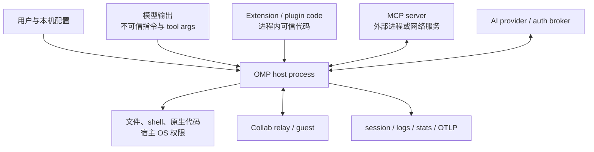

# 第 18 章　配置、安全与信任边界

> OMP 同时接触源码、shell、模型服务、插件、MCP、长期记忆和协作链接。安全不能靠一个“safe mode”概括，而要逐条问：谁提供输入、谁能执行、数据发到哪里、哪一层负责拦截？

## 18.1 先画出信任边界



边界的关键判断是：

- 模型输出是**数据**，必须通过 schema、审批和工具实现；
- extension/plugin 是被 `import()` 到本进程的**代码**；
- MCP 是独立服务，但其工具结果仍是外部数据；
- native addon 与 host 同权限；
- provider、relay、OTLP collector 都是潜在的数据出口；
- session、artifact、memory 和 stats 是本地持久化面。

这一章不会把“有检查”推导成“已沙箱化”。

## 18.2 配置为何本身是安全机制

配置决定：

- 哪些 provider、extension、MCP server 会启动；
- 哪些工具可见、可自动执行；
- secrets 是否处理；
- 子代理是否隔离、能否联网；
- telemetry 是否导出内容；
- memory 是否向远端 retain；
- collab 分享是否先做 secret scrub。

因此读取了哪份配置、谁覆盖谁，不只是 UX 细节。一个误读的 `tools.approvalMode` 或 overlay 就可能改变实际授权。

## 18.3 Settings 的有效值合并顺序

[`Settings`](https://github.com/can1357/oh-my-pi/blob/v17.1.3/packages/coding-agent/src/config/settings.ts) 的有效视图按低到高合并：

```text
schema default
    < global profile config
    < project settings
    < explicit config overlays
    < runtime overrides
```

源码中的 `#rebuildMerged()` 实际执行：

```ts
global → project → configOverlay → overrides
```

schema default 不被物化进 merged object，而是在 `get(path)` 找不到显式值时返回。

这里要区分两个“命令行层”：

- `--config` / `PI_CONFIG_FILES` 是 YAML overlay，进入 `configOverlay`；
- 解析后的模型、thinking、tool 等启动参数可成为 runtime override，优先级更高且不持久化。

## 18.4 全局配置、项目配置与 overlay

全局主配置位于 active agent/profile directory，首选 `config.yml`，兼容其他 `MAIN_CONFIG_FILENAMES`。默认目录通常是 `~/.omp/agent/`。

项目设置由第 10 章的 capability discovery 收集；`.omp/config.yml` 还参与原生项目配置兼容。显式 overlay 来自：

- `PI_CONFIG_FILES`，按系统 path delimiter 分隔；
- 构造 `Settings` 时传入的 `configFiles`；
- CLI 的 `--config` 最终进入同一机制。

多个 overlay 按给定顺序深合并，后者覆盖前者。

## 18.5 显式 overlay 为什么采用严格失败

自动发现的可选配置不存在时可以跳过；用户明确写了 `--config x.yml`，路径拼错却静默继续，会让程序在错误安全策略下运行。

[`#loadOverlayYaml()`](https://github.com/can1357/oh-my-pi/blob/v17.1.3/packages/coding-agent/src/config/settings.ts) 因此将这些情况作为 hard error：

- 文件不存在；
- 文件不可读；
- YAML 无法解析；
- 顶层不是 mapping。

与此相对，普通持久配置解析失败会 warning 并返回空对象，尽量允许用户进入 UI 修复。这是“显式意图 fail closed、自动发现可恢复”的差异。

## 18.6 配置迁移不是原地盲改

Settings 启动时能从旧 `settings.json` 和 agent DB 迁移到 YAML，并把旧 JSON 改名为 `.bak`。随后还做字段级迁移，例如：

- `queueMode` → `steeringMode`；
- 旧 `theme` 字符串 → dark/light slot；
- isolation boolean/旧 backend 名 → 新 `mode`；
- `memories.enabled` → `memory.backend`；
- 已删除字段被清理，让 schema default 生效。

迁移的安全价值是防止旧 object 在 boolean 判断中变成 truthy，或旧枚举被误当成有效新策略。迁移必须幂等，否则每次启动都可能继续改变语义。

## 18.7 Profile 必须在普通模块加载前确定

[`profile-bootstrap.ts`](https://github.com/can1357/oh-my-pi/blob/v17.1.3/packages/coding-agent/src/cli/profile-bootstrap.ts) 在完整参数解析前提取 `--profile/--alias`。原因是 `pi-utils/env` 导入时会立即读取 agent directory 的 `.env`；若 profile 晚一步切换，进程已把错误 profile 的凭据和路径加载进来。

bootstrap parser 还要尊重其他 flag 的值消费和 `--` 边界，避免把：

```text
--system-prompt --profile foo
```

里的 `--profile` 错当全局 flag，而它其实可能是 `--system-prompt` 的字面值。

这说明“早期参数解析”是目录与凭据隔离的一部分。

## 18.8 `.env` 的实际优先级

[`packages/utils/src/env.ts`](https://github.com/can1357/oh-my-pi/blob/v17.1.3/packages/utils/src/env.ts) 读取：

1. 当前 process/Bun 环境；
2. 项目 `.env`；
3. active agent/profile `.env`；
4. OMP config root `.env`；
5. home `~/.env`。

后四层只填充尚未存在的变量，所以越靠前优先级越高。文件内 `OMP_X` 还生成兼容别名 `PI_X`，而显式进程环境不会被较低层覆盖。

环境入口会过滤空名、含 `=`/NUL 的 key、含 NUL 的 value，并剔除 macOS malloc stack logging 变量；child shell 还会去掉 launch cwd 的 `.env.local` 注入值。这些措施保护 `execve` framing 与子进程边界，但不等于环境变量内容已经保密。

## 18.9 Schema 验证与运行时归一化

[`settings-schema.ts`](https://github.com/can1357/oh-my-pi/blob/v17.1.3/packages/coding-agent/src/config/settings-schema.ts) 为设置提供 type、default、enum 和 UI 元数据。Settings 的 hook 再把有效值同步到 provider 并发、theme、worktree dir 等运行时组件。

但 schema 文件不是万能防线：

- 外部 YAML 仍以 `unknown` 进入；
- 某些 record 的子结构需要专门 validator；
- 路径、regex、provider ID 等有语义验证；
- extension 可注册新的 flag/行为。

因此使用点仍要做 `validateProviderMaxInFlightRequests()` 一类防御式检查，而不是假定“来自 Settings 就一定正确”。

## 18.10 工具参数首先是不可信模型输出

模型返回的 tool call 包含 name 与 JSON arguments。Agent loop 的顺序应理解为：

```text
tool name lookup
→ schema/形状验证
→ argument-dependent tier
→ user/tool policy
→ scheduler/ownership
→ execute
→ result 配对
```

审批不能替代参数验证：用户批准了 `write`，并不代表畸形 path 或 `xd://` payload 可直接使用。参数验证也不能替代审批：合法的 `rm` 参数仍可能破坏数据。

## 18.11 三个 approval tier

[`tools/approval.ts`](https://github.com/can1357/oh-my-pi/blob/v17.1.3/packages/coding-agent/src/tools/approval.ts) 定义：

| tier | 含义 | 常见例子 |
| --- | --- | --- |
| `read` | 观察/查询 | 普通 read、glob、memory recall |
| `write` | 工作区或外部状态写入 | write/edit/manage_skill |
| `exec` | 执行代码、进程或高能力入口 | bash、eval、browser、task |

工具可声明固定 tier，也可由 `approval(args)` 动态计算。缺少声明默认按 `exec`，这是保守选择；未经标注的 MCP/extension tool 不会被错误当成只读。

## 18.12 三种 approval mode

| mode | 自动允许到哪一层 |
| --- | --- |
| `always-ask` | `read` |
| `write` | `read` + `write` |
| `yolo` | `read` + `write` + `exec` |

17.1.3 的 schema 默认是 `yolo`。这是一项重要静态事实：默认体验偏自治，不应在安全说明中写成“所有破坏性行为默认询问”。

用户可用 `tools.approval.<tool>: allow|prompt|deny` 做逐工具策略；显式 `deny` 保持权威，即使在 yolo 中也阻断。工具自身也可返回强制 deny、prompt 或 override reason。

## 18.13 Approval 解析的优先级

简化后的决策顺序是：

1. 计算工具自身的 argument-dependent decision；
2. 工具 deny 永远阻断；
3. 用户 per-tool deny 永远阻断；
4. yolo 自动通过 tier，但仍尊重工具明确策略与用户 allow/prompt/deny；
5. 非 yolo 下，工具 override/明确策略先于普通 user/mode 比较；
6. 最后比较 mode 允许的最大 tier。

审批 prompt 只展示截断后的必要细节，避免一个巨大 tool arg 把 UI 或会话塞满。MCP 工具会标注其来源，让用户知道批准的不是内建实现。

## 18.14 Bash 还要做命令级安全判断

[`tools/bash.ts`](https://github.com/can1357/oh-my-pi/blob/v17.1.3/packages/coding-agent/src/tools/bash.ts) 除普通 exec tier 外，还识别少量高置信 critical patterns，例如：

- 针对根目录的递归删除/权限破坏；
- `mkfs`、写块设备、`dd ... of=/dev/...`；
- 改写 passwd/shadow/sudoers；
- remote fetch 直接 pipe 到 shell；
- fork bomb、关机、kill PID 1；
- 常见 netcat shell。

用户可配置有序 bash wildcard rules；但 allow rule 对 shell control 形态有限制，避免一个宽泛匹配轻易放行组合命令。

正则列表不是完整恶意命令检测器。编码、别名、脚本文件、解释器间接执行都可能绕开表面形态，所以最终安全仍依赖 approval mode、OS 权限和隔离，而不是“命令正则防病毒”。

## 18.15 ACP 客户端还有一层权限门

当 coding-agent 由 ACP 编辑器客户端承载时，[`session-tools.ts`](https://github.com/can1357/oh-my-pi/blob/v17.1.3/packages/coding-agent/src/session/session-tools.ts) 可把需要询问/拒绝的调用转为 `session/request_permission`。

客户端可返回本次允许、总是允许、本次拒绝、总是拒绝；session 按 permission intent cache 决策。Abort 会和 permission response race，避免用户取消后迟到批准继续执行。

这是 host 与 IDE 间的授权协议，不会自动约束脱离 ACP 运行的普通 CLI。

## 18.16 Plan mode 的 artifact sandbox 是什么

[`plan-mode-guard.ts`](https://github.com/can1357/oh-my-pi/blob/v17.1.3/packages/coding-agent/src/tools/plan-mode-guard.ts) 在 plan mode 阻止普通源码写入，但允许写 session-local `local://` artifact，以便模型生成计划。

这里的 sandbox 指“允许写的目录边界”，不是进程沙箱：

- 它约束 write/edit 一类受 guard 包装的工具；
- 不等于隐藏网络、环境变量或所有系统调用；
- 若另一个高能力 extension 绕开工具层直接调用 fs，guard 不能拦截。

术语上必须说“artifact write sandbox”，不能说“plan mode 在安全容器里运行”。

## 18.17 Internal URL 必须防路径逃逸

`local://`、`artifact://`、`skill://` 等把逻辑资源映射到文件系统。只检查字符串里有没有 `..` 不够，因为 symlink 也能逃逸。

[`local-protocol.ts`](https://github.com/can1357/oh-my-pi/blob/v17.1.3/packages/coding-agent/src/internal-urls/local-protocol.ts) 使用：

- URL decode 后的 relative path 验证；
- `path.resolve` 后的 root-prefix containment；
- root、parent、target 的 realpath/symlink containment；
- binary sniff 与 1 MiB 内部文本物化上限；
- session ID 清洗和 Windows 短路径 fallback。

Router 还把没有 `write` handler 的 scheme 明确标为只读。逻辑 URL 是能力入口，不应被当成普通路径字符串交给任意 stdlib 函数。

## 18.18 Secrets 功能默认关闭

[`secrets.enabled`](https://github.com/can1357/oh-my-pi/blob/v17.1.3/packages/coding-agent/src/config/settings-schema.ts) 默认 `false`。开启后，来源包括：

- profile/global `secrets.yml`；
- 项目 `.omp/secrets.yml`，同内容时覆盖 global；
- 名称像 `KEY/SECRET/TOKEN/PASSWORD/AUTH/...` 且值至少 8 字符的环境变量。

配置 entry 支持 `plain` 或 `regex`，以及：

- `obfuscate`：生成可在本地恢复的 placeholder；
- `replace`：单向替换，可指定 replacement。

短于 8 字符的 plain secret 不进入可逆 placeholder，避免把常见短词大面积误删。

## 18.19 可逆 placeholder 如何避免字典推测

[`secrets/obfuscator.ts`](https://github.com/can1357/oh-my-pi/blob/v17.1.3/packages/coding-agent/src/secrets/obfuscator.ts) 生成形如 `#NAME_HASH#` 的标记，并维护 placeholder → secret 映射。hash 不是普通裸 hash，而是使用 per-install 随机 key 的 keyed digest。

[`secrets/index.ts`](https://github.com/can1357/oh-my-pi/blob/v17.1.3/packages/coding-agent/src/secrets/index.ts) 将 32 字节随机 key 写到：

```text
<agentDir>/secret-placeholder.key
```

文件用 `wx` 竞争创建、权限 `0600`，并校验 base64url 长度。多进程同时创建时，输的一方等待胜者写完，避免缓存空 key。

这个 key 的用途是让模型看见的 hash 不能被离线枚举猜测，同时让不同 session 的 placeholder 稳定；它不是把整个 session journal 加密的密钥。

## 18.20 Provider boundary 在哪里混淆与恢复

[`SessionProviderBoundary`](https://github.com/can1357/oh-my-pi/blob/v17.1.3/packages/coding-agent/src/session/session-provider-boundary.ts) 将处理集中在出站/入站边界：

- 构造 provider context 前 obfuscate；
- side request、handoff、compaction prompt 同样处理；
- Snapcompact preserve 文本也处理；
- provider 返回文本与 tool arguments 在本地 deobfuscate；
- 流式 delta 暂扣可能尚未闭合的 placeholder 后缀，避免 UI 短暂露出半个标记；
- display/resume 使用适当的 live/legacy alias 恢复逻辑。

保持 session 内语义与 provider 可见语义分开，才能既不把 secret 发出，又不让本地工具收到无法使用的 placeholder。

## 18.21 Secret obfuscation 不保证什么

它能降低已知明文凭据被直接发送的概率，但不是 DLP 或加密沙箱：

- 默认关闭；
- 未配置、名称不像 credential 的 env value 可能不被发现；
- secret 经编码、拆分、散列或变形后可能不匹配；
- regex 配错会漏报或误报；
- 本地 extension/native code 与拥有文件权限的工具仍可能读到原文；
- provider metadata、外部程序、日志 hook 必须分别审计；
- share scrub 还有独立设置，不能因为 provider boundary 开启就假定所有出口都处理。

“obfuscate”尤其不是匿名化：本机为了继续执行必须能恢复原 secret。

## 18.22 Extension 是同进程可信代码

[`extensibility/extensions/loader.ts`](https://github.com/can1357/oh-my-pi/blob/v17.1.3/packages/coding-agent/src/extensibility/extensions/loader.ts) 使用 Bun 原生 import 加载 TypeScript module，并给 extension API 提供：

- 注册工具、命令、flag、renderer 和 event handler；
- 发消息、改模型、改 active tools；
- `exec()` 调用外部命令；
- 访问导出的 coding-agent API。

它没有进程隔离。恶意 extension 不需要等模型调用其工具，就可以在 import/handler 中使用当前用户权限。安装 plugin/extension 应按安装本地应用代码对待，来源审查比 tool approval 更早。

## 18.23 MCP 的边界不同，但仍需授权

MCP server 通过 stdio、HTTP/SSE 等 transport 独立运行。优点是生命周期、断线和协议错误可隔离；代价是：

- stdio server 本身仍是本机可执行程序；
- remote MCP 会收到发送给它的参数；
- server 返回的 text/resource 可能包含 prompt injection；
- MCP tool 无 approval 声明时按 exec tier 保守处理；
- reconnect 不能让旧 session 的迟到 response 被误配。

MCP bridge 清理 wire-only intent/空字段、解析 internal URL，是协议适配，不是对 server 结果真实性背书。

## 18.24 Provider 与 Auth Broker

Provider 请求会带对话、system prompt、tool schema，可能还有图片和 telemetry metadata。选择模型等于选择数据接收方；custom base URL 又增加一层代理/网关信任。

[`packages/ai/src/auth-broker`](https://github.com/can1357/oh-my-pi/tree/v17.1.3/packages/ai/src/auth-broker) 支持用 bearer token 从 broker 获取 credential snapshot、订阅 SSE 更新并做本地 cache。它解决集中轮换和多账户调度，但不会自动提供安全传输：

- broker URL 应使用受信网络与 TLS；
- bearer token 本身是 secret；
- snapshot cache 是本地敏感面；
- 远端返回仍做 schema validation；
- stream 首帧必须是 snapshot，畸形 JSON/事件立即报错。

集中化减少凭据散落，也把 broker 变成高价值信任根。

## 18.25 Collab 链接的加密与权限

[`collab/crypto.ts`](https://github.com/can1357/oh-my-pi/blob/v17.1.3/packages/coding-agent/src/collab/crypto.ts) 使用 AES-256-GCM，frame 布局是 12-byte IV 加 ciphertext/tag。room key 位于 URL fragment，relay 只看到密文 payload。

链接分为：

- view link：只有 room key，可读；
- full link：room key 后再带 write token，可提交写操作。

这提供 relay 不可读的内容加密与读写能力区分，但仍有边界：

- 拿到完整链接的人拥有对应能力；
- browser/history/chat 截图都可能泄露 fragment；
- relay 可见连接时序、房间标识和流量大小等 metadata；
- host 端会解密，host 本身仍可信；
- 分享 session 前是否做 secret scrub 是独立配置。

不要把“端到端密文”理解为“分享内容一定不含 secret”。

## 18.26 Isolation、审批与权限不是同一件事

| 机制 | 主要保护 | 不能替代 |
| --- | --- | --- |
| tool schema | 畸形参数 | 用户授权 |
| approval | 未经同意的能力使用 | OS 级隔离 |
| path containment | 特定文件根逃逸 | 任意进程/extension fs 访问 |
| task isolation | 并行工作区互相污染 | 完整容器安全 |
| secret obfuscation | provider 明文泄露 | 本地代码保密、全出口 DLP |
| AES-GCM collab | relay 读取/篡改 payload | 链接泄露、host 被攻破 |
| profile | 配置/凭据命名空间 | 不同 Unix 用户权限 |
| auth broker | 凭据集中轮换 | broker 本身与 transport 信任 |

这张表是理解 OMP 安全模型最重要的速查。

## 18.27 一个实用的加固基线

对不完全受信仓库或高价值环境，可采用：

1. `tools.approvalMode: always-ask`；
2. 对不需要的 `bash/eval/task/browser/computer` 显式 `deny`；
3. 只启用审查过的 extension/plugin/MCP；
4. 将 profile 与项目凭据分离，缩小 `.env`；
5. 开启并测试 `secrets.enabled`，为特殊凭据写 `secrets.yml`；
6. 禁止不需要的远端 memory、collab、telemetry content capture；
7. 子代理使用合适的 isolation backend，但仍以低权限 OS/container 运行；
8. 检查自定义 provider base URL 和 auth broker URL；
9. 定期审计 session、artifact、memory、logs 与 stats DB 的本地权限；
10. 把 OMP 进程本身放在最小 OS 权限账户中。

最后一条最可靠：上层策略出现漏洞时，OS 权限仍限定最大损害面。

## 18.28 调试与审计落点

| 问题 | 首先检查 |
| --- | --- |
| 设置看似无效 | `Settings.#rebuildMerged()` 的 global/project/overlay/override 来源 |
| 错 profile 的 key 被加载 | bootstrap 是否早于 `pi-utils/env` import |
| `--config` 启动失败 | overlay 路径、YAML 顶层类型 |
| 工具没询问 | 当前 approval mode（默认 yolo）、per-tool policy、tool tier |
| yolo 中仍被阻止 | 工具 deny/override 或用户显式 deny |
| ACP 重复询问 | permission intent/cache key 是否变化 |
| secret 出现在 provider payload | `secrets.enabled`、entry/env discovery、provider boundary hook |
| UI 显示 placeholder | deobfuscate 与 streamed suffix guard |
| `local://../` 或 symlink 异常 | relative-path、realpath containment |
| MCP 工具意外高权限 | server 来源、tool approval 默认 exec |
| extension 启动即执行副作用 | 它是同进程 import，不经过模型 tool call |
| collab guest 能写 | 是否发出了 full link/write token |

## 18.29 本章小结

OMP 的安全模型是多层组合，不是单一开关：

- Settings 精确决定行为，合并顺序必须可解释；
- 模型 tool args 先验证，再按 capability tier 与策略授权；
- secret 处理集中在 provider boundary，但默认关闭且不是全出口 DLP；
- internal URL 和 task isolation 约束具体资源，不是通用进程沙箱；
- extension/native 是进程内可信代码，MCP/provider/collab 是外部边界；
- 最终权限上限仍由宿主 OS 与部署方式决定。

下一章转向另一个经常与安全冲突的需求：怎样观测一次 Agent 运行，同时控制内容捕获、持久化和发布供应链。

---

[上一章：Rust 原生层与跨平台执行](./第17章-Rust原生层与跨平台执行.md) · [下一章：观测、统计、测试与发布](./第19章-观测统计测试与发布.md)
