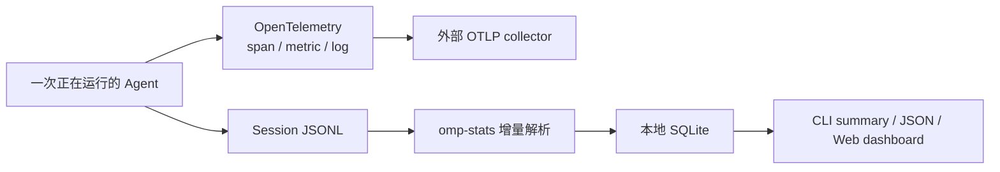
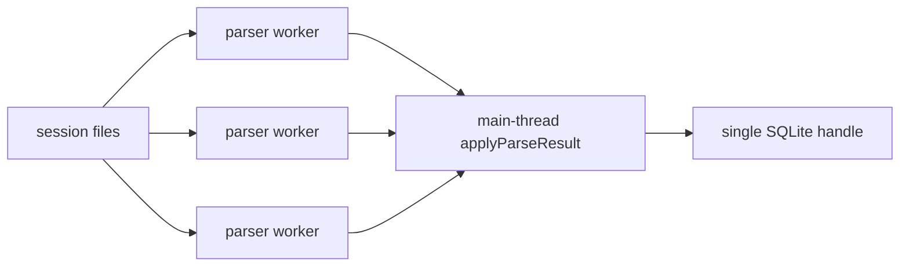

# 第 19 章　观测、统计、测试与发布

> Agent 系统的“正确”不只是最终回答看起来合理。还要能回答：调用了几次模型、哪个工具失败、成本从哪里来、取消是否完整、哪个发布产物包含了哪版 native addon。

## 19.1 两条观测平面

OMP 有两套互补系统：



- OTLP 是**实时运行观测**，适合跨服务 trace、告警和生产仪表盘；
- stats 是**本地离线事实重建**，从已经持久化的 session 计算使用量、成本、工具和行为趋势。

两者不应合并成一套：OTLP 可能未配置或上报失败，session 仍应可恢复；stats 可以事后重算，却不适合实时串起 provider gateway span。

## 19.2 Telemetry 先在 Agent 内核建语义

[`packages/agent/src/telemetry.ts`](https://github.com/can1357/oh-my-pi/blob/v17.1.3/packages/agent/src/telemetry.ts) 不负责具体 exporter，而是定义 Agent 运行的 span 语义：

```text
invoke_agent
├── chat model-A                 每次 provider round trip
├── execute_tool read
├── execute_tool bash
├── chat model-A
└── handoff main → child         若发生代理转交
```

主要 span：

| span | 表示 | 关键属性 |
| --- | --- | --- |
| `invoke_agent` | 一次 `runLoop` | agent identity、step 数、聚合 usage/tool/error |
| `chat <model>` | 一次模型调用 | provider/model、TTFT、finish reason、tokens、gateway |
| `execute_tool <name>` | 一次工具执行 | call ID、name、status、latency、error type |
| `handoff` | Agent 间转交 | source/target identity |

内核遵循 OpenTelemetry GenAI semantic conventions，同时用 `pi.gen_ai.*`/`pi.omp.*` 补充 OMP 特有字段。

## 19.3 为什么配置未启用时开销要接近零

`AgentTelemetryConfig` 未传入时，loop 连 tracer lookup 都不做。传入 config 但没有安装 SDK 时，OpenTelemetry API 返回 no-op tracer。

这个两级设计很重要：

- 普通本地 CLI 不应为了可能永远没人消费的 trace 构建大量属性；
- SDK embedder 可注入自己的 tracer，不必依赖 coding-agent exporter；
- coding-agent 可以按环境变量安装全局 SDK，而 agent-core 保持 vendor-neutral。

## 19.4 Coding-agent 负责 OTLP bootstrap

[`packages/coding-agent/src/telemetry-export.ts`](https://github.com/can1357/oh-my-pi/blob/v17.1.3/packages/coding-agent/src/telemetry-export.ts) 检查标准 `OTEL_*` 环境变量，为三种 signal 分别注册：

- `NodeTracerProvider` + `OTLPTraceExporter`；
- `LoggerProvider` + `OTLPLogExporter`；
- `MeterProvider` + `OTLPMetricExporter`。

`OTEL_SDK_DISABLED=true` 是总 kill switch。每种 signal 可用自己的 endpoint/exporter/protocol，也可继承 `OTEL_EXPORTER_OTLP_ENDPOINT`。

当前只支持 `http/protobuf`。显式设置 `grpc` 或 `http/json` 时，该 signal 被拒绝并 warning，而不是看似启用却运行未经验证的 transport。

## 19.5 Resource 与 service identity

Exporter 给资源设置 service name，默认使用 OMP 的固定服务名，也允许 `OTEL_SERVICE_NAME` 覆盖。标准 resource attributes 可继续通过 OpenTelemetry 环境变量注入，例如 deployment、host 或团队标签。

Agent telemetry 还可由 session 提供动态 attributes，把这些维度带到 span：

- session/conversation ID；
- main/subagent/advisor identity；
- provider session ID；
- model role、service tier；
- gateway 路由与 response cache status。

动态 resolver 失败是 non-fatal telemetry error，不能让主模型调用失败。

## 19.6 Content capture 默认要克制

`OTEL_INSTRUMENTATION_GENAI_CAPTURE_MESSAGE_CONTENT` 控制内容捕获。内核支持三个实际级别：

| 级别 | 行为 |
| --- | --- |
| `none` | 不导出消息/tool 内容 |
| `summary` | 有界、适合 dashboard 的摘要 |
| `full` | 额外导出完整 OTEL message payload |

`true/full` 才进入完整捕获，`summary` 只输出限制过数量和长度的结构。自定义 serializer 抛错时，记录 coverage error 并省略内容，不传播到 Agent loop。

开启 full 意味着 system prompt、用户源码、模型输出、tool arguments/result 可能进入 collector。即使 Secrets provider boundary 已启用，也应单独验证 telemetry serializer 是否使用相同脱敏策略；两条出口不能靠想当然联动。

## 19.7 Chat span 的生命周期

一次 chat 的观测顺序是：

1. 用 model/provider/request snapshot 创建 client span；
2. 可选记录 request message summary/full content；
3. 激活 span，让下游子 span正确挂接；
4. 捕获 provider response headers；
5. stream 完成后写 response model/ID、finish reason、TTFT；
6. 写 input/output/cache/reasoning/server-tool token；
7. 估算 cost；
8. 写 gateway/Portkey 等 trace/routing attributes；
9. 成功或异常设置 terminal status；
10. collector 汇总后结束 span。

若 provider 在 stream 建立前抛错，`failChatSpan()` 仍会结束 span。缺少 finish path 会留下永不关闭的 trace，仪表盘延迟也会失真。

## 19.8 Tool span 的状态比 success/error 更细

`execute_tool` 的终态包括：

- `ok`；
- `error`；
- `skipped`；
- `blocked`；
- `timeout`；
- `aborted`。

预验证、审批拒绝等可能在真正 span 生命周期前结束，collector 仍可用“bypassed tool”接口计入 coverage 和相应状态。这样“没有 span”不会被误读成“模型从未请求这个工具”。

## 19.9 Run collector 与 coverage

外层 `invoke_agent` 结束时，collector 将子事件折叠成：

- chat 次数、总 latency、各 finish reason；
- tool 总数和各 terminal status；
- tool 总 latency；
- available/invoked/unused tools；
- input/output/cache write/cache read/reasoning/total tokens；
- estimated USD；
- error 分类与 telemetry hook 自身的 coverage error。

available 与 unused 能回答“工具是没注册，还是注册了但模型没用”；仅看 invoked 数无法区分这两种问题。

## 19.10 OTLP metrics

`AgentMetricRecorder` 建立的主要 instrument：

| instrument | 类型 | 意义 |
| --- | --- | --- |
| `gen_ai.client.token.usage` | histogram | 按 token type 的用量 |
| `pi.omp.agent.chat.cost.estimated_usd` | counter | 估算调用成本 |
| `pi.omp.agent.runs` | counter | Agent run 数 |
| `pi.omp.agent.steps` | counter | run step 数 |
| `pi.omp.agent.chat.calls` | counter | chat/finish reason 数 |
| `pi.omp.agent.chat.duration` | histogram | chat latency |
| `pi.omp.agent.tool.calls` | counter | tool/status 数 |
| `pi.omp.agent.tool.duration` | histogram | tool latency |
| `pi.omp.agent.errors` | counter | error type 数 |

属性先经过 `metricAttributes()` 过滤，只有 OTEL 可接受的标量/数组进入；不能把任意深层对象直接塞进高基数标签。

## 19.11 Logs 与 30 秒 flush

Log exporter 桥接结构化应用日志并遵守 `OTEL_LOG_LEVEL`。trace、log、metric provider 建立后，bootstrap 设置 30 秒 interval 主动 `forceFlush()`；timer `unref()`，不会单独阻止短命 print process 退出。

正常 shutdown 清 interval，并并行关闭三类 provider。进程崩溃仍可能丢最后一个 batch，因此关键恢复事实必须先写 session JSONL，不能只存在 telemetry buffer。

## 19.12 本地 Stats 从 Session 重建事实

[`packages/stats/src/parser.ts`](https://github.com/can1357/oh-my-pi/blob/v17.1.3/packages/stats/src/parser.ts) 读取第 11 章的 JSONL，抽取：

- assistant request：model/provider/API、duration、TTFT、stop reason、usage/cost；
- user message：字符、词数及启发式行为指标；
- assistant content 中每个 tool call；
- tool result 的字符数和 error flag；
- service tier change；
- transcript 路径对应的 agent type。

这是派生数据库，session JSONL 才是源事实。parser/schema 升级后可以清 offset 或做 backfill 重新计算。

## 19.13 Lenient parser 如何面对真实历史

Session 可能来自旧版本、崩溃截断或外部 producer。Parser 因此：

- 缺 entry ID 的旧 message 跳过，避免违反 DB 唯一/非空约束；
- 缺 model/provider/API/usage 的 assistant entry 跳过；
- 缺 token/cost 字段时补零；
- 缺 stop reason 时按 errorMessage 推断 `error`，否则 `aborted`；
- timestamp 无效时退到 entry ISO timestamp，再退到 0；
- 非法完整 JSON 行跳过；
- 最后一个没有换行且 JSON 截断的尾部不推进 offset，等待下次写完整。

“宽容”不是伪造数据：无法安全归属的行跳过，可合理默认的 NOT NULL 字段才补值。

## 19.14 增量 offset 还要恢复隐含状态

每个 session file 在 DB 保存 byte offset 与 mtime。下次只解析新增尾部，大文件无需每次全量 materialize 为对象。

但 service tier 是由较早 `service_tier_change` 决定的状态。若从 offset 直接开始，后续 priority request 会丢失 tier。Parser 因此只扫描 prefix 以找最后一个 tier，不保留 prefix entries，再解析 tail。

这是增量 parser 的通用规律：offset 省下了数据重读，但任何跨记录状态都必须有 snapshot 或 prefix 恢复策略。

## 19.15 主代理、子代理与 Advisor 分开统计

`classifyAgentType()` 根据 session 路径分类：

- `<sessions>/<project>/<file>.jsonl` → `main`；
- 更深的普通 transcript → `subagent`；
- 任意深度的 `__advisor.jsonl` / `__advisor.<slug>.jsonl` → `advisor`。

因此 token/cost dashboard 能回答增长来自主循环、并行子任务还是只读审阅。Advisor 也可能属于 child，basename 规则优先于目录深度。

## 19.16 Tool call 与 result 必须后关联

Assistant message 中一轮可含多个 `toolCall` block；parser 为每个 call 记录：

- `toolCallId`；
- name、model、provider、agent type；
- 本轮 call 数；
- arguments JSON 字符数。

后续 `toolResult` 通过 ID 更新 result chars 与 `isError`。这再次验证第 5、11 章的不变量：call/result ID 配对不仅影响 provider replay，也决定离线工具统计是否可信。

## 19.17 SQLite 为什么保留 offset 与 backfill sentinel

[`packages/stats/src/db.ts`](https://github.com/can1357/oh-my-pi/blob/v17.1.3/packages/stats/src/db.ts) 创建：

- `messages`；
- `user_messages`；
- `tool_calls`；
- `file_offsets`；
- `meta`。

数据库使用 WAL 与 5 秒 busy timeout。`UNIQUE(session_file, entry_id/tool_call_id)` 让重复同步幂等；`meta` 的 pending/complete sentinel 管一次性 agent-type、user-message、fork dedupe、tool-call 等 backfill。

表结构/指标版本变化时，代码可能 drop 派生表、清 offset、重新 ingest。派生 DB 可重建，优先保证新定义一致，而不是永远兼容错误旧列。

## 19.18 Parser worker pool 与单写者

[`packages/stats/src/aggregator.ts`](https://github.com/can1357/oh-my-pi/blob/v17.1.3/packages/stats/src/aggregator.ts) 把 JSON 解析分发给 worker，但所有 SQLite 写入留在主线程：



默认 worker 数按硬件取值并封顶 8；macOS 强制 1，因为 Bun 1.3.x compiled worker re-entry 曾触发进程 abort。更多 parser worker 也不会让串行 SQLite 写无限加速。

compiled/bundled CLI 的 worker 通过隐藏 argv 重新进入同一个 CLI entry；源码 SDK 场景可直接加载 `sync-worker.ts`。`--smoke-test` 专门 ping worker，防止“没有新 session 时 early return”掩盖打包后的 worker 入口损坏。

## 19.19 Dashboard 不是每个 API 请求都扫描磁盘

[`packages/stats/src/server.ts`](https://github.com/can1357/oh-my-pi/blob/v17.1.3/packages/stats/src/server.ts) 的读取 API 只查 DB；`/api/sync` 才做昂贵的 session scan。CLI 启动 dashboard 前先同步一次。

`omp stats` 支持：

- 默认打开本地 Web dashboard；
- `--summary` 输出终端摘要；
- `--json` 输出完整 JSON；
- `--port` 指定端口。

Dashboard 包含 overview、models、providers、costs、tools、errors、requests、behavior、gain/project 等视图。源码开发时按 mtime 重建前端；npm bundle/compiled binary 使用内嵌压缩 archive，解包时做路径逃逸检查，并按 archive hash 缓存。

## 19.20 行为指标要当启发式，而非心理诊断

`user-metrics.ts` 统计 yelling、profanity、anguish、negation、repetition、blame 等文本信号，并通过多版 backfill 修正误报。

这些数据适合观察“某模型/版本是否让用户更频繁重复或否定”，不适合断言用户真实情绪或个人属性。代码注释中大量 technical-collision 修正正说明：自然语言 heuristic 必然有假阳性和语境偏差。

## 19.21 Monorepo 的质量命令

根 [`package.json`](https://github.com/can1357/oh-my-pi/blob/v17.1.3/package.json) 将质量工作拆成：

| 命令 | 作用 |
| --- | --- |
| `bun run test` | 本地 TypeScript 测试编排 |
| `bun run test:rs` | Rust nextest workspace |
| `bun run check` | TS + Rust 检查并行 |
| `bun run lint` | Biome + Clippy |
| `bun run fmt` | Biome/Prettier 路径 + rustfmt |
| `bun run build` | 各 workspace 有 build 的包 |
| `bun run ci:test:smoke` | CLI/version/help/stats/worker smoke |
| `bun run test:py` | Python RPC/robomp pytest |

`check`、`lint`、`test` 不是同义词：类型正确不代表行为通过，测试通过也不代表格式和发布声明能被消费者解析。

## 19.22 TypeScript 测试为何不是一个巨大 `bun test`

[`scripts/ci-test-ts.ts`](https://github.com/can1357/oh-my-pi/blob/v17.1.3/scripts/ci-test-ts.ts) 按工作性质分 bucket：

- 小型 workspace packages；
- native/integration packages；
- coding-agent singleton/global-state；
- UI/TUI；
- runtime/session；
- native/tooling/browser；
- heavy/local-only。

大 bucket 再按文件数分 chunk，每个 chunk 新进程运行，重置 heap 并回收遗留 child。UI chunk 只有 5 个文件，runtime/native 通常 10 个；singleton 不拆，因为它特意测试进程级全局状态。

这种分片不是纯性能优化，而是将已知 Bun heap/GC、native 和全局单例约束编码进测试拓扑。

## 19.23 CI 与本地覆盖不完全相同

例如 Mnemopi embedding suite 需要约 270 MB 的本地模型，CI fast bucket 不下载，要求本地单独运行；Python web workspace 也在单独路径。反过来，CI 会下载 native artifact 并运行安装/compiled smoke，普通单包测试不一定覆盖发布形态。

所以“根 test 绿”与“所有可选重依赖都测过”不是一回事。变更某子系统时应补跑该包专属测试，而不是只依赖默认快速集合。

## 19.24 Rust task 的变更感知

[`scripts/run-rs-task.ts`](https://github.com/can1357/oh-my-pi/blob/v17.1.3/scripts/run-rs-task.ts) 在本地检查 git status：没有 `.rs`、Cargo/build/rustfmt/clippy 等相关变化时，除 fmt 外可跳过 Rust check/lint/test；CI 总是运行。

对应命令：

- `cargo fmt --check`；
- `cargo clippy --workspace -- -D warnings`；
- `cargo nextest run --workspace`。

macOS 还优先使用 `rustup which cargo`，防止 Homebrew 的 `rustup-init` 在 PATH 中冒充 cargo。变更感知减少日常成本，但仓库不是 git 或检测失败时应保守执行，而不是假定无需测试。

## 19.25 原生与安装测试必须覆盖发布拓扑

源码 workspace 能加载本地 `.node`，不能证明 npm platform leaf、compiled embed 或 Windows staging 正确。因此项目另有：

- native loader/unit tests；
- `ci-build-native`；
- release binary 构建测试；
- source/tarball/binary install containers；
- CLI smoke；
- stats worker smoke；
- macOS sign/hardened runtime 流程；
- musl release tests。

测试的目标是验证用户拿到的形态，而不只是开发者目录里的形态。

## 19.26 Release 脚本先建立可重复基线

[`scripts/release.ts`](https://github.com/can1357/oh-my-pi/blob/v17.1.3/scripts/release.ts) 的主流程：

1. 必须在 `main`；
2. worktree 必须 clean；
3. 目标 semver 必须高于最新 `v*` tag；
4. 更新所有 public package version 与 root catalog；
5. 更新 Cargo workspace version；
6. 同步 native 版本哨兵；
7. 重新生成 Bun/Cargo lockfile；
8. 整理并切分 changelog；
9. `bun run check`；
10. commit；
11. 创建 tag，原子 push main + tag；
12. 用 `gh` 观察 CI，遇到 job failure 输出日志尾部。

脚本不是从任意 dirty branch“帮你发布”，而是把 release commit 做成可审计的单一状态。

## 19.27 为什么 tag push 使用 commit object ID

仓库维护任务可能并发 prune 尚未推到 remote 的本地 tag。普通 `git push refs/tags/vX` 在 ref 消失窗口会失败。

release 脚本将：

```text
<HEAD sha>:refs/tags/vX.Y.Z
```

与 main branch 一起 `--atomic` push。remote tag 直接由仍可达的 commit object 创建，不依赖本地 tag ref 在 push 解析时仍存在。

这是一个典型工程教训：发布脚本要考虑同机后台 git maintenance，而不只考虑命令的理想串行语义。

## 19.28 多平台独立二进制构建

[`scripts/ci-release-build-binaries.ts`](https://github.com/can1357/oh-my-pi/blob/v17.1.3/scripts/ci-release-build-binaries.ts) 定义：

- macOS arm64/x64；
- Linux glibc arm64/x64；
- Linux musl arm64/x64；
- Windows x64。

构建前生成并嵌入 stats client、collab tool views、MuPDF 等资产；每个 target 再生成对应 native embedded metadata，调用 Bun compile。macOS host 上对 Mach-O 做 ad-hoc codesign 修复。

关键的 `try/finally` 会在成功或失败后重置 native/stats/MuPDF 生成占位文件，避免一次跨目标 build 把 target-specific bytes 留在 worktree，污染下一个 target 或 commit。

## 19.29 Native core 与 leaf 分开发布

[`scripts/ci-release-publish.ts`](https://github.com/can1357/oh-my-pi/blob/v17.1.3/scripts/ci-release-publish.ts) 将：

- public TypeScript packages + native core 作为一组；
- 每个平台 native leaf 在拿到对应 `.node` artifact 后单独发布。

core manifest 的 `optionalDependencies` 固定到同一 version，并只打包 loader、声明、embedded stub、README。leaf package 包含那个平台/ISA 的实际 addon。

分开后 release matrix 可并行产出平台二进制，但版本哨兵与 pinned dependency 仍保证 JS/core/leaf lock-step。

## 19.30 发布的 TypeScript 声明为何要重写

开发 manifest 的 `types` 指向 `src/*.ts`，方便 monorepo/source install；发布时脚本：

1. 用 `tsgo` 生成 `dist/types/*.d.ts`；
2. 将 manifest 的 `types`/`exports[*].types` 改指 dist；
3. 给 extensionless relative specifier 补 `.js`，兼容 NodeNext consumer；
4. coding-agent 的 `bin` 从源码 CLI 改为 prepack bundle；
5. stats 额外打包 dashboard assets。

这避免消费者必须采用仓库自己的 tsconfig/Bun 才能解析类型。

## 19.31 为什么 `bun pm pack` 后交给 `npm publish`

`bun pm pack` 能正确解析 monorepo 的 `catalog:`/`workspace:` 协议并运行 prepack；直接用 npm pack 可能把内部协议原样装进 tarball。

真正 publish 又使用 npm CLI，因为 npm 支持 OIDC trusted publishing/token fallback 和 provenance 流程。脚本先读取**打包后的** package name/version，再查 registry；已发布版本可幂等跳过，并处理并发 publisher 在 preflight 后抢先成功的冲突。

发布的是 tarball 事实，不是工作区 manifest 的想象。

## 19.32 可观测性也有失败隔离

这些故障不应阻断 Agent 主任务：

- telemetry attribute resolver/serializer/hook 抛错；
- exporter 暂时不可用；
- stats 遇到一条坏 JSON；
- stale native cache 清理失败；
- dashboard 某个旧 session 字段缺失。

但这些故障应 fail closed 或阻断发布：

- 显式 OTLP protocol 不支持却假装成功；
- release 版本未递增；
- native version sentinel 未同步；
- package 类型/manifest 无法构建；
- check/CI 失败；
- tarball 没有正确 name/version；
- compiled asset 缺失。

区别在于：前者是旁路观测，后者会让分发产物本身不可信。

## 19.33 调试落点

| 现象 | 首先检查 |
| --- | --- |
| 完全没有 span | 是否传 telemetry config、OTEL endpoint/exporter、SDK disabled |
| 某 signal 不导出 | signal-specific endpoint/protocol，当前只支持 http/protobuf |
| trace 没有父子关系 | `runInActiveSpan()` 是否包住实际 async 调用 |
| chat span 永不结束 | success/error/abort 是否都进入 finish/fail path |
| tool 数与 span 数不等 | blocked/skipped 是否走 bypassed-tool collector |
| collector 收到源码 | content capture 是否为 full、serializer/secret 策略 |
| stats 重复计数 | unique key、file offset、mtime、backfill sentinel |
| stats 漏掉最后一轮 | JSONL 尾行是否截断/未换行，offset 是否保留 |
| priority cost 不对 | prefix service-tier 恢复与 model tier |
| 子代理成本算在 main | transcript path/classifyAgentType |
| stats sync macOS 崩溃 | worker count 是否误开大于 1 |
| CI exit 137/GC abort | test bucket/chunk 是否被绕过 |
| npm 包类型在 NodeNext 失效 | dist declarations 与 `.js` specifier rewrite |
| 新版 JS 加载旧 native | release sentinel、core/leaf version、binary embed |

## 19.34 本章小结

OMP 把可观测与可发布性设计成同一条“证据链”：

- Agent 内核产生稳定 span/metric 语义；
- coding-agent 按标准环境变量安装 OTLP exporter；
- session JSONL 保留可恢复源事实；
- stats 增量、宽容地重建本地派生数据库；
- 测试按状态/内存/native 边界分片；
- release 同步 TS、Rust、native sentinel、锁文件、changelog 和 tarball 拓扑；
- CI 验证的最终对象包括安装包与独立二进制，而不只源码。

最后一章将把这些子系统放回一条真实请求：从用户按下 Enter 开始，逐步追到 provider、工具、持久化、TUI、压缩、记忆和退出清理。

---

[上一章：配置、安全与信任边界](./第18章-配置安全与信任边界.md) · [下一章：一次请求的完整旅程](./第20章-一次请求的完整旅程.md)
