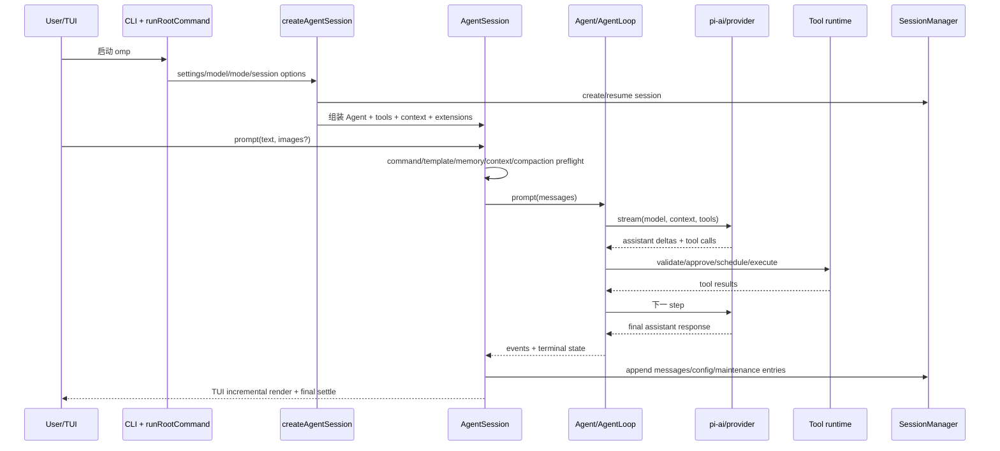
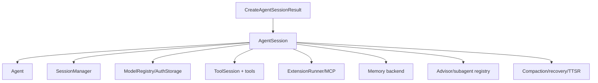
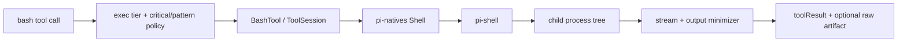

# 第 20 章　一次请求的完整旅程

> 前 19 章拆开了零件。本章只做一件事：跟踪一条请求，从 `omp` 启动到用户看到最终答案，标出每次跨层、持久化、授权和恢复边界。

## 20.1 示例场景

假设用户在仓库中启动：

```bash
omp
```

然后输入：

```text
修复 parser 在最后一行没有换行时丢数据的问题，并运行相关测试。
```

模型预期会：

1. 读相关文件；
2. 搜索 parser/test；
3. 编辑代码；
4. 运行测试；
5. 根据结果继续修正或总结。

这看似一个 prompt，运行时实际上是多次模型调用、多个工具调用、数十个事件与多条 JSONL entry。

## 20.2 先区分五种身份

调试前必须知道日志里不同 ID 在标识什么：

| ID | 作用域 | 用途 |
| --- | --- | --- |
| session ID | OMP 会话 | JSONL、artifact、resume、collab |
| provider session/cache key | 模型供应商 | prompt cache、routing、provider metadata |
| entry ID + parentId | session tree | 持久化顺序、branch/leaf |
| tool call ID | 一次 tool call/result | provider replay、stats 关联 |
| trace/span ID | telemetry | `invoke_agent/chat/execute_tool` 父子关系 |

它们可能共享某些来源，但不能混用。特别是 tool call ID 不是 session entry ID，provider response ID 也不是本地 session ID。

## 20.3 总时序图



下面逐段展开。

## 20.4 阶段 0：`cli.ts` 先做最早期决策

入口 [`packages/coding-agent/src/cli.ts`](https://github.com/can1357/oh-my-pi/blob/v17.1.3/packages/coding-agent/src/cli.ts) 保持轻量，先处理必须在普通模块 import 前完成的事情：

- profile/alias bootstrap；
- 环境与目录基线；
- 隐藏 worker argv/re-entry；
- 顶层命令分流；
- startup/crash/stderr guard。

若用户选择 `--profile work`，必须在 `pi-utils/env` 读取 profile `.env` 前确定。否则后面即使 Settings 指向新目录，旧 profile 的环境变量已经进入进程。

CLI 再 lazy import [`main.ts`](https://github.com/can1357/oh-my-pi/blob/v17.1.3/packages/coding-agent/src/main.ts)，把普通 `--help`/子命令的启动成本与完整 coding-agent graph 分开。

## 20.5 阶段 1：`runRootCommand()` 选择产品运行模式

[`runRootCommand()`](https://github.com/can1357/oh-my-pi/blob/v17.1.3/packages/coding-agent/src/main.ts) 负责把 argv 和环境转换为 `CreateAgentSessionOptions`，并决定最终 runner：

- interactive TUI；
- print/JSON；
- RPC；
- ACP；
- resume/fork/session selector；
- 初始 prompt/图片；
- model/thinking/service tier；
- tools、config overlay、system prompt；
- telemetry 与 host bridge。

这里还会启动不阻塞主路径的工作，例如某些 runtime bootstrap、版本提示或 discovery。模式差异主要发生在输入/输出适配层，后面的 `AgentSession.prompt()` 与 Agent loop 尽量复用。

## 20.6 阶段 2：Settings 形成一次运行的政策快照

Settings 按第 18 章顺序合并 global、project、overlay、runtime override，并执行 migration/hook。

这一步决定本请求的关键政策：

```text
selected model / model role
thinking level / auto thinking
tool approval mode
enabled tools / MCP / extensions
context + skills + rules
compaction strategy
memory backend
secrets boundary
telemetry export
task isolation
```

配置不是每次工具调用都重新从 YAML 读取；运行时 Settings object 是可同步读取、可监听更新的权威视图。部分动态设置变化会触发 system prompt/tool registry 重建。

## 20.7 阶段 3：`createAgentSession()` 是 composition root

[`packages/coding-agent/src/sdk.ts`](https://github.com/can1357/oh-my-pi/blob/v17.1.3/packages/coding-agent/src/sdk.ts) 的 `createAgentSession()` 将几十个子系统连接起来。它先固定：

- `cwd` 与 `agentDir`；
- `EventBus`；
- `ModelRegistry` 与唯一的 `AuthStorage`；
- `Settings`；
- `SessionManager`；
- session/provider/cache identity。

AuthStorage identity 有显式不变量：若调用者同时给 `modelRegistry` 和不同实例的 `authStorage`，立即抛错。否则 credential-disabled event 可能落在一套 storage，而 session/MCP 使用另一套，造成失效凭据继续被调用。

## 20.8 装配期间并行发现什么

与 model/session 初始化可重叠的 discovery 会尽早启动：

- workspace tree 与 AGENTS index；
- context files；
- active repo context；
- WATCHDOG/advisor config；
- prompt templates；
- slash commands；
- skills；
- rules/TTSR；
- extension/plugin 与 MCP 配置。

Workspace scan 有 5 秒 startup deadline；超时后主启动继续，后台 promise 仍可暖 cache，system prompt 还有自己的 deadline/fallback。并行并不表示没有顺序：真正消费某份结果前必须 await，失败 ownership 也要由 composition root 统一清理。

## 20.9 恢复旧会话发生在 Agent 创建前

SessionManager 读取当前 branch，迁移 JSONL 并重建 context。若旧进程留下非终结 assistant tail，SDK 会先追加 terminal aborted record，再恢复 runtime state。

随后从 session、明确 CLI、default role、可用鉴权中解析 model。恢复 model 时只调用同步 `hasConfiguredAuth()`，不在启动热路径执行 OAuth refresh、`!command` key 或 auth-broker 网络请求；真实 key 到请求前再解析。

这避免一个不可达 broker 让“打开历史会话”逐候选卡 10 秒。

## 20.10 Secrets 也必须在恢复 context 前建立

若 `secrets.enabled`：

1. 读 global/project `secrets.yml`；
2. 收集 credential-shaped env values；
3. 判断是否需要 persisted placeholder key；
4. 建 `SecretObfuscator`；
5. 用它恢复旧 session placeholder。

先恢复 session、后创建 obfuscator 会把 placeholder 当普通文本留在 Agent context；先创建才能保持本地语义连续。

## 20.11 最终被装配出的不是一个对象

简化后的结果是：



`Agent` 只拥有当前模型循环所需 state；`AgentSession` 拥有产品级 orchestration；`SessionManager` 拥有可恢复历史。

## 20.12 阶段 4：InteractiveMode 接管输入输出

[`runInteractiveMode()`](https://github.com/can1357/oh-my-pi/blob/v17.1.3/packages/coding-agent/src/main.ts) 创建 [`InteractiveMode`](https://github.com/can1357/oh-my-pi/blob/v17.1.3/packages/coding-agent/src/modes/interactive-mode.ts) 与 TUI controller。

输入 controller 负责：

- editor text 与 pasted images；
- slash command 本地预览；
- Enter/steer/follow-up keybinding；
- focused subagent session；
- streaming 时 queue chip；
- 失败后把草稿放回 editor；
- clipboard image 仍在读取时防止过早 submit。

[`submitInteractiveInput()`](https://github.com/can1357/oh-my-pi/blob/v17.1.3/packages/coding-agent/src/main.ts) 最终调用 `session.prompt()` 或 `promptCustomMessage()`。从这里起，TUI 不直接调用 provider。

## 20.13 空闲提交与流中提交是两种操作

当 session idle，输入开启新 run；当 session 正在 streaming，调用者必须指定：

- `steer`：尽快插入正在运行的 loop，影响下一可用 step；
- `followUp`：当前 run 结束后开启后续 turn。

没指定行为却在 streaming 时调用 `prompt()`，抛 `AgentBusyError`。这防止竞态下一个普通 prompt 被含糊地当成 steer 或 follow-up。

queue 顺序还保证 magic keyword notice 先于它修饰的 user message，否则模型先读到任务，后读到“用 ultrathink”的隐藏指导。

## 20.14 阶段 5：`AgentSession.prompt()` 先处理本地语义

[`AgentSession.prompt()`](https://github.com/can1357/oh-my-pi/blob/v17.1.3/packages/coding-agent/src/session/agent-session.ts) 还没有调用 LLM，就依次处理：

1. extension slash command；
2. custom TypeScript command；
3. file-based slash command；
4. prompt template；
5. magic keyword notices；
6. user/synthetic attribution；
7. eager todo/task prelude；
8. 图片规范化与 text-only model 的 vision description fallback。

本地 command 若完全消费输入，返回 `false`，上层不等待 `agent_end`。返回 `true` 才表示已交给 Agent 或进入 steer/follow-up queue。

## 20.15 Prompt generation 防止 setup 竞态

真正的 `#promptWithMessage()` 记录当前 generation，并在多个 async 阶段后检查它：

- recovery；
- `@file` 自动读取；
- memory transition；
- extension `before_agent_start`；
- auto-thinking classification；
- pre-prompt compaction。

若用户在这些 await 中 abort 并开始新 cycle，旧 generation 立即返回，不能在新 turn 上覆写 system prompt、pending next-turn messages 或 plan-reference flag。

这是 UI “已经取消”与异步 setup “还在返回”之间的 CAS 式防线。

## 20.16 请求前的硬校验

在任何模型调用前：

- 检查 selected model；
- 通过 ModelRegistry 解析真实 API key；
- 恢复 retry fallback primary；
- 做 usage/quota preflight；
- flush pending bash/eval/IRC message；
- 对上个 `error/length` assistant 做 recovery/compaction；
- arm plan-yolo 等模式状态。

没有 model 或 key 会在这里给出可操作错误，不会创建一个空 provider span 再等待远端失败。

## 20.17 本轮消息如何形成

本轮送入 Agent 的新增 messages 可能按以下顺序组合：

```text
approved plan reference
plan-mode / goal-mode / vibe-mode guidance
eager todo/task + magic keyword + image description
actual user/developer/custom message
pending next-turn messages
@file mention snapshots
extension before_agent_start messages
```

System prompt 另行由 base prompt、context files、workspace tree、skills/rules、memory instructions、tool guidance、extension hook 等构建。

计划引用的“已发送”flag 只在即将真正调用 `agent.prompt()` 时提交。若前面的 compaction/hook 抛错，flag 仍为 false，重试会再次注入计划，不会永久丢失。

## 20.18 Memory 在最后时刻动态参与

`await memory.transition` 确保 backend 切换已稳定；随后 `#buildSystemPromptForAgentStart()` 可加入 backend developer instructions，并按当前 query 执行 `beforeAgentStartPrompt()` recall。

这使长期记忆可以针对本次 parser 问题提供过去决策，又不把整库记忆永久塞进 base prompt。召回内容作为 background knowledge；当前 `@file` 与工具读取证据优先。

## 20.19 Pre-prompt compaction 是最后一道容量门

Session 先估计：

- system prompt；
- tool schema；
-历史 messages；
- 本轮新增 messages；
-其他 non-message tokens。

若达到阈值，`SessionMaintenance` 在 provider request 前剪枝/压缩。默认策略是 Snapcompact；也可能远端压缩或 LLM summary。成功后基于新 branch/context 继续同一 prompt。

只有通过这一门，SessionStats 才记录 pending prompt snapshot，并把 messages 交给 recovery wrapper。

## 20.20 阶段 6：`Agent.prompt()` 建立运行状态

[`packages/agent/src/agent.ts`](https://github.com/can1357/oh-my-pi/blob/v17.1.3/packages/agent/src/agent.ts) 的 `prompt()` 做轻量规范化，然后进入私有 `#runLoop()`：

- 拒绝并发普通 prompt；
- 建新的 `AbortController`；
- `isStreaming = true`；
- 清 stream message/error/pending buffer；
- snapshot system prompt/messages/tools；
- 建 `invoke_agent` telemetry span；
- 调 [`agentLoop()`](https://github.com/can1357/oh-my-pi/blob/v17.1.3/packages/agent/src/agent-loop.ts)。

Agent state 的 `messages` 是运行上下文，不等同于 SessionManager 原始全部 branch entries；compaction/custom entry 会在 session context builder 中转换后进入这里。

## 20.21 阶段 7：Agent Loop 的单步结构

[`agent-loop.ts`](https://github.com/can1357/oh-my-pi/blob/v17.1.3/packages/agent/src/agent-loop.ts) 的 `runLoopBody()` 可理解为：

```text
append new messages
while not terminal:
    poll steering
    normalize context for model/provider
    stream assistant response
    append assistant message
    if no tool calls: break
    execute tool calls
    append every tool result
    poll steering / continue next step
drain follow-up according to mode
```

一个 user turn 可产生多个 assistant/toolResult 交替。只有最后一个 assistant 不再请求工具，或遇到 stop/error/abort/length/yield 等终止条件，run 才结束。

## 20.22 Context 在 provider boundary 再转换一次

Agent loop 持有统一 `AgentMessage`，但 provider 不接受所有 OMP custom message。Session 注入的转换管线负责：

- `transformContext`：TTSR、pruning、provider-specific history 修整；
- `convertToLlm`：custom/developer/tool message 转统一 pi-ai `Message`；
- secret obfuscation；
- 图片 capability/fallback；
- dangling tool-call pairing 修复；
- provider dialect/replay payload 处理。

同一 Session 可切 provider，但历史里的 opaque payload/signature 只有在兼容边界内复用；跨 provider 时剥离不可信的私有字段，保留规范化语义。

## 20.23 Tool descriptors 也是请求的一部分

Provider payload 除 messages 还包含当前 active tools 的 schema/description。Discoverable tools 可能只在 system prompt 暴露目录，需要模型先 discover；essential/active tools 则直接进 schema。

本次 parser 任务通常会暴露 `read`、`grep`、`write/edit`、`bash` 等。MCP、extension、xdev device 最终也被适配为同一个 `AgentTool` 合同。

工具集变化会改变 prompt cache shape，所以 fork/session restore 对 provider prompt cache key 有显式继承条件；model/system/tool shape 被 override 时不能盲继承旧 key。

## 20.24 阶段 8：`pi-ai` 选择实际 stream adapter

第 6 章的调用链在这里发生：

```text
Model { provider, api, id, baseUrl }
→ provider registry
→ API key resolver/auth storage
→ service tier/routing/options
→ provider stream adapter
→ HTTP/SSE/WebSocket protocol
→ normalized AssistantMessage events
```

`chat <model>` span包住一次实际 round trip。回调捕获 request payload、HTTP response headers、SSE event、response ID、TTFT、usage 与 gateway routing。

安全重试只在能证明请求可重放的阶段进行；已向 UI/loop 交付部分语义后换 credential 重放，可能生成重复 tool call，不能当普通网络 retry。

## 20.25 阶段 9：流事件同时服务三类消费者

Provider delta 经 pi-ai 规范化后进入 Agent event stream：

1. Agent state：累积 `streamMessage`；
2. AgentSession：持久化、recovery、advisor、TTSR、stats hooks；
3. InteractiveMode：增量渲染 text/thinking/tool card。

TUI 不是每个 delta 全屏重绘。第 14 章的 ledger 保留 committed prefix，只更新底部 live region；稳定内容跨过 commit seam 后进入 terminal scrollback，普通 rerender 不再改写。

Secret placeholder 的 streamed delta 会先在 provider boundary 本地恢复；尚未闭合的 `#...` 后缀暂扣，下一 delta 到来后再显示。

## 20.26 模型第一次请求 `read`

假设 assistant 输出：

```json
{
  "name": "read",
  "arguments": { "path": "packages/stats/src/parser.ts" }
}
```

Tool runtime 依次：

1. 根据 name 找 tool；
2. 验证 arguments；
3. 计算 argument-dependent approval tier；
4. 合并工具策略、用户策略与 mode；
5. 经 ACP/client permission（若存在）；
6. 进入 scheduler；
7. 构造带 cwd/session/artifact/abort/bridge 的 ToolSession；
8. 调 tool implementation；
9. 规范化 output、metadata、artifact；
10. 生成相同 call ID 的 `toolResult`。

普通本地文件 read 是 read tier；若 path 指向 `ssh://` 等远端边界，tier 可按参数提升。

## 20.27 Read 返回的不只是字符串

Read 会：

- 解析普通路径或 internal URL；
- 识别文本/图片/PDF等；
- 处理 line range 与大小预算；
- 为可编辑文本生成 Hashline anchor；
- 保存 snapshot 供后续 edit 并发校验；
- 超长结果 spill 到 artifact，只把摘要与引用送回模型。

因此下一次 edit 的正确性依赖这次 read 的 snapshot/tag，而不是模型记住的行号。

## 20.28 多个工具可以并发，但结果仍要完整配对

若模型同一 assistant message 请求 `read parser.ts` 和 `grep parser tests`，scheduler 可并发执行互不冲突的 read calls。写操作、同资源 mutation、特殊工具则按 policy 串行或排他。

无论某个 call 失败、被 deny、timeout 或 abort，Agent loop 都要为每个已声明 call 产生一个 toolResult。否则下一 provider 请求带一个悬空 tool call，许多 API 会直接拒绝整个历史。

Telemetry 为每个调用产生 `execute_tool` 或 bypassed terminal record；stats 以后按 call ID 把 result 关联回来。

## 20.29 模型随后请求 Edit

Edit 路径不是“按行号替换字符串”：

- 模型引用 read 产生的 Hashline/tag；
- 工具验证文件当前内容仍匹配 snapshot；
- 解析 edit/patch/AST 操作；
- 计算 write tier并询问（取决于 mode）；
- 写入前后生成 diff；
- bump per-path mutation version；
- invalidates scan/cache/LSP diagnostics；
- 返回可审阅结果。

若用户在模型思考期间手工改文件，tag/hash 不匹配会拒绝 stale edit。Agent 必须重新 read，而不是覆盖用户的新内容。

## 20.30 Bash 测试穿过 TS 与 Rust

模型请求：

```text
bun test packages/stats/src/parser.test.ts
```

调用链是：



AbortSignal 会桥接到 Rust cancellation token，再清理后代进程；只让前端停止等待而不杀测试进程是不完整取消。

## 20.31 每个 step 之后再次调用模型

Tool results 加入 context 后，loop 开始第二次/第三次 `chat`：

- 模型看到 read 内容；
- 决定 edit；
- 看到 diff；
- 决定 test；
- 看到 test failure，可能再 read/edit；
- test pass 后给 final text。

所以“一个请求的 token/cost”应在 `invoke_agent` 聚合，不是只取最后一次 assistant usage。Session stats 则会把每个 assistant/provider response 作为独立 request row。

## 20.32 Steering 在工具之间插入

假设测试运行时用户输入：

```text
不要改公共 API，只做兼容修复。
```

Enter 若配置为 steer，这条消息进入 Agent steering queue。Loop 在下一个 poll 点把它插入 context，常见位置是当前 tool batch 后、下一 chat 前。

它不会撤销已经完成的 edit；若要立刻停止当前命令，用户应 abort。Steering 是改变后续决策，不是事务回滚。

## 20.33 阶段 10：SessionManager 如何持久化

AgentSession 订阅 Agent event，把稳定状态写入 [`SessionManager`](https://github.com/can1357/oh-my-pi/blob/v17.1.3/packages/coding-agent/src/session/session-manager.ts)：

- user/developer/custom message；
- assistant terminal message；
- tool result；
- model/thinking/service-tier change；
- compaction/branch/custom metadata；
- title/label 等 session 状态。

JSONL append 先经过 session-local serialization chain；大 binary/image 外置 blob，entry 中只留引用。树结构用 `id/parentId`，current leaf 决定 resume context。

Stream 中的临时 partial 不能被伪装成正常 terminal assistant；崩溃恢复会识别非终结 tail并追加 aborted 证据。

## 20.34 Provider cache 与持久化格式为什么分离

为了 cache 命中，发送给 provider 的历史前缀要尽量字节稳定；为了跨 provider/resume，session 又必须保存可迁移的规范语义。

因此：

- passive autolearn 不在下一 turn 中间偷插 reminder；
- compact/branch 操作用显式 entry 表达；
- provider-private payload只在兼容条件下复用；
- display context 可以 deobfuscate，而 provider context 再 obfuscate；
- SessionManager 不把 TUI presentation 当源事实。

一个结构同时承担 cache、持久化、UI 三种职责会很快失控。

## 20.35 Advisor 与子代理在主请求旁边运行

若 Advisor 开启，它读取主 session 的增量 transcript，在自己的 Agent/模型/tool subset 中审阅，通过 `advise` 把建议送回 yield queue。它有独立 provider session label 与 telemetry identity，不把私有 transcript混进主 JSONL assistant chain。

若主模型调用 `task`：

- AgentRegistry/LifecycleManager 创建 child；
- child 可能获得独立 isolation workspace；
- child session 有独立 JSONL/artifact；
- parent 等待、yield 或异步接收结果；
- parking 保留可恢复 ref，kill 才注销。

主请求因此可能是一棵运行树，不只一条 call stack。

## 20.36 阶段 11：终止不只是收到 final text

最后一个 assistant message 没有 tool call 后，Agent loop：

- 记录 finish reason/usage；
- 处理剩余 steering/follow-up mode；
- 结束 tool/chat/invoke spans；
- 清 streaming state 与 pending calls；
- resolve `waitForIdle()`。

AgentSession 随后还可能：

- post-turn recovery；
- context/compaction check；
- TTSR reminder/auto-continue；
- todo/goal/yield 状态更新；
- Advisor delivery drain；
- memory retain/consolidate queue；
- eligible 的 auto-learn capture；
- queued follow-up drain。

因此 `agent.prompt()` 返回与“所有后台学习/统计都落盘”不是完全相同的时刻；dispose/flush 负责最终有界收尾。

## 20.37 Compaction 可能在本轮之后发生

若 final assistant 将 context 推过阈值，SessionMaintenance 可：

- 剪掉旧 tool result/image；
- 生成 summary；
- 运行远端 compaction；
- 用 Snapcompact 将旧文本渲染成可视 archive；
- 写 compaction entry 并重建 leaf context；
- 自动继续被 length 截断的任务。

压缩不是删除 JSONL 历史；它改变下一次 `buildSessionContext()` 的有效视图，原 branch 仍可用于 transcript/history。

## 20.38 Memory 在 turn 结束后学习

Hindsight/Mnemopi 可把可见对话 retain；local backend 可 enqueue rollout extraction；AutoLearnController 只在顶层、非 plan/goal、非 abort 且达到最小工具工作量时考虑 capture。

这些管线失败应记录并降级，不能把已经成功的 parser 修复 turn 改成失败。长期记忆也不能无条件把 tool log/thinking 当 durable truth。

## 20.39 阶段 12：用户最终看到什么

InteractiveMode 从事件构建：

- user message；
- streaming assistant text/thinking；
- tool call card、approval dialog、progress；
- tool result 摘要/artifact link；
- final assistant message；
- token/cost/context/branch/status line。

当 live region 稳定，TUI 把完整行 commit 到 terminal scrollback；resize 只重排尚未提交区域。退出时恢复 raw mode、光标、mouse/kitty 等终端状态。

Print/RPC/ACP 使用相同 session/loop，但把事件转换为 stdout JSON、wire response 或 client notification，不使用 native scrollback ledger。

## 20.40 阶段 13：同一请求留下两类统计证据

实时 OTLP 大致留下：

```text
invoke_agent(session/main)
├── chat model
├── execute_tool read
├── execute_tool grep
├── chat model
├── execute_tool edit
├── execute_tool bash
└── chat model
```

本地 session/stats 留下：

```text
user entry
assistant(toolCall read, grep)
toolResult read
toolResult grep
assistant(toolCall edit, bash)
toolResult edit
toolResult bash
assistant(final)
```

前者擅长 latency/跨服务因果；后者擅长完整恢复与事后重新聚合。

## 20.41 六条主要失败分支

### A. 没有模型或凭据

在 Session prompt preflight 失败；不进入 Agent loop。UI 恢复输入，session 不应伪造一个正常 assistant turn。

### B. Provider 429/网络错误

pi-ai/TurnRecovery 按错误分类、credential/fallback chain、是否已交付内容决定 retry。Telemetry 结束失败 chat span；若最终失败，assistant terminal entry 带 error。

### C. Context overflow/length

先 prune/compact；必要时恢复 incomplete turn 并 auto-continue。不能只删最后几条 message，必须保持 tool pairing 和 summary boundary。

### D. Tool validation/approval/执行失败

仍生成 `toolResult(isError)` 给模型；loop 可让模型纠正参数或选择替代方案。工具失败不自动等于整个 run 失败。

### E. 用户 Abort

AbortController 传到 stream、tools、Rust process；Agent 产生 aborted terminal state，Session 清 busy/queue/recovery flags。迟到 permission/stream event 不能重启已取消 generation。

### F. 进程崩溃

已经 append 的 JSONL 保留；最后 partial/non-terminal tail 在下次创建 session 时标记 aborted。未 flush 的 OTLP batch 和内存 queue 可能丢失，因此不能作为恢复源。

## 20.42 一张按症状定位的调用链

| 症状 | 先看层 | 关键文件/对象 |
| --- | --- | --- |
| CLI 启动慢 | bootstrap/SDK discovery | `cli.ts`、`main.ts`、`sdk.ts` timing |
| 读错 profile/config | early env + Settings | `profile-bootstrap.ts`、`settings.ts` |
| prompt 没发给模型 | local command/preflight | `AgentSession.prompt()` 返回值与错误 |
| 旧消息/记忆没进入 context | session/memory build | `buildSessionContext`、memory transition |
| Provider payload 不对 | provider boundary/dialect | `session-provider-boundary.ts`、pi-ai adapter |
| 模型请求工具但没执行 | validation/approval/scheduler | tool registry、`approval.ts`、ToolSession |
| 工具执行了但模型报 missing result | call/result pairing | `agent-loop.ts`、tool call IDs |
| 文件被 stale overwrite | Hashline/snapshot | read/edit mutation version |
| Ctrl-C 后测试还跑 | cancellation bridge | Agent abort → N-API → pi-shell process tree |
| UI 文字重复/消失 | event/TUI ledger | InteractiveMode、TUI commit seam |
| resume 后最后一轮怪异 | JSONL terminal recovery | SessionManager/SDK interrupted-tail handling |
| token/cost 对不上 | 聚合粒度 | invoke-agent summary vs 每个 assistant stats row |

## 20.43 贯穿全链路的不变量

一次请求能可靠完成，依赖这些约束同时成立：

1. 同一时刻一个 Agent 只有一个 active run；
2. 每个 tool call 都有同 ID terminal result；
3. Session append/rewrite 经过有序写链；
4. current leaf 决定有效 branch，不等于文件最后一行；
5. provider-private payload 不跨不兼容 dialect 盲复用；
6. tool args 在执行前始终视为不可信；
7. approval 不是 sandbox，native/extension 与 host 同权限；
8. secret 在 provider boundary 转换，本地 display/resume 再恢复；
9. committed TUI prefix 不被普通 rerender 改写；
10. generation/ownership token 阻止迟到异步结果覆盖新状态；
11. compaction 改有效 context，不销毁原历史；
12. telemetry/stats 是旁路证据，session 才是恢复事实；
13. child/advisor 有独立 identity，不能把成本和生命周期算进 main；
14. dispose 必须有界、幂等并由资源所有者执行。

其中任一条破坏，都可能表现成“模型偶尔不听话”，但根因其实是运行时状态不一致。

## 20.44 四种运行模式共享什么、不同什么

| 层 | Interactive | Print | RPC | ACP |
| --- | --- | --- | --- | --- |
| Settings/SDK | 共享 | 共享 | 共享 | 共享 |
| AgentSession/loop | 共享 | 共享 | 共享 | 共享 |
| 输入 | editor/keybinding | initial stdin/args | command message | ACP prompt request |
| 流式输出 | TUI ledger | stdout renderer | JSON events | client notifications |
| 权限 | TUI dialog | headless policy | RPC protocol | ACP request_permission |
| 生命周期 | 用户退出 | prompt 后退出 | server loop | editor host loop |

这说明排查 provider/tool bug 时不应从四套模式各读一遍；先找共享 AgentSession/loop。只有输入 race、permission bridge 或呈现异常才进入 mode-specific controller。

## 20.45 如果只用一条命令追踪

开发调试可以同时利用：

- `PI_DEBUG_STARTUP`：启动/native loader markers；
- `PI_TIMING` / module timer：import 与装配阶段；
- application logs：session/recovery/tool/extension warning；
- OTEL endpoint：run/chat/tool spans；
- session JSONL：最终持久化真相；
- `omp stats --json`：离线使用量/tool 聚合；
- artifact/local URL：完整被截断输出。

先选与症状相符的一条证据，不要一开始就全文 grep 所有日志。比如“模型看到了什么”查 provider payload/context；“退出后能恢复什么”查 JSONL branch；“哪里慢”查 spans/timing。

## 20.46 从这条旅程重新理解项目

Oh My Pi 17.1.3 不是：

```text
readline → call LLM → exec tool → print
```

而是：

```text
early bootstrap
→ policy/config composition
→ recoverable session assembly
→ capability/context discovery
→ provider-neutral Agent loop
→ validated and authorized tool runtime
→ native/platform mechanism
→ event-driven persistence and UI
→ compaction/recovery/memory
→ observability and release evidence
```

复杂度的来源不是“功能太多”这么简单，而是它要让长时间、多 provider、多工具、多代理、可中断的运行仍然可恢复、可解释、可授权。

## 20.47 全教程总结

如果要用六句话概括整个拆解：

1. `coding-agent` 是 composition root 与产品运行时，`agent` 是可嵌入循环内核。
2. `SessionManager` 用追加式树历史保存事实，`AgentSession` 将事实转换为当前有效上下文。
3. `pi-ai` 用统一消息/stream 合同隔离 provider 方言，但兼容性边界必须显式维护。
4. 工具系统的核心不是工具数量，而是 schema、approval、scheduler、ownership、result pairing 与 artifact budget。
5. Rust、TUI、memory、MCP、subagent、telemetry 都服从相同原则：明确边界、明确所有者、迟到结果不得破坏当前状态。
6. 真正可靠的 Agent 不是永不失败，而是失败能落成证据、恢复能重建语义、用户能知道系统做过什么。

接下来可用附录 A 按问题导航源码，用附录 B 在修改状态机前核对不变量。

---

[上一章：观测、统计、测试与发布](./第19章-观测统计测试与发布.md) · [附录 A：源码导航与阅读路线](./附录A-源码导航与阅读路线.md)
