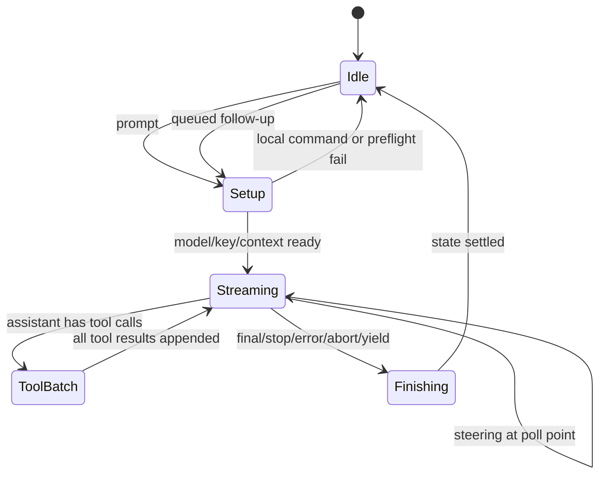
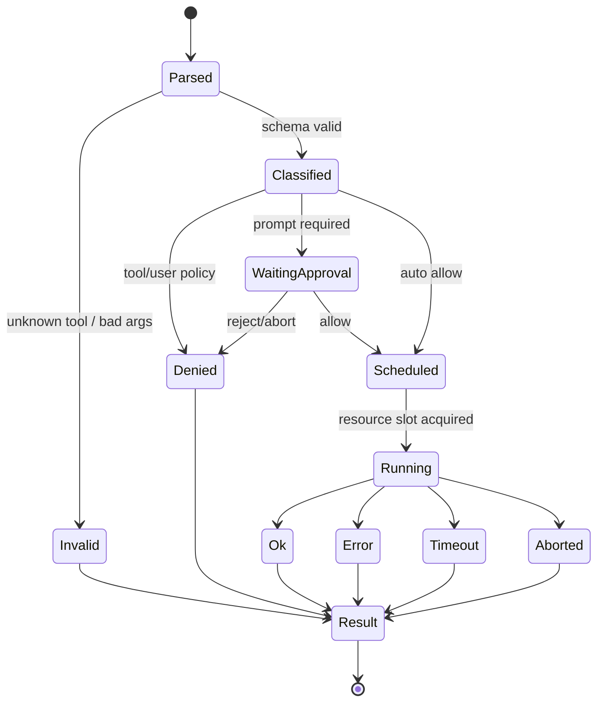
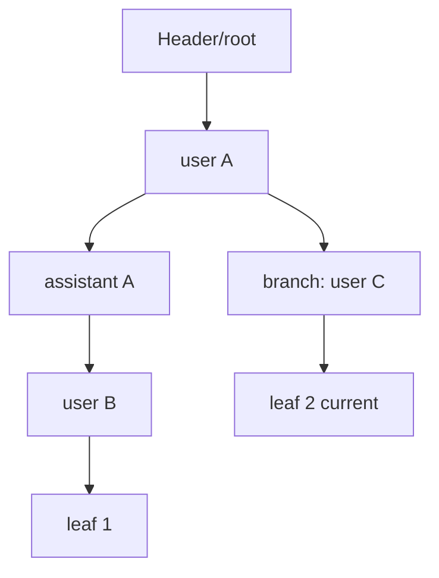
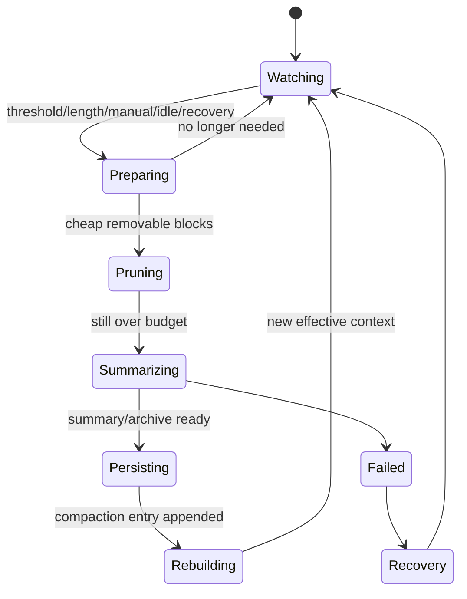
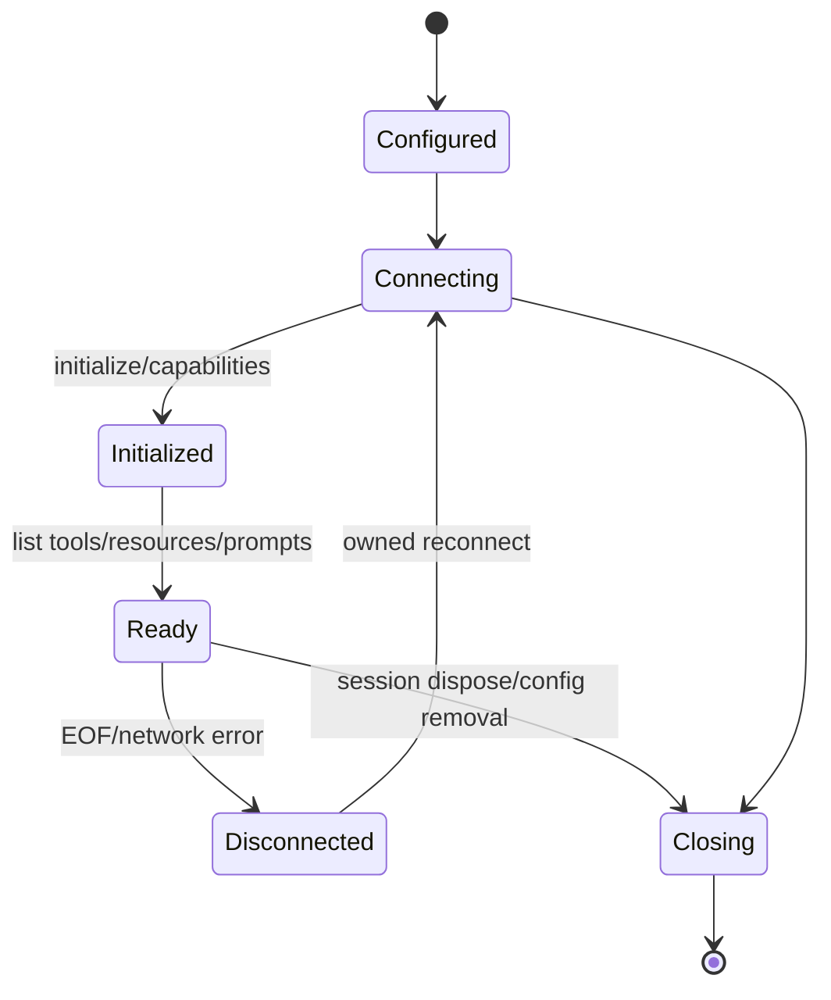
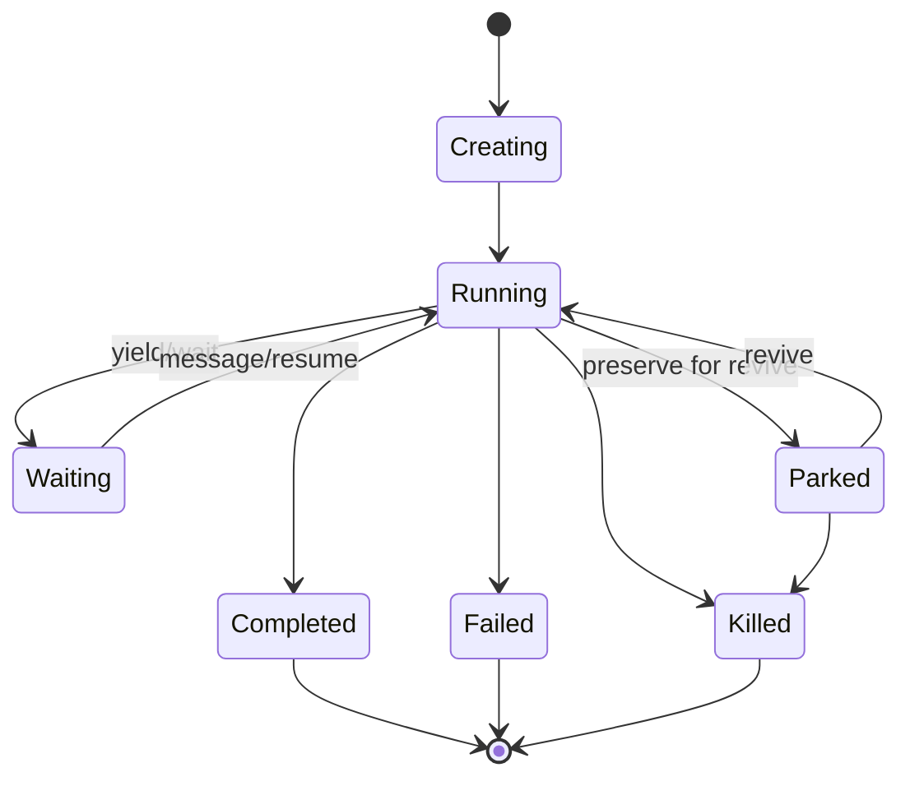
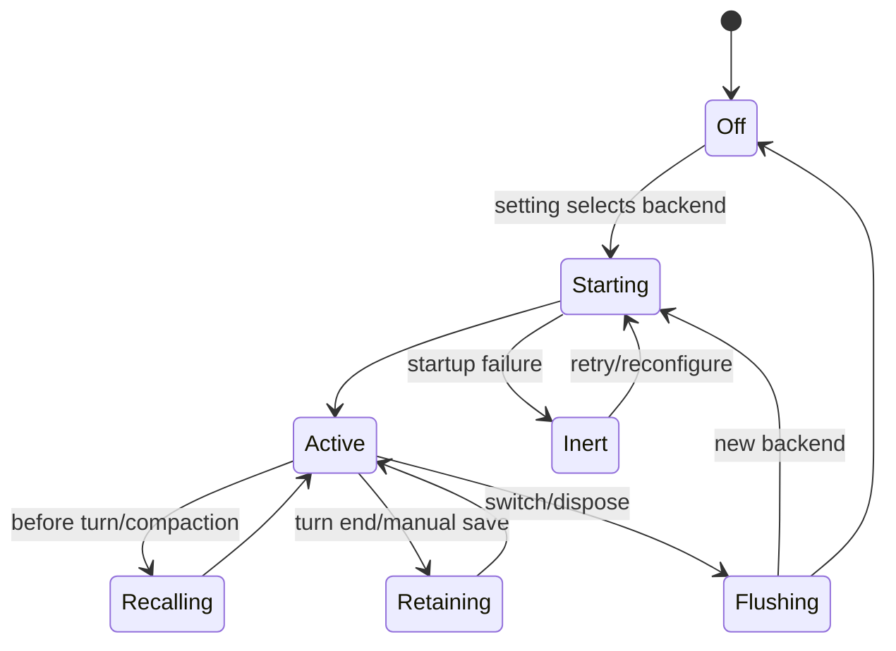
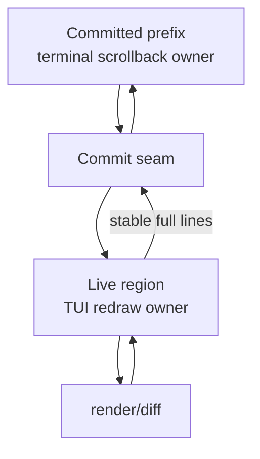
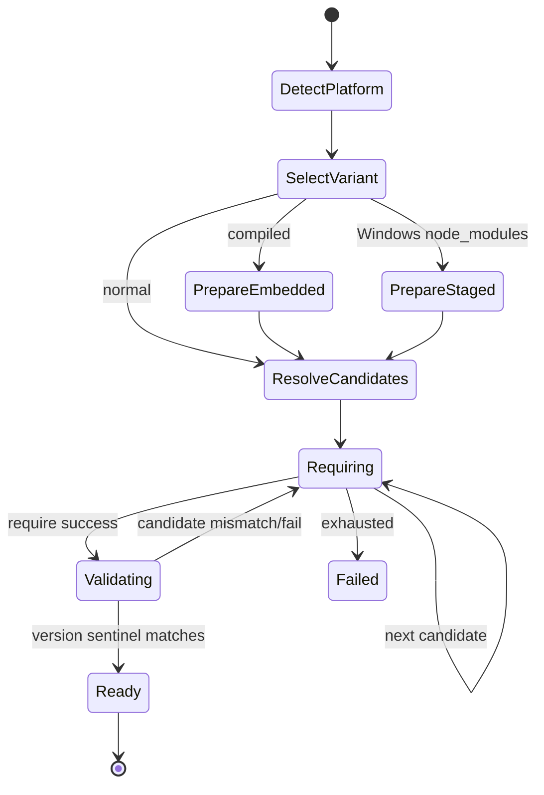

# 附录 B　术语、状态机与不变量速查

> 当一个改动同时触及 stream、tool、session、TUI 或子代理时，先用这份附录核对术语和不变量。很多“偶现 bug”本质是两个层把同一个词理解成不同状态。

## B.1 三个最容易混淆的核心对象

| 对象 | 负责 | 不负责 |
| --- | --- | --- |
| `Agent` | 当前 model/tools/messages、stream、steer/follow-up、loop state | JSONL、TUI、skills、MCP lifecycle |
| `AgentSession` | prompt 编排、持久化事件、压缩、恢复、模式、extension、memory、subagent | 原生 JSONL 树存储细节、provider wire 实现 |
| `SessionManager` | JSONL entries、parent tree、current leaf、branch context、blob | 启动模型调用、执行工具、渲染 UI |

代码入口：[`agent.ts`](https://github.com/can1357/oh-my-pi/blob/v17.1.3/packages/agent/src/agent.ts)、[`agent-session.ts`](https://github.com/can1357/oh-my-pi/blob/v17.1.3/packages/coding-agent/src/session/agent-session.ts)、[`session-manager.ts`](https://github.com/can1357/oh-my-pi/blob/v17.1.3/packages/coding-agent/src/session/session-manager.ts)。

## B.2 高频术语表

| 术语 | 精确定义 |
| --- | --- |
| Turn | 一次用户/合成输入启动的 Agent run，可含多个模型 step |
| Step | 一次 chat 响应及其 tool batch；工具后通常进入下一 step |
| Run | `Agent.#runLoop()` 的一次生命周期，telemetry 对应 `invoke_agent` |
| AgentMessage | OMP/agent-core 内部消息代数，允许 custom/developer 等 |
| Message | pi-ai 面向 LLM 的统一消息，仍未必是最终 provider JSON |
| Provider payload | 某 adapter 生成的 HTTP/SSE/API 方言对象 |
| Session entry | JSONL 中带 ID/parentId/type/timestamp 的持久记录 |
| Branch | 从 root 沿 parentId 到 current leaf 的 entry 序列 |
| Leaf | 当前选择的树末端；不一定是文件物理末行 |
| Transcript | 展示/导出用较完整历史，可不同于有效 model context |
| Tool call | assistant 请求执行工具的结构，必须带 call ID |
| Tool result | 与 call ID 配对的 terminal 结果，成功/失败/阻断都算 |
| ToolSession | 工具执行时的 cwd、session、abort、artifact、bridge 等能力上下文 |
| Tool tier | `read/write/exec` 能力等级，不等于执行结果严重度 |
| Approval mode | tier 自动允许上限：always-ask/write/yolo |
| Steering | 插入当前 active run 的后续 poll 点 |
| Follow-up | 当前 run 终止后再开启的输入 |
| Next-turn message | 与下一真实 prompt 一起注入，不立即启动 run |
| Capability | 可从多个 provider/location 发现并按优先级合并的资源类型 |
| Skill | 渐进披露的可复用指令/流程能力 |
| Rule/TTSR | 条件规则与 tool-result 后提醒/注入机制 |
| Extension | 同进程动态 TypeScript 代码，可注册工具/事件/UI |
| Plugin | 可分发 bundle，可能包含 extension、skill、MCP/config 等 |
| MCP server | 外部 Model Context Protocol 进程/服务 |
| Internal URL | `local://`、`skill://`、`mcp://` 等逻辑资源地址 |
| xdev | 通过 `xd://` 把设备/动作挂到 read/write 统一入口 |
| Hashline | 将读到的行内容编码为抗漂移 edit anchor 的机制 |
| Artifact | session-scoped 大输出/中间文件；model context 常只放引用 |
| Blob | SessionManager 外置的 binary/image payload 引用 |
| Compaction | 用摘要/剪枝/archive 改变后续有效 context 的维护操作 |
| Snapcompact | 将旧文本渲染为紧凑位图/保留数据的 compaction 策略 |
| Recovery | 对 error/length/abort/partial turn 的可重试或终结处理 |
| ModelRegistry | model 查找、可用性与 API key resolver 的运行时注册表 |
| AuthStorage | credential/OAuth/account 状态的所有者 |
| Provider session ID | 发送到 provider/telemetry 的会话身份 |
| Prompt cache key | provider 缓存前缀身份，shape 变化时不能盲继承 |
| AgentRegistry | 进程内 main/child AgentRef 索引 |
| Parking | dispose live session，但保留可 revive 的 AgentRef/历史 |
| Advisor | 独立只读审阅 Agent，通过 advise/yield 给主会话建议 |
| Memory backend | `off/local/hindsight/mnemopi` 中恰选一个的长期记忆实现 |
| Isolation backend | APFS/Btrfs/overlay/copy 等工作区机制，不等同通用安全容器 |
| OTLP telemetry | 实时 span/metric/log 出站观测 |
| Stats | 从 session JSONL 离线重建的本地 SQLite 派生统计 |

## B.3 Agent Run 状态机



核心不变量：

1. `isStreaming=true` 期间普通 `prompt()` 不能再开第二个 run；
2. Setup 中 abort/new prompt 要用 generation 阻止迟到 continuation；
3. ToolBatch 必须为每个 call 生成 terminal result；
4. Finishing 的 success/error/abort path 都要 clear busy 并 resolve `waitForIdle()`；
5. Follow-up 在 terminal 后开启，steering 不等同 follow-up。

## B.4 Prompt Setup 状态机

```text
Raw input
→ extension/custom/file slash command
→ prompt template
→ magic/eager/image preludes
→ reserve in-flight generation
→ model/auth/quota validation
→ recover prior incomplete turn
→ assemble mode + user + nextTurn + @file messages
→ wait memory transition / dynamic recall
→ build system prompt / before_agent_start extension
→ auto-thinking
→ pre-prompt compaction
→ commit pending stats/plan reference
→ Agent.prompt
```

提交点在最后。前面任何 await 失败都不应留下“已发送 plan reference”“已消费 pending nextTurn”“已切 system prompt”这类不可重试半状态。

## B.5 Tool Call 状态机



无论走哪条 terminal 分支，都要形成 provider 可接受的 tool result。Telemetry status 与 `isError` 可不同粒度，但不能没有终态。

## B.6 Approval 速查

### Tier 排序

```text
read < write < exec
```

### Mode 自动允许上限

| Mode | read | write | exec |
| --- | --- | --- | --- |
| `always-ask` | allow | prompt | prompt |
| `write` | allow | allow | prompt |
| `yolo` | allow | allow | allow |

17.1.3 默认 mode 是 `yolo`。但以下仍可阻断/询问：

- tool 自身 `deny`；
- 用户 per-tool `deny`；
- 工具明确 `prompt`/override；
- provider/client safety check；
- ACP permission gate；
- plan-mode guard；
- 参数验证失败。

Approval 只决定 tool runtime 是否调用 implementation，不改变宿主 OS 权限。

## B.7 Tool Scheduler 不变量

1. 只读、互不冲突的 call 可并发；
2. mutation/resource conflict 必须按 scheduler policy 排序；
3. 同一 call 只执行一次，迟到 retry 不得重复 side effect；
4. abort 后未开始任务应 skipped/aborted，已开始任务收到 signal；
5. 外层 `write xd://` 要继承 inner device 的 argument-dependent tier；
6. result 顺序可以与执行完成顺序不同，但 call ID 配对必须稳定；
7. output spill 不改变语义 terminal status。

## B.8 Provider Chat 状态机

```text
context transform
→ unified Message
→ secret obfuscation
→ provider dialect payload
→ auth/routing/service tier
→ request accepted
→ stream deltas
→ normalized assistant message
→ usage/finish reason
→ deobfuscate local output
→ terminal chat span
```

安全 retry 的关键分界：

- 请求前/未产生可见语义：通常可重放；
- 已流出 text/tool call：重放可能重复副作用，必须由 recovery 明确处理；
- provider-private signature/payload：只在同方言/兼容模型间可信；
- auth rotation：不能让旧响应与新请求混成一个 assistant message。

## B.9 消息三形态不变量

| 形态 | 允许包含 | 主要消费者 |
| --- | --- | --- |
| Session entry | custom metadata、branch/config/compaction、blob refs | resume/history/stats |
| AgentMessage | user/developer/custom/assistant/toolResult | Agent loop |
| Provider payload | provider 支持的 role/content/tool/signature | 远端 API |

转换必须：

1. 保留用户可见语义；
2. 保持 tool call/result 邻接与 ID；
3. 不把 UI-only/custom details 全发给 provider；
4. 不把不兼容 provider payload 当普适事实；
5. 在 persistence 前去掉不应长期保存的 transient/signature；
6. 在 display 与 provider secret view 之间保持明确方向。

## B.10 Session Tree 状态机



不变量：

- `parentId` 定义逻辑树；文件 append 顺序不定义 current branch；
- current leaf 必须存在或通过恢复规则修正；
- branch context 只沿 ancestor chain；
- fork 可共享历史语义，但新 entry identity 独立；
- title slot/header update 不得破坏第一条 JSONL header 合同；
- rewrite/move 必须 atomic，并与 append serialization 协调；
- blob ref 的生命周期跟 session storage，不跟 Agent message array。

## B.11 Session Append 状态机

```text
candidate entry
→ assign ID/parent/timestamp
→ sanitize/externalize blob
→ enqueue session-local write chain
→ append/rewrite atomic storage
→ update in-memory index/current leaf
→ notify consumers
```

不要允许两个异步写者直接 `Bun.write` 同一个 JSONL。即使单线程 JS，await 之间也会交错并造成重复 parent、lost update 或截断。

## B.12 Assistant terminal 状态速查

| stop/状态 | 含义 | 后续 |
| --- | --- | --- |
| normal stop | 最终回答 | post-turn maintenance |
| tool use | 非 terminal run step | 执行所有 tools 后继续 |
| length | 上下文/输出截断 | compaction + recovery/continue |
| error | provider/loop 错误 | retry/fallback 或 terminal error entry |
| aborted | 用户/超时/恢复终结 | 清 busy；是否保留 queue 按策略 |
| yield | 协作/goal 的显式交还 | lifecycle/yield queue 决定后续 |
| empty/reasonless | 可疑不完整状态 | stream guard/recovery 分类 |

“assistant message 已 append”不一定表示 run 成功；必须看 terminal stop reason。

## B.13 Compaction 状态机



不变量：

1. 不在 tool call/result 中间切断；
2. recent window 与 reserve budget 明确；
3. previous summary/preserveData 可迭代；
4. compaction entry 是新 context boundary，不删除原树；
5. secrets 在 compaction provider request 前处理；
6. 成功后 plan/memory等必须可按需要重新注入；
7. 同一 session 只允许一个 compaction owner；
8. length recovery 不能无限自动继续。

## B.14 Snapcompact 不变量

- 文本渲染为可读 archive image，但 recent 原文仍保留；
- system prompt/tool results 的 preserve slots 有明确 key；
- vision-capable model 才能消费 image archive；
- render failure 必须可降级到其他 compaction/recovery；
- archive 是 context 表达，不是 session 源历史；
- token savings 要在加入图片成本后计算，不能只看被删文字。

入口：[`snapcompact-inline.ts`](https://github.com/can1357/oh-my-pi/blob/v17.1.3/packages/coding-agent/src/session/snapcompact-inline.ts) 与 [`packages/snapcompact`](https://github.com/can1357/oh-my-pi/tree/v17.1.3/packages/snapcompact/src)。

## B.15 Extension 生命周期

```text
discover path/plugin
→ import module (已有任意代码执行能力)
→ factory registration phase
→ runtime initialization
→ event/command/tool handlers active
→ settings reload/rebuild as supported
→ managed timer/handler dispose
```

不变量：

- registration phase 的 action stub 在 runtime 未初始化时应抛错；
- 一个 extension 的 handler error 进入 error channel，不破坏所有 extension；
- timers/subscriptions 必须由 owner 回收；
- command/tool 名冲突有确定优先级/诊断；
- extension 是可信进程内代码，approval 只覆盖其 tool 被模型调用，不覆盖 import-time side effect。

## B.16 MCP 生命周期



不变量：

1. reconnect generation 只允许最新连接发布 tools；
2. 旧 transport 的迟到 response 不能解析到新 request；
3. tool/resource/prompt namespace 有 server identity；
4. wire-only intent/空 optional field 在 bridge 边界清理；
5. remote result 是不可信内容；
6. session dispose 关闭 transport 与 pending requests。

## B.17 子代理生命周期



关键区别：

- `dispose session` 不必等于 `unregister ref`；parking 就保留 ref；
- `completed` 不等于 worktree 已合并；parent 仍要读取/应用结果；
- `waiting` 不等于无资源，可能仍有 session/ref/async job；
- kill 要终止 live work、关闭 session并取消 registry；
- CAS/expected ref 防止旧 lifecycle callback 改掉同 ID 的新 agent。

## B.18 AgentRegistry 与所有权 token

任何按 ID 查找再异步更新的逻辑都要防 ABA：

```text
读取 agent X ref=A
await ...
X 被删除并重新创建 ref=B
旧 callback 返回
```

正确做法是更新前验证：

```text
registry.get(X) === A
```

或比较 generation/ownership token。相同模式出现在：

- prompt generation；
- memory backend transition；
- MCP reconnect；
- local memory lease；
- async job delivery；
- session title/write slot；
- collab snapshot/version。

## B.19 Advisor 不变量

- Advisor transcript/Agent identity 与 main 分离；
- 默认只通过 `advise` 等限定工具反馈；
- user interrupt 可抑制 auto-resume，下一 user prompt 再解除；
- 多 advisor 的 roster/status 顺序稳定；
- primary reset/re-prime 不把旧 delivery 重复注入；
- subagent 是否启用 advisor 由独立 setting 控制；
- cost/token telemetry 标注 advisor，而不是 main；
- advisor failure 不阻断 primary loop。

## B.20 Memory backend 状态机



不变量：

1. 运行时恰有一个 selected backend；
2. 切换先 flush/dispose 旧 state，再发布新 tools/prompt；
3. failure 不能留下“prompt 声称有 memory、tools 指向已销毁 state”；
4. recall 是背景，当前用户/tool evidence 优先；
5. retain 去掉 thinking/tool noise/旧 `<memories>` 反馈；
6. child alias 不独立重复自动 retain/recall；
7. remote clear 与 local state clear 的承诺要区分。

## B.21 Local Memory Lease 状态机

```text
pending
→ claim(worker, ownershipToken, leaseUntil)
→ running
→ renew or finish
→ verify ownershipToken
→ commit outputs
```

Lease 过期后另一进程可接管；旧 worker 的迟到输出必须在 commit 前失败。Phase 2 按 cwd 分区，不能跨项目合并 rollout。

## B.22 TUI Ledger 状态机



不变量：

- 普通 redraw 不得改 committed prefix；
- resize 只重排 live region，除非进入显式全量重建协议；
- committed 行必须 byte-stable；
- cursor/clear sequence 不能越过 seam；
- image/SIXEL 占用与文本 cell 几何一致；
- headless test 不触碰真实 stdin/raw mode/terminal probes；
- exit/异常都恢复终端模式。

## B.23 Input 状态机

```text
draft text/images
→ wait pending paste/clipboard reads
→ submit intent
→ snapshot + clear editor
→ session.prompt
→ accepted: keep clear
→ rejected/error: restore exact draft/images
```

Streaming 时：

- Enter 可变成 steer；
- follow-up keybinding 进入 follow-up；
- 空提交可能触发 abort/queue semantics；
- focused child session 由 controller 路由；
- queue chip 是 UI 显示，不是唯一队列事实。

## B.24 Native Loader 状态机



不变量：

- platform tag 在支持列表；
- x64 modern 可降 baseline；
- embedded tar filename/entry 不得逃逸；
- Windows staging 路径按 version 分区；
- JS 预期 sentinel 与 Rust export 同版本；
- 成功后旧 cache 清理只是 best effort；
- 无等价语义时不要静默 JS fallback。

## B.25 Secrets 双向边界

```text
local session/plaintext
→ obfuscate known secrets
→ provider-visible placeholder/replacement
→ provider output/tool arguments
→ deobfuscate exact registered placeholders
→ local display/tool execution
```

不变量：

- 默认关闭；
- 只有 exact registered placeholder 可恢复；
- per-install key 不发送给 provider；
- key file `0600` 且并发创建安全；
- replace mode 是单向；
- placeholder 反复 obfuscate 应是 fixed point；
- streamed incomplete suffix 不提前显示；
- compaction/handoff/side request 同样经过 boundary；
- 它不是 session 加密或全出口 DLP。

## B.26 Config 优先级速查

```text
schema default
< global/profile config
< project settings
< explicit config overlays (顺序合并)
< runtime overrides
```

`.env`：

```text
existing process env
> project .env
> active agent/profile .env
> OMP config-root .env
> home .env
```

显式 overlay 丢失/格式错 hard fail；自动可选配置通常 warning/skip。Profile 在 eager env import 前确定。

## B.27 Observability 不变量

- telemetry disabled 时主 loop 近零额外成本；
- 每个 started span 在 success/error/abort 都 end；
- `invoke_agent` 是 run 聚合，`chat` 是一次 provider request；
- tool bypassed/blocked 也计 coverage；
- content capture 独立 opt-in；
- telemetry hook failure 不阻断 Agent；
- JSONL 是恢复事实，OTLP buffer 不是；
- stats offset 只推进到完整/可跳过的换行记录；
- stats DB 是派生物，可 backfill/rebuild；
- main/subagent/advisor 分类保持独立。

## B.28 Dispose 顺序

通用原则：停止新工作 → abort live work → drain/flush owner queue → 关闭外部连接 → 持久化终态 → 注销 identity → 恢复宿主 UI/terminal。

典型资源：

```text
queued prompt/continuation
agent provider stream
running tools/processes/eval
advisor/subagent hooks
MCP transports/extensions timers
memory retain/consolidation
async jobs/collab
session writes/blobs
telemetry flush
TUI terminal state
auth storage/native/global cleanup
```

Dispose 必须幂等；构造只完成一半时也能清理已拥有部分。不要依赖 `process.exit()` 自动完成 async teardown。

## B.29 常见竞态与对应防线

| 竞态 | 防线 |
| --- | --- |
| setup await 后旧 prompt 继续 | prompt generation |
| 同 ID child 被重建，旧 callback 返回 | AgentRef identity/CAS |
| MCP 旧连接迟到注册 tools | reconnect generation |
| 两进程同时归纳 memory | lease + ownership token |
| 两次 JSONL append 交错 | session-local promise chain |
| 用户改文件后模型 stale edit | Hashline/snapshot/mutation version |
| abort 与 ACP approval 同时返回 | Promise race + abort terminal check |
| backend 切换与 prompt 同时发生 | serialized memory transition |
| old native 仍驻留进程 | version sentinel + restart diagnosis |
| stats 从 offset 丢 service tier | prefix state scan |
| editor clipboard image迟到 | pending paste gate |
| TUI resize 改写历史 | committed prefix seam |

## B.30 变更 Agent Loop 前的检查表

- [ ] Idle/Streaming/Finishing 是否仍有唯一 owner？
- [ ] 所有 throw/abort path 是否 clear busy？
- [ ] 每个 tool call 是否都有 result？
- [ ] steering 与 follow-up poll 顺序是否明确？
- [ ] 新 event 是否被 Session/TUI/RPC/ACP/telemetry 消费？
- [ ] provider partial output 后是否会错误重放？
- [ ] `waitForIdle()` 是否一定 resolve？
- [ ] session terminal entry 是否能在崩溃后解释？

## B.31 变更 Session 格式前的检查表

- [ ] 新 entry 有版本/迁移策略？
- [ ] parentId/leaf/branch 语义是否保持？
- [ ] loader 对截断/旧字段宽容？
- [ ] persistence sanitizer/blob externalization 已更新？
- [ ] compaction/context builder 是否识别？
- [ ] stats parser 是否需要新字段/backfill？
- [ ] collab snapshot/wire 是否需要升级？
- [ ] fork/resume/move/rewrite 测试齐全？
- [ ] title/header 首行合同未破坏？

## B.32 变更工具前的检查表

- [ ] schema 对 model-mangled/partial args 防御？
- [ ] tier 是否按最危险实际能力声明？
- [ ] argument-dependent path/remote/device 会提升 tier？
- [ ] plan mode/ACP/MCP/xdev wrapper 是否覆盖？
- [ ] AbortSignal 真的停止底层工作？
- [ ] 大输出有 budget/artifact？
- [ ] side effect 重试是否幂等？
- [ ] error/deny/timeout 都形成 toolResult？
- [ ] 文件写入有 stale protection/cache invalidation？
- [ ] telemetry/stats/generated tool view 是否更新？

## B.33 变更 Provider 前的检查表

- [ ] catalog、registry、adapter 三层职责都更新？
- [ ] auth/env/OAuth/broker resolution 正确？
- [ ] message role、thinking、tool schema 方言完整？
- [ ] call/result ID 与并行工具约束满足？
- [ ] response delta/usage/TTFT/finish reason 规范化？
- [ ] retry 在 partial delivery 后安全吗？
- [ ] cross-provider replay 会剥离私有 payload/signature？
- [ ] context overflow/remote compaction 行为已测？
- [ ] secrets 与 telemetry content boundary 覆盖？
- [ ] custom base URL/gateway header 处理清楚？

## B.34 变更并发/子代理前的检查表

- [ ] Agent ID/task prefix/session path 唯一？
- [ ] registry 更新使用 expected ref/token？
- [ ] park、complete、kill、dispose 区分？
- [ ] isolation root/backend 与工作结果回收明确？
- [ ] async job delivery 路由到正确 owner？
- [ ] parent abort 是否级联，child 独立任务是否例外？
- [ ] memory state 是 alias 还是独立 owner？
- [ ] advisor/child telemetry 与 stats 分类正确？
- [ ] worktree/result merge 是显式步骤？

## B.35 变更 TUI 前的检查表

- [ ] committed prefix 是否 byte-stable？
- [ ] resize 是否只影响 live region？
- [ ] Unicode/ANSI/image 宽度一致？
- [ ] streaming delta 与 terminal message 不重复？
- [ ] approval/modal/focus 恢复正确？
- [ ] editor 失败后能恢复 text + images？
- [ ] headless tests 不触碰真实 terminal？
- [ ] exception/exit 恢复 raw mode/cursor/mouse？

## B.36 安全审查最小问题集

对每个新入口回答：

1. 输入由用户、模型、repo、extension 还是网络提供？
2. 它最终能 read、write、exec、network、credential 中的哪些能力？
3. schema 与语义检查分别在哪里？
4. approval tier 与默认 mode 下会发生什么？
5. 是否绕开 ToolSession 直接执行？
6. 数据会发到 provider、MCP、memory、collab、OTLP 中的哪里？
7. 本地会持久化到 session、artifact、log、stats 的哪里？
8. abort/dispose 能否停止底层 side effect？
9. isolation 是目录、工作区、进程还是完整容器？
10. 最小 OS 权限仍能限制什么？

## B.37 一页式系统不变量

最后把全项目压缩成二十条：

1. Composition root 唯一决定资源所有权。
2. Agent 同时只有一个 active run。
3. Prompt generation 淘汰迟到 setup。
4. 每个 tool call 必有 terminal result。
5. Model arguments 永远是不可信输入。
6. Approval 不等于 sandbox。
7. Extension/native 与 host 同权限。
8. MCP/provider/collab/OTLP 是独立数据出口。
9. Session append 有序，current leaf 由树决定。
10. JSONL 是恢复事实，UI/OTLP/stats 都是投影。
11. Provider 私有 payload 只在兼容边界复用。
12. Secrets 在出站/入站边界转换，默认关闭。
13. Hashline 拒绝 stale edit，不能静默覆盖。
14. Abort 必须穿到 stream、线程和进程树。
15. Compaction 改有效 context，不删除原历史。
16. TUI committed prefix 不被普通更新重写。
17. Registry/lease/reconnect 都用 identity 或 generation 防 ABA。
18. Child、Advisor、main 的 identity、成本和生命周期分离。
19. Dispose 幂等、有界、按 ownership 逆序清理。
20. 发布产物、native sentinel、类型声明和源码版本保持 lock-step。

如果一个设计不能说明自己如何保持这些不变量，就还没有准备好进入实现。

---

[返回教程首页](../README.md) · [附录 A：源码导航与阅读路线](./附录A-源码导航与阅读路线.md)
